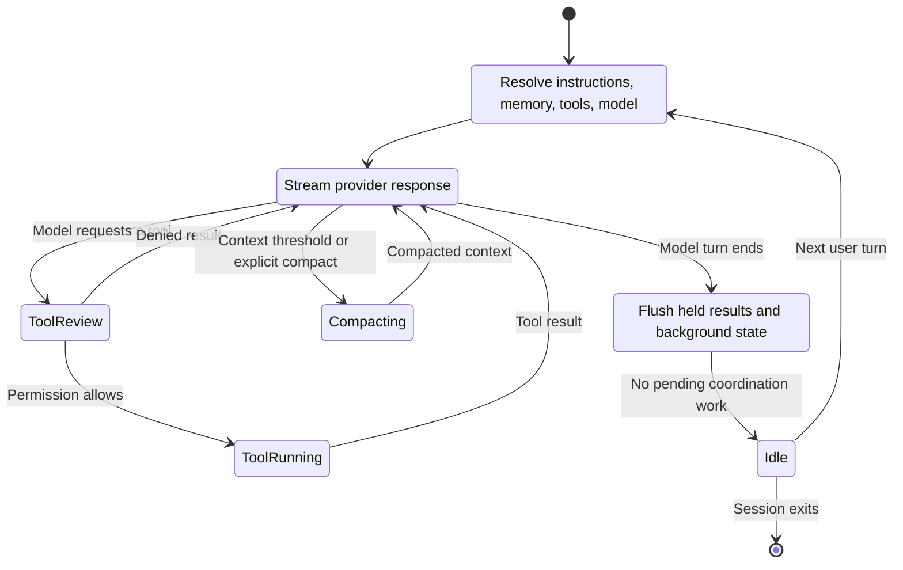

# Agent Loop, Context, and Compaction

The agent loop coordinates remote model output with local context, tools, extensions, persistence, and background work. It is more accurately modeled as an event-driven state machine than as a single request/response call.

Derived Anchor [`agent-loop.core-generator`](https://github.com/swyxio/claude-code-internals/blob/main/evidence/anchors.json) identifies the central turn engine as an asynchronous generator. That shape fits a loop that yields streamed model, tool, lifecycle, and state events over time.

## Turn state machine

Derived State names are independent reconstruction terms. The transition constraints are grounded by lifecycle anchors, CLI protocol options, and pending-work observations.

## Context assembly

Potential context inputs include the user prompt, system prompt, appended prompt, `CLAUDE.md` instructions, selected agent prompt, skill material, memory, repository state, additional directories, file attachments, tool schemas, MCP capability descriptions, and conversation history.

CLI controls can replace the system prompt, append to it, load prompt text from files, select an agent, define agents as JSON, and move dynamic machine sections from the system prompt into the first user message. This shows that prompt construction is a layered operation rather than a single fixed string.

Derived [`agents.append-prompt`](https://github.com/swyxio/claude-code-internals/blob/main/evidence/anchors.json) identifies an optional fragment propagated to Task subagents and nested subagents. This is a context inheritance boundary: parent context is not necessarily copied wholesale, but selected prompt policy can propagate.

## Tool-result feedback

Tool calls create a local round trip inside one model turn. The model proposes structured input; the client resolves the tool identity, applies policy, executes or denies it, normalizes the result, and sends the result back to the model. Hook events can surround the operation.

The lifecycle anchor includes `PreToolUse`, `PostToolUse`, `PostToolUseFailure`, `PostToolBatch`, `PermissionRequest`, and `PermissionDenied`. These event names establish observable boundaries but not a universal ordering for every internal failure. For example, schema rejection may occur before a hook-eligible tool use exists.

## Compaction

Derived Anchor [`compaction.lifecycle`](https://github.com/swyxio/claude-code-internals/blob/main/evidence/anchors.json) records separate compaction progress and completed-boundary events. The hook vocabulary also contains `PreCompact` and `PostCompact`.

Derived Compaction should be treated as a context transformation with lifecycle, not as truncation. A correct reconstruction preserves identity and pending work while replacing or summarizing history that will be sent in future provider requests.

Questions the current evidence does not fully answer include:

- the exact threshold calculation and model-specific context window;
- whether every attachment or tool result is eligible for summarization;
- which metadata survives a compact boundary;
- how compaction interacts with forked sessions and background agents.

## Idle and completion

[`agent-loop.idle-boundary`](https://github.com/swyxio/claude-code-internals/blob/main/evidence/anchors.json) says idle is emitted only after held-back results flush and the background-agent loop exits. [`agents.pending-turn-state`](https://github.com/swyxio/claude-code-internals/blob/main/evidence/anchors.json) records counts for pending background agents and workflows at completion.

This produces three distinct concepts:

1. **Provider complete:** the current response stream ended.
2. **Turn complete:** foreground orchestration has a terminal result and records pending work.
3. **Session idle:** deferred results and relevant background coordination have drained.

Automation consuming stream-JSON should not infer the third condition solely from the end of an assistant text block.
