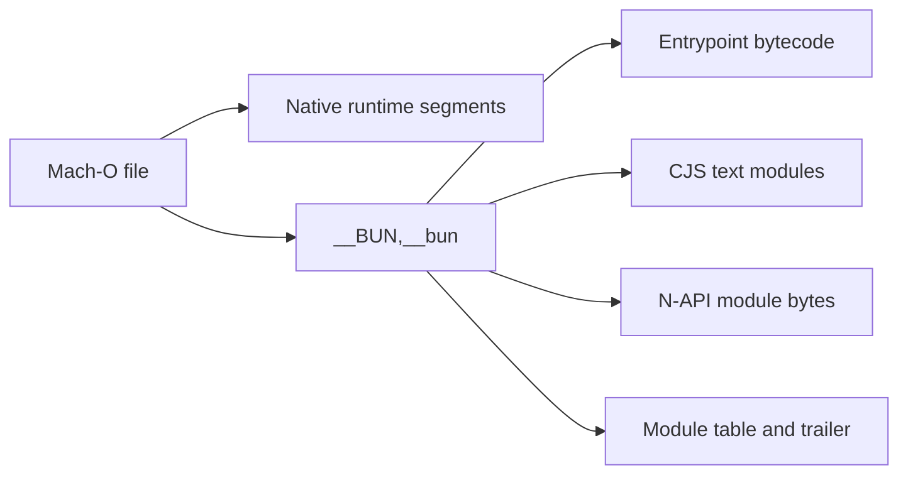

# Mach-O and Bun Container

For the exact byte ranges, 52-byte module-record interpretation, JSC cache
alignment, all eleven modules, and native wrapper pairings, continue to the
[Bun and JSC deep dive](bun-jsc-deep-dive.md).

The installed artifact is both a native macOS executable and a container for the JavaScript application graph. Understanding those two layers prevents native-runtime features from being incorrectly attributed to the Claude Code application.

## Native envelope

<span class="evidence-label observed">Observed</span> The active file is a thin, little-endian, 64-bit arm64 Mach-O signed with identifier `com.anthropic.claude-code`. It uses the hardened runtime and carries four entitlements: JIT, unsigned executable memory, disabled library validation, and audio input. See [snapshot identity](../snapshot-2.1.177.md) and [provenance](https://github.com/swyxio/claude-code-internals/blob/main/evidence/provenance.json).

The signature answers who signed the bytes and whether the signed content has changed. It does not attest that every embedded behavior is safe, that downloaded plugins are trusted, or that runtime configuration is benign.

## Embedded graph framing

The parser locates the `__BUN` segment and `__bun` section through Mach-O load commands. The first eight bytes encode the bounded Bun payload size. A trailer and offsets record the standalone graph, module table, entrypoint ID, and flags.

<span class="evidence-label observed">Observed</span> The embedded runtime identifies itself with the literal string `1.3.14+2a41ca974`. Only the nine-character revision prefix is present in that string.

<span class="evidence-label derived">Derived</span> The prefix resolves to upstream commit `2a41ca974b7302952252a20eddbb3b5c3f2dee9b`. The version-matched layout reference is therefore [`StandaloneModuleGraph.zig`](https://github.com/oven-sh/bun/blob/2a41ca974b7302952252a20eddbb3b5c3f2dee9b/src/standalone_graph/StandaloneModuleGraph.zig); using this pinned source avoids silently interpreting the payload through a later layout.



All offsets in [`binary-inventory.json`](https://github.com/swyxio/claude-code-internals/blob/main/evidence/binary-inventory.json) are bounds-checked against the payload before use. Each module’s content is hashed independently, allowing later comparison without committing the bytes.

## Module inventory

| Index | Virtual module | Loader | Size |
|---:|---|---|---:|
| 0 | `/$bunfs/root/src/entrypoints/cli.js` | JavaScript/CJS | 17,038,096 |
| 1 | `/$bunfs/root/image-processor.js` | JavaScript/CJS | 1,976 |
| 2 | `/$bunfs/root/audio-capture.js` | JavaScript/CJS | 1,974 |
| 3 | `/$bunfs/root/url-handler.js` | JavaScript/CJS | 1,972 |
| 4 | `/$bunfs/root/computer-use-swift.js` | JavaScript/CJS | 1,979 |
| 5 | `/$bunfs/root/computer-use-input.js` | JavaScript/CJS | 1,979 |
| 6–10 | Five matching `.node` modules | N-API | 336,864–1,692,096 |

The primary module has both a 17 MB text representation and a 129 MB bytecode region. No source map is declared. The five small JavaScript modules act as binding boundaries to five native modules.

<span class="evidence-label derived">Derived</span> The product’s meaningful application-module boundaries have largely been erased by bundling into the single entry module. Treating each minified closure as an original source file would create false precision. The atlas instead reconstructs modules by cohesive responsibility and records anchor-to-module evidence.

## Native add-on boundaries

The module names establish capabilities, not complete APIs. An add-on named `audio-capture.node` is evidence of an audio-capture native boundary; it does not alone prove when recording begins, how permissions are requested, or what data is retained. Those questions require call-site anchors or controlled runtime traces.

The independent reconstruction therefore represents native modules as opaque interfaces:

- image processing;
- audio capture;
- URL handling;
- macOS computer-use support;
- computer-use input injection.

Security review should follow values across the JavaScript/native boundary, especially file paths, image buffers, accessibility input, URLs, and permission state. This project does not disassemble or redistribute the native modules.

## Reproducible parsing

Run the repository inspection test against the exact artifact:

```sh
CLAUDE_BINARY="$HOME/.local/share/claude/versions/2.1.177" npm run check
```

The test asserts the section offset, graph size, entrypoint identity, main content size, bytecode size, and N-API module count. Extraction is intentionally a separate local action and its output belongs under ignored `.work/`, never in the public repository.
