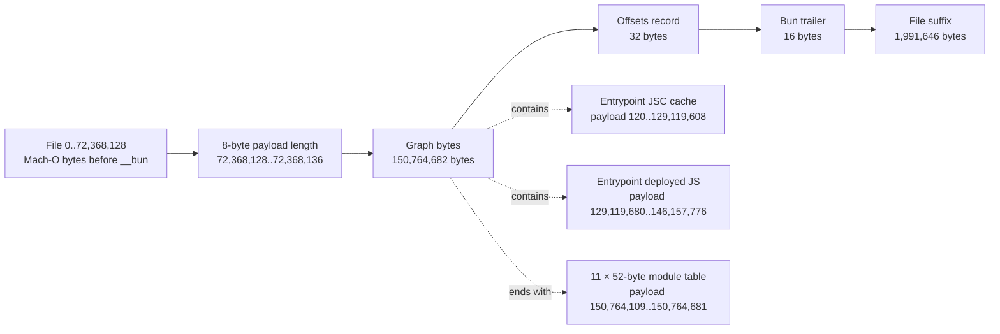

# Bun Standalone Graph and JSC Cache Deep Dive

This page narrows one question: what can be recovered from the Bun container in
the signed Claude Code `2.1.177` Mach-O, and what would be false precision? It
uses the committed [provenance](https://github.com/swyxio/claude-code-internals/blob/main/evidence/provenance.json),
[binary inventory](https://github.com/swyxio/claude-code-internals/blob/main/evidence/binary-inventory.json),
[derived topology](https://github.com/swyxio/claude-code-internals/blob/main/evidence/binary-topology.json),
and the version-pinned Bun
[`StandaloneModuleGraph.zig`](https://github.com/oven-sh/bun/blob/2a41ca974b7302952252a20eddbb3b5c3f2dee9b/src/standalone_graph/StandaloneModuleGraph.zig).
It publishes no recovered module content, JSC cache bytes, or native payloads.

## Evidence basis

<span class="evidence-label observed">Observed</span> The artifact is a thin
arm64 Mach-O of 225,124,512 bytes with SHA-256
`eb073035…e40ed9`. Its embedded runtime string is `1.3.14+2a41ca974`.
The nine-character revision prefix resolves to pinned Bun commit
`2a41ca974b7302952252a20eddbb3b5c3f2dee9b`; the full revision is a derived
lookup recorded in provenance, not a string carried in the Claude binary.

<span class="evidence-label observed">Observed in pinned Bun source</span> A
serialized module record contains six offset/length pointers—for name, content,
source map, bytecode, module information, and bytecode origin—followed by one
byte each for encoding, loader, module format, and side. That yields the 52-byte
record size used by the
[public parser](https://github.com/swyxio/claude-code-internals/blob/main/tools/inspect-binary.mjs).

## Byte layout

<span class="evidence-label observed">Observed</span> Mach-O load commands name
one `__BUN,__bun` section. Its first eight bytes hold the payload length. The
payload ends with a 32-byte offsets record and the 16-byte Bun trailer; the
offsets record says the preceding graph is 150,764,682 bytes.



<span class="evidence-label derived">Derived</span> “Before” and “suffix” in
the diagram are coordinate partitions, not claims that those bytes are opaque
to every Mach-O tool. The topology generator deliberately classifies only the
Bun section; ordinary native segments, load commands, signatures, and link-edit
data remain the Mach-O parser’s responsibility.

### Layout landmarks

| Region         | Coordinate system |       Start | End, exclusive |       Bytes |
| -------------- | ----------------- | ----------: | -------------: | ----------: |
| `__BUN,__bun`  | file              |  72,368,128 |    223,132,866 | 150,764,738 |
| payload        | file              |  72,368,136 |    223,132,866 | 150,764,730 |
| graph bytes    | payload           |           0 |    150,764,682 | 150,764,682 |
| module table   | payload           | 150,764,109 |    150,764,681 |         572 |
| offsets record | payload           | 150,764,682 |    150,764,714 |          32 |
| trailer        | payload           | 150,764,714 |    150,764,730 |          16 |

<span class="evidence-label observed">Observed</span> The graph flags value is 15. Under the pinned Bun `Flags` layout, all four defined bits are set:
disable default environment files and disable autoload of bunfig, tsconfig, and
package.json. This is a compile-container setting; it does not mean Claude Code
ignores its own settings files.

## Module table

<span class="evidence-label observed">Observed</span> The table has 11 records:
six Latin-1 CJS/JavaScript records on the serialized `server` side and five
binary N-API records on the serialized `client` side. “Client” and “server” are
Bun enum values here; this evidence does not reinterpret them as a browser/server
deployment split.

|   # | Virtual module                         | Loader / format / side     | Content bytes | JSC cache bytes |
| --: | -------------------------------------- | -------------------------- | ------------: | --------------: |
|   0 | `/$bunfs/root/src/entrypoints/cli.js`  | `js` / `cjs` / `server`    |    17,038,096 |     129,119,488 |
|   1 | `/$bunfs/root/image-processor.js`      | `js` / `cjs` / `server`    |         1,976 |               0 |
|   2 | `/$bunfs/root/audio-capture.js`        | `js` / `cjs` / `server`    |         1,974 |               0 |
|   3 | `/$bunfs/root/url-handler.js`          | `js` / `cjs` / `server`    |         1,972 |               0 |
|   4 | `/$bunfs/root/computer-use-swift.js`   | `js` / `cjs` / `server`    |         1,979 |               0 |
|   5 | `/$bunfs/root/computer-use-input.js`   | `js` / `cjs` / `server`    |         1,979 |               0 |
|   6 | `/$bunfs/root/image-processor.node`    | `napi` / `none` / `client` |     1,249,368 |               0 |
|   7 | `/$bunfs/root/computer-use-swift.node` | `napi` / `none` / `client` |       879,672 |               0 |
|   8 | `/$bunfs/root/computer-use-input.node` | `napi` / `none` / `client` |     1,692,096 |               0 |
|   9 | `/$bunfs/root/audio-capture.node`      | `napi` / `none` / `client` |       438,112 |               0 |
|  10 | `/$bunfs/root/url-handler.node`        | `napi` / `none` / `client` |       336,864 |               0 |

<span class="evidence-label observed">Observed</span> Content totals
21,644,088 bytes; bytecode-cache storage totals 129,119,488 bytes. Every source
map and module-information pointer has size zero. The inventory hashes each
content region independently but intentionally does not publish its bytes.

## Deployed source versus JSC cache

<span class="evidence-label observed">Observed</span> Module 0 has two separate
pointers in the same record: a 17,038,096-byte deployed JavaScript/CJS content
region and a 129,119,488-byte bytecode-cache region. Its bytecode origin path is
exactly the module name, `/$bunfs/root/src/entrypoints/cli.js`.

<span class="evidence-label observed">Observed in pinned Bun source</span> Bun
stores the path used to generate bytecode because it must match at runtime for a
cache hit. For Mach-O’s eight-byte section header, Bun targets payload offset
modulo 128 equal to 120, making the cache’s file address 128-byte aligned. This
artifact matches both conditions: payload offset 120 and file offset 72,368,256,
whose modulo 128 is zero.

<span class="evidence-label derived">Derived</span> The JSC region is a
runtime-specific cache paired with—not a replacement for—the deployed content.
Its size must not be interpreted as source complexity: the pinned serializer
can include alignment and trailing cache storage, and the format is coupled to
runtime expectations and the origin path. This project therefore locates and
sizes the cache but does not present it as a portable intermediate language or
attempt to turn it back into proprietary source.

<span class="evidence-label observed">Observed</span> The cache ends at payload
offset 129,119,608 and the deployed content begins at 129,119,680. The 72-byte
gap is recorded as a coordinate fact only; no semantic meaning is assigned to
it.

## Native boundary map

<span class="evidence-label derived">Derived</span> Five small CJS modules and
five N-API records share virtual basenames. Basename pairing is strong evidence
of wrapper/add-on boundaries, but it does not establish exports, argument
schemas, call frequency, or permission behavior.

| Boundary label       | JavaScript wrapper | N-API payload | Native bytes |
| -------------------- | -----------------: | ------------: | -----------: |
| `image-processor`    |           module 1 |      module 6 |    1,249,368 |
| `audio-capture`      |           module 2 |      module 9 |      438,112 |
| `url-handler`        |           module 3 |     module 10 |      336,864 |
| `computer-use-swift` |           module 4 |      module 7 |      879,672 |
| `computer-use-input` |           module 5 |      module 8 |    1,692,096 |


<span class="evidence-label observed">Observed</span> The outer executable uses
the hardened runtime and carries entitlements for JIT, unsigned executable
memory, disabled library validation, and audio input. Entitlement presence is a
security-envelope fact, not proof that a particular module exercised the
capability in a given run. The independently authored
[native boundary reconstruction](https://github.com/swyxio/claude-code-internals/blob/main/reconstructed/native/runtime-boundaries.ts)
keeps these interfaces opaque.

## Parser invariants

The [read-only parser](https://github.com/swyxio/claude-code-internals/blob/main/tools/inspect-binary.mjs)
fails closed on structural ambiguity:

1. <span class="evidence-label observed">Implemented</span> Require a thin,
   little-endian, 64-bit Mach-O and fully bounded load-command table.
2. <span class="evidence-label observed">Implemented</span> Require exactly one
   `__BUN,__bun` section with matching segment/section names.
3. <span class="evidence-label observed">Implemented</span> Treat every offset
   and size as a safe integer and reject any slice outside its owner.
4. <span class="evidence-label observed">Implemented</span> Require the payload
   to fit the section, the trailer to match, and graph byte count to equal the
   offsets-record start.
5. <span class="evidence-label observed">Implemented</span> Require module-table
   size divisible by 52, an in-range entrypoint, and bounded module pointers.
6. <span class="evidence-label observed">Implemented</span> Require NUL
   terminators for names, contents, bytecode-origin paths, and compile argv.
7. <span class="evidence-label observed">Implemented</span> Keep extraction
   optional, path-contained, collision-checked, and N-API payloads excluded
   unless explicitly requested.

<span class="evidence-label derived">Derived</span> These checks establish
memory-safe parsing of this declared layout; they do not authenticate semantic
meaning. Artifact identity still comes from the binary hash and code signature,
while format interpretation comes from the pinned Bun revision.

## What is and is not recoverable

| Recoverable from this artifact                                                                                       | Not established or not recoverable faithfully                                                                                   |
| -------------------------------------------------------------------------------------------------------------------- | ------------------------------------------------------------------------------------------------------------------------------- |
| Exact container ranges, module records, virtual names, sizes, encodings, loaders, sides, formats, and content hashes | Original source-repository layout, package boundaries, build configuration, comments, formatting, and most original identifiers |
| Local deployed JavaScript contents at bounded offsets                                                                | A claim that the deployed 17 MB bundle is the original source tree                                                              |
| Presence and coordinates of one JSC cache plus its origin path                                                       | Reliable high-level source reconstruction from JSC cache bytes                                                                  |
| Five local N-API payload ranges and wrapper-name pairings                                                            | Native source code, complete exports, argument contracts, or runtime permission behavior                                        |
| Short anchored literals and their offsets                                                                            | Full proprietary prompts, code, or a redistribution right                                                                       |
| One embedded Anthropic build Git SHA                                                                                 | Access to, or identity of, a public upstream Anthropic source repository                                                        |

<span class="evidence-label observed">Observed</span> The bundle preserves at
least one source-like path literal—`src/tools/BashTool/readOnlyValidation.ts`—as
recorded by anchor `tools.bash-readonly-source`. Such survivors are useful
anchors, not evidence that the original file tree can be reconstructed.

## Deterministic validation

[`build-binary-topology.mjs`](https://github.com/swyxio/claude-code-internals/blob/main/tools/build-binary-topology.mjs)
reads only the two committed JSON inputs, checks their shared artifact identity
and layout invariants, and emits no timestamps. Rebuild and compare it with:

```sh
node tools/build-binary-topology.mjs /tmp/binary-topology.json
cmp evidence/binary-topology.json /tmp/binary-topology.json
node --check tools/build-binary-topology.mjs
npm run check
```

The generated JSON includes SHA-256 digests of both source evidence files, so a
later metadata change cannot masquerade as the same derived topology.
