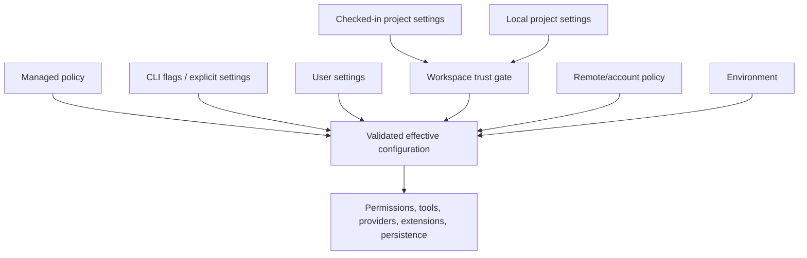

# Configuration Resolution

Configuration is the control plane for tools, permissions, providers, extensions, persistence, integrations, and security posture. The critical distinction is not merely “which setting exists,” but **who supplied it and whether a less-trusted source may override it**.

## Visible sources

The CLI advertises these explicit inputs:

- `--settings <file-or-json>` for an additional settings document;
- `--setting-sources user,project,local` to select ordinary sources;
- command-line switches for model, tools, permissions, MCP, plugins, agents, prompts, and directories;
- environment variables used by provider, auth, transport, test, and feature paths.

Bundle anchors also distinguish managed policy from ordinary settings. [`permissions.managed-only`](https://github.com/swyxio/claude-code-internals/blob/main/evidence/anchors.json) records `allowManagedPermissionRulesOnly`; [`permissions.disable-bypass`](https://github.com/swyxio/claude-code-internals/blob/main/evidence/anchors.json) records a policy control that disables bypass mode.

## Reconstructed trust ordering

Derived The diagram shows source categories and trust gates, not a complete last-write-wins order. The exact precedence may be key-specific: security policy can prohibit a behavior rather than simply provide a value, while explicit mode flags can suppress entire loaders.

## Validation behavior

Interactive startup can surface invalid settings. The `--print` help text says settings that fail validation are silently ignored in non-interactive mode. That asymmetry matters for automation: a typo may produce a permissive or feature-incomplete run rather than a startup error.

Configuration documentation should record for every key:

| Property | Question |
|---|---|
| Source eligibility | May policy, user, project, local, CLI, or environment set it? |
| Validation | What type and values are accepted? |
| Merge behavior | Replace, append, intersect, or deny? |
| Trust requirement | Is workspace approval required before use? |
| Side effect | Can it execute, spawn, read secrets, or open network connections? |
| Failure behavior | Ignore, warn, prompt, or abort? |

## Security-sensitive examples

Derived [`memory.project-path-hardening`](https://github.com/swyxio/claude-code-internals/blob/main/evidence/anchors.json) says a custom auto-memory directory is ignored when supplied by checked-in project settings. This prevents a repository from redirecting automatic memory to an arbitrary location through that source.

Derived [`workspace-trust.proxy-helper`](https://github.com/swyxio/claude-code-internals/blob/main/evidence/anchors.json) gates a project/local proxy-auth helper until trust is accepted. A helper is executable configuration, not a passive string.

Observed `--strict-mcp-config` ignores all MCP configurations except those explicitly supplied with `--mcp-config`. This changes source inclusion, not merely server priority.

## Dynamic configuration

The hook vocabulary includes `ConfigChange`, `InstructionsLoaded`, `CwdChanged`, and `FileChanged`. Skills have a [`skills.dynamic-refresh`](https://github.com/swyxio/claude-code-internals/blob/main/evidence/anchors.json) anchor describing a replacement command list when discovery changes mid-session.

Derived Some configuration is therefore live rather than bootstrap-only. Consumers need snapshot semantics: a tool request should be evaluated against a coherent permission and extension state even if files change while the session runs.

## What remains unknown

The public evidence does not yet encode a complete settings schema, key-by-key source allowlist, or precedence matrix. Environment-variable presence in a bundle can also come from vendor code, tests, or disabled features. The [reference catalog](../reference/files-config-env.md) includes only variables tied to CLI help or a semantic anchor; raw string inventories are not treated as supported API.
