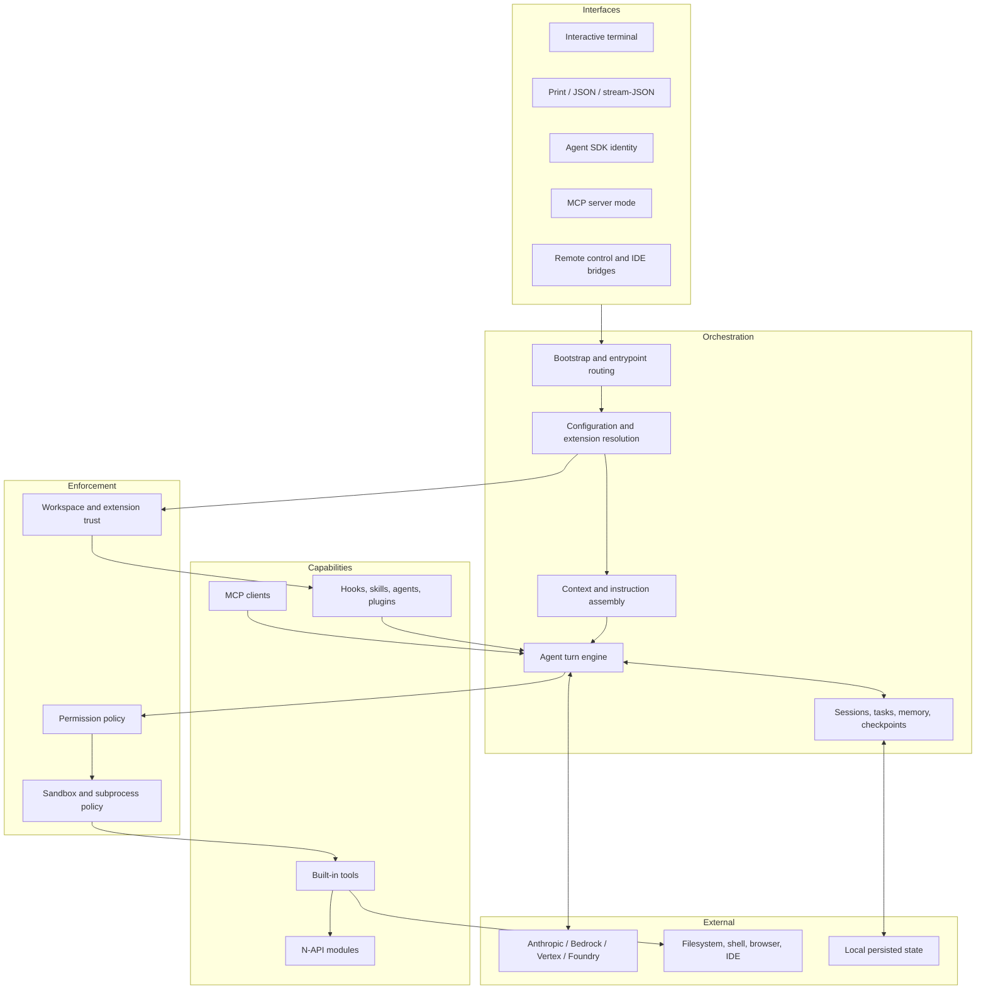

# Runtime Architecture

Claude Code `2.1.177` packages a local orchestration system into one native executable. The executable embeds a Bun runtime, a large application module, binding loaders, and platform-native add-ons. The model is reached over a provider transport; the client remains responsible for assembling context and executing local capabilities.

For a compact linked view, use the [visual system map](../maps/system-map.md)
and [execution-flow map](../maps/execution-flow.md).

## Trace the runtime by question

| Question | Mechanism | Runtime observation / proof |
|---|---|---|
| What is actually packaged in the executable? | [Mach-O and Bun container](binary-container.md) → [Bun/JSC deep dive](bun-jsc-deep-dive.md) | [Derived binary topology](https://github.com/swyxio/claude-code-internals/blob/main/evidence/binary-topology.json) |
| What happens before the first model request? | [Startup and entrypoint routing](startup.md) → [configuration resolution](configuration.md) | [Observed provider startup](../dynamics/runtime-startup-provider.md) |
| How does a model request become a local side effect? | [Agent loop](agent-loop-context.md) → [tool runtime](tool-runtime.md) → [permission engine](permissions.md) | [Observed tool loop](../dynamics/runtime-tool-session.md) |
| What can outlive one turn? | [Sessions and background work](sessions-background.md) | [Observed transcript shape](../dynamics/runtime-tool-session.md#transcript-record-sequence) |
| What can leave the process? | [Model providers and streaming](providers-transport.md) | [Network data-flow map](../maps/provider-network.md) |
| How is the artifact replaced? | [Installer and updater](updater-install.md) | [Versioned snapshot](../snapshot-2.1.177.md) |

## Architectural layers

Derived Anchor [`entrypoint.routing`](https://github.com/swyxio/claude-code-internals/blob/main/evidence/anchors.json) establishes that one binary recognizes multiple entrypoint identities through `CLAUDE_CODE_ENTRYPOINT`. CLI help separately exposes interactive, print, MCP-server, remote-control, IDE, background-agent, and worktree behaviors.

Derived The boxes above are analytical boundaries, not recovered original packages. They group behavior by inputs, outputs, side effects, and trust level so readers can reason about the system without mistaking minified bundler boundaries for product architecture.

## Core control loop

At the highest level, a session repeatedly accepts user input, builds a model request, consumes streamed model output, evaluates requested tool calls, executes approved capabilities, and returns results to the model. Completion is not equivalent to receipt of the last model token: background agents, held-back tool results, hooks, compaction, and persistence may still be active.

The [`agent-loop.idle-boundary`](https://github.com/swyxio/claude-code-internals/blob/main/evidence/anchors.json) anchor says the idle signal follows held-back-result flushing and exit from the background-agent loop. [`agents.pending-turn-state`](https://github.com/swyxio/claude-code-internals/blob/main/evidence/anchors.json) records pending background-agent and workflow counts at turn completion. Those observations make “idle” a coordination boundary rather than a rendering state.

## Four kinds of extension

The runtime exposes several mechanisms that are often conflated:

1. **Context extensions** add instructions or callable descriptions: `CLAUDE.md`, memory, skills, and custom agents.
2. **Lifecycle extensions** run around events: hooks and workflow machinery.
3. **Capability extensions** add callable systems: MCP servers, plugin-provided components, LSP, IDE, and browser integrations.
4. **Transport extensions** change where inference or control messages travel: cloud-provider routes, gateways, remote control, and stream-JSON.

Their security properties differ. A Markdown instruction does not execute by itself; a command hook does. An MCP server may be a local child process or a remote endpoint. A plugin is a container for multiple component types and therefore inherits the union of their risks.

## Stable facts versus moving policy

The binary layout, content hashes, CLI capture hashes, and anchor locations are stable for the artifact digest. Permission defaults, managed policy, account capability, remote configuration, and server behavior may vary even with the same binary. Pages therefore separate **mechanism** from **effective policy**.

For example, the binary contains a bypass-permissions mode and a managed setting that can disable it. The presence of the mode is an artifact fact; whether a particular organization permits it is runtime state outside this dataset.

## Browse the reconstruction

The repository’s independent [`reconstructed/`](https://github.com/swyxio/claude-code-internals/tree/main/reconstructed) expresses these layers as descriptive TypeScript contracts. Those files are optimized for browsing and cross-referencing, not compilation or behavioral cloning.
