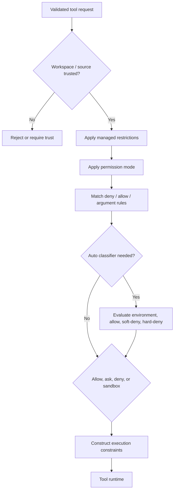

# Permission Engine

Visual companion: [settings and permissions map](../maps/settings-permissions.md).

The permission engine decides whether a requested local capability may proceed, must be confirmed, should be denied, or should be constrained by a sandbox. Its effective decision combines mode, rules, managed policy, workspace trust, tool identity, arguments, and environment posture.

## Advertised modes

The root CLI accepts six permission modes:

| Mode | Intended posture from the CLI surface |
|---|---|
| `default` | Ordinary interactive permission behavior |
| `acceptEdits` | Automatically accept an edit-oriented class of actions |
| `plan` | Analysis-oriented mode that avoids mutation/execution |
| `dontAsk` | Do not prompt; unresolved requests cannot rely on confirmation |
| `bypassPermissions` | Skip permission checks; explicitly warned for isolated sandboxes |
| `auto` | Use an automatic classifier and configured rule sets |

The table describes advertised intent, not a complete per-tool matrix. In particular, `acceptEdits` should not be read as “allow every tool,” and `dontAsk` should not be equated with bypass.

Observed dynamically In one
isolated Bash request, `dontAsk` without an allow rule returned an error tool
result and did not execute. Adding `--allowedTools Bash` produced a non-error
result and marker. [Permission probe](../dynamics/security-permissions-sandbox.md#dontask-and-explicit-allow).

## Decision model

Derived The graph expresses security gates, not a proven line-by-line evaluation order. Managed restrictions are shown first because the anchors demonstrate their ability to invalidate lower-trust choices.

## Managed controls

Derived [`permissions.managed-only`](https://github.com/swyxio/claude-code-internals/blob/main/evidence/anchors.json) records a policy that makes non-managed permission rules ineffective.

Derived [`permissions.disable-bypass`](https://github.com/swyxio/claude-code-internals/blob/main/evidence/anchors.json) records a policy control that disables bypass-permissions mode.

Derived [`sandbox.fail-closed`](https://github.com/swyxio/claude-code-internals/blob/main/evidence/anchors.json) records a managed deployment option that fails startup when a required sandbox is unavailable.

Together these show policy as a constraint layer, not merely another settings file.

## Subprocess hardening

[`permissions.subprocess-scrub`](https://github.com/swyxio/claude-code-internals/blob/main/evidence/anchors.json) says `CLAUDE_CODE_SUBPROCESS_ENV_SCRUB` forces default permissions unless tools are explicitly allowed. Derived A child process cannot safely inherit every ambient session assumption; the scrubbed posture rebuilds permission context from an explicit subset.

The related sandbox anchors establish three independent controls:

- `allowUnsandboxedCommands` can make a per-command sandbox-disable request ineffective.
- `autoAllowBashIfSandboxed` can allow sandboxed shell commands under explicit policy.
- `enableWeakerNetworkIsolation` is a macOS compatibility option whose name acknowledges reduced isolation.

These options should never be collapsed into one “sandbox enabled” boolean.

## Automatic mode

The `auto-mode` command can print defaults, print effective configuration, and request AI critique of custom rules. This exposes at least four conceptual rule sets: environment, allow, soft deny, and hard deny.

Derived [`auto-mode.anti-bypass`](https://github.com/swyxio/claude-code-internals/blob/main/evidence/anchors.json) says the classifier recognizes attempts to tunnel around a denial as bypass behavior. That is a policy signal, not proof the classifier detects every evasion.

## Rules and arguments

CLI examples use `Tool(optional-specifier)`, such as `Bash(git *)`, implying that permission matching can include structured or textual call detail. Tool aliases complicate this boundary: policy should match a stable canonical identity, while user-facing configuration may refer to an alias.

Open questions include exact wildcard semantics, quoting normalization, rule precedence across sources, canonicalization before matching, and how MCP tool namespaces interact with aliases. Until the rule parser is reconstructed and tested, the atlas does not promise shell-like glob behavior.
