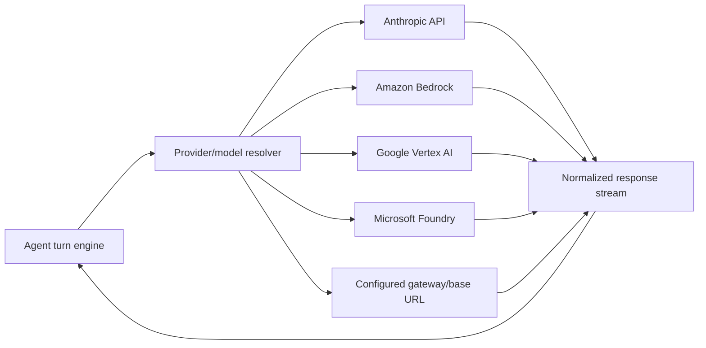

# Providers and Transport

Visual companion: [providers and network map](../maps/provider-network.md).

The client separates local orchestration from the inference provider. Version `2.1.177` contains routes for Anthropic’s API and three cloud-hosted alternatives, plus model selection, fallback, streaming, proxy, and credential controls.

## Provider routes

Derived The anchor ledger supports these provider-route interpretations:

- [`providers.bedrock`](https://github.com/swyxio/claude-code-internals/blob/main/evidence/anchors.json): `CLAUDE_CODE_USE_BEDROCK`;
- [`providers.vertex`](https://github.com/swyxio/claude-code-internals/blob/main/evidence/anchors.json): `CLAUDE_CODE_USE_VERTEX`;
- [`providers.foundry`](https://github.com/swyxio/claude-code-internals/blob/main/evidence/anchors.json): `CLAUDE_CODE_USE_FOUNDRY`.

The CLI’s bare-mode description explicitly says Bedrock, Vertex, and Foundry use their own credentials. These paths should be modeled as provider adapters with different authentication and request-signing behavior, not aliases for one base URL.

Derived “Normalized response stream” is the natural boundary required by the shared agent loop. Provider-specific wire schemas and retry semantics may still leak through metadata or error handling.

## Model selection and fallback

The root CLI supports a model alias or full model ID, an effort level, beta headers, a maximum dollar budget, and fallback models. Its help states that fallback is print-mode-only, accepts a comma-separated sequence, and retries the primary at the start of each user turn.

This establishes two distinct selectors:

1. the requested primary model and capability profile;
2. a turn-scoped availability fallback chain.

It does not establish that provider adapters expose identical model names or capabilities. Extension code should not infer tool use, image input, thinking, or context-window support from a display alias alone.

## Authentication boundary

[`auth.api-key`](https://github.com/swyxio/claude-code-internals/blob/main/evidence/anchors.json) establishes direct `ANTHROPIC_API_KEY` support. [`auth.api-key-helper`](https://github.com/swyxio/claude-code-internals/blob/main/evidence/anchors.json) establishes an executable helper path. [`auth.oauth-url`](https://github.com/swyxio/claude-code-internals/blob/main/evidence/anchors.json) identifies an explicit Claude.ai authorization endpoint constant.

Authentication selects a credential source; transport selects an endpoint/provider. Those choices intersect but are not interchangeable. In particular, bare mode refuses OAuth and keychain reads for first-party auth while leaving third-party provider credential mechanisms intact.

## Streaming protocols

Print mode supports text, one-shot JSON, and stream-JSON output. Stream-JSON can include partial message chunks, hook lifecycle events, prompt suggestions, and replayed input acknowledgments. Input can be plain text or realtime stream-JSON.

Derived The internal provider stream is adapted into a stable client event vocabulary, but the CLI output protocol also includes orchestration events that never came from the provider. Consumers must discriminate model content, tool activity, hook events, session state, and final result records.

## Proxy and custom endpoint risk

Custom base URLs, headers, proxies, certificate stores, and auth helpers can redirect or augment outbound requests. A repository-controlled helper is specifically trust-gated by [`workspace-trust.proxy-helper`](https://github.com/swyxio/claude-code-internals/blob/main/evidence/anchors.json).

The current evidence does not prove that every custom-header or proxy value is redacted from debug output. Treat transport configuration as secret-bearing and review logs before sharing them.
