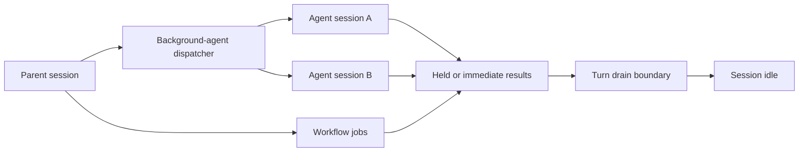

# Sessions and Background Work

Sessions provide identity and persistence around the agent loop. Background agents, workflows, worktrees, and remote control add work that can outlive a foreground response, so lifecycle and storage must be considered together.

## Session identity operations

The CLI exposes:

- `--session-id <uuid>` to select an explicit identity;
- `--continue` to use the most recent conversation in the current directory;
- `--resume [value]` to select by ID or picker search;
- `--fork-session` to create a new identity when continuing or resuming;
- `--no-session-persistence` for print mode;
- `--from-pr` to resume a session associated with a pull request;
- `--name` to assign a display name.

Derived Resume reuses conversation state; fork reuses prior context while separating future identity. The exact copied storage objects and parent linkage are not established by help text alone.

## Persisted project state

The `project purge [path]` help description names four categories it deletes: transcripts, tasks, file history, and a configuration entry. That is direct evidence that these categories belong to project state, though it does not establish their formats or locations.

[`sessions.local-transcript`](https://github.com/swyxio/claude-code-internals/blob/main/evidence/anchors.json) separately identifies transcript content in local persistence, while [`sessions.external-store`](https://github.com/swyxio/claude-code-internals/blob/main/evidence/anchors.json) identifies a bounded external `SessionStore` load path. Derived Session persistence is adapter-shaped rather than necessarily tied to one local file format.

Automatic memory is separately configurable. [`memory.enable`](https://github.com/swyxio/claude-code-internals/blob/main/evidence/anchors.json) says automatic memory reads and writes can be controlled independently. [`memory.project-path-hardening`](https://github.com/swyxio/claude-code-internals/blob/main/evidence/anchors.json) prevents a checked-in project setting from redirecting its directory.

## Background coordination

The `agents` command can select a working-directory scope, pass additional directories, choose model and effort, set permission mode, provide MCP and plugin configuration, and emit active sessions as JSON. It can optionally include completed sessions.

Derived [`agents.lifecycle-hook`](https://github.com/swyxio/claude-code-internals/blob/main/evidence/anchors.json) establishes a `SubagentStart` lifecycle event. The broader event set also includes `SubagentStop`, `TeammateIdle`, `TaskCreated`, and `TaskCompleted`.

Derived [`agents.pending-turn-state`](https://github.com/swyxio/claude-code-internals/blob/main/evidence/anchors.json) records pending background-agent and workflow counts at turn completion.

## Worktree isolation

`--worktree [name]` creates a Git worktree for a session. `--tmux` requires worktree mode and may use iTerm2 panes or classic tmux. Worktree isolation separates filesystem branches; it does not automatically isolate credentials, network, home-directory state, or process privileges.

The lifecycle vocabulary includes `WorktreeCreate` and `WorktreeRemove`, making worktree provisioning observable to hooks. A hook at either boundary can itself perform unsandboxed work depending on configuration, so isolation must include extension review.

## Remote-control state

[`remote.startup`](https://github.com/swyxio/claude-code-internals/blob/main/evidence/anchors.json) records automatic Remote Control startup. [`remote.peer-isolation`](https://github.com/swyxio/claude-code-internals/blob/main/evidence/anchors.json) records a mode that requires explicit approval before cross-machine messages.

Derived Remote control introduces at least three identities: the local session, the authenticated remote channel, and a peer machine. Approval and message routing should be documented separately from model authentication.

## Persistence hazards

Sensitive material can enter transcripts, tool results, debug logs, tasks, memory, checkpoints, or background-agent messages. `--no-session-persistence` only promises to disable session persistence in print mode; it should not be assumed to disable provider logging, shell history, hook logs, MCP server storage, telemetry, or application-level caches.
