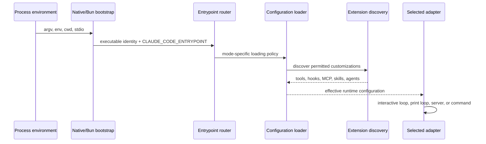

# Startup and Entrypoint Routing

One executable supports multiple invocation personalities. Startup is therefore a routing problem before it becomes an agent-loop problem.

## Entrypoint discriminator

Derived Anchor [`entrypoint.routing`](https://github.com/swyxio/claude-code-internals/blob/main/evidence/anchors.json) finds `CLAUDE_CODE_ENTRYPOINT` throughout the main module and supports routing among CLI, IDE, remote, SDK, MCP, GitHub Action, and other identities.

The public CLI independently exposes:

- an interactive session by default;
- non-interactive `--print` mode;
- text or stream-JSON input and output;
- `mcp serve`;
- `agents` management;
- `--remote-control` and `--ide`;
- worktree and tmux launch paths;
- install, update, auth, project, plugin, and diagnostic subcommands.

These are invocation surfaces, not necessarily separate processes. The routing anchor supports the interpretation that shared bootstrap code selects a specialized top-level adapter.

## Reconstructed startup sequence

Derived The order above is a conservative architecture model. Exact interleaving may differ: some prefetches or integration probes can start concurrently, and safe/bare modes deliberately skip categories of discovery.

## Mode gates

Three startup postures are visible in CLI help:

- **Normal** loads ordinary configuration and customization according to source selection and policy.
- **Safe mode** disables customizations such as instructions, skills, plugins, hooks, MCP servers, custom commands/agents, workflows, themes, and keybindings while retaining managed policy, auth, model selection, built-in tools, and permissions.
- **Bare mode** skips hooks, LSP, plugin synchronization, attribution, automatic memory, background prefetches, keychain reads, and automatic `CLAUDE.md` discovery. It constrains first-party auth to an API key or configured helper, while still allowing explicitly named inputs and skill resolution.

Those are not synonyms. See [Normal, Safe, and Bare Modes](../security/runtime-modes.md).

## Trust-sensitive startup work

Two advertised paths deserve special caution:

1. `--print` skips the interactive workspace-trust dialog. CLI help explicitly says to use it only in trusted directories; invalid settings can also be ignored silently in this mode.
2. `doctor` also skips the trust dialog and may spawn stdio servers from `.mcp.json` for health checks.

Derived Anchor [`workspace-trust.proxy-helper`](https://github.com/swyxio/claude-code-internals/blob/main/evidence/anchors.json) supports one defensive gate: a proxy authentication helper originating in project/local settings is skipped before workspace trust is accepted.

Hypothesis Other startup consumers of project-local executable configuration may have equivalent gates, but this dataset does not justify assuming universal coverage. Each executable setting class should be traced separately.

## Deep-link argument handling

Anchor [`deeplink.argument-injection`](https://github.com/swyxio/claude-code-internals/blob/main/evidence/anchors.json) records rejection of trailing arguments after a deep-link URI as possible argument injection. That is evidence of an explicit parser boundary between a URL payload and process arguments. It should be tested per platform before generalizing to every URL entrypoint.

## Failure boundaries

Startup can fail before UI initialization because of malformed explicit settings, missing auth, required sandbox unavailability, invalid native modules, or entrypoint-specific constraints. A useful reconstruction keeps those errors close to the layer that establishes the requirement rather than treating every early exit as a generic CLI error.
