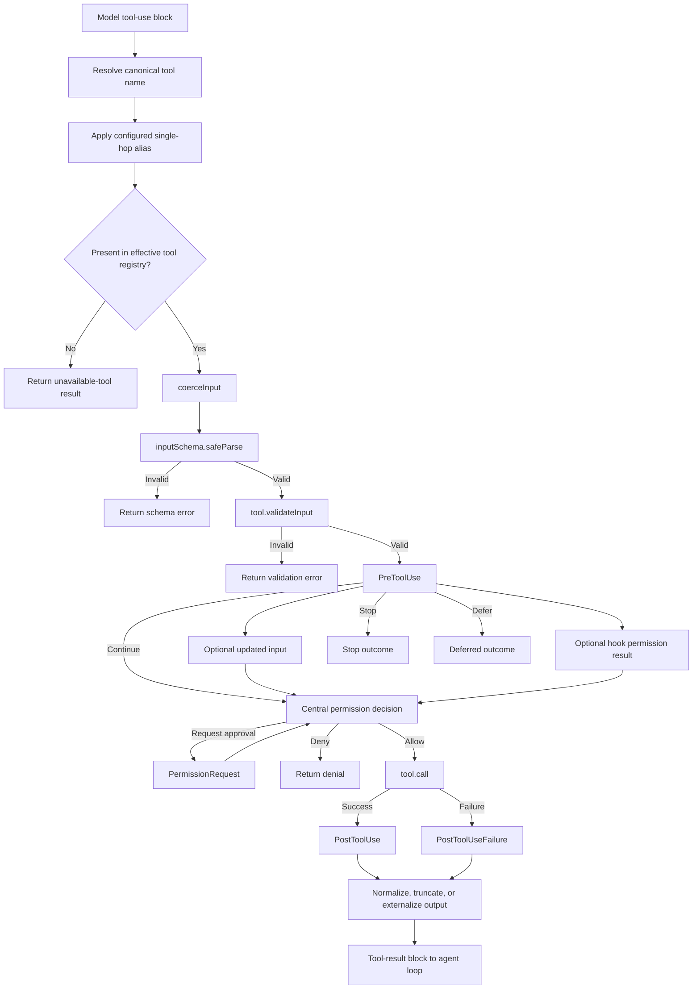

# Tool Runtime

Tools turn model output into local side effects. After registry and alias resolution, the shared execution path coerces input, schema-parses it, runs tool-specific validation, invokes `PreToolUse`, reaches the centralized permission decision, calls the tool, invokes the corresponding post-use hook, and returns a bounded result.

Derived [`tools.registry`](https://github.com/swyxio/claude-code-internals/blob/main/evidence/anchors.json) identifies a built-in registry assembled before mode and feature filtering. [`tools.execution-pipeline`](https://github.com/swyxio/claude-code-internals/blob/main/evidence/anchors.json) identifies a shared asynchronous path for individual tool calls.

## Reconstructed dispatch pipeline

Derived Exact bundle inspection establishes the shared per-tool order as coerce → schema `safeParse` → `validateInput` → `PreToolUse` → centralized permission decision, including `PermissionRequest` when needed → `tool.call` → `PostToolUse` or `PostToolUseFailure`. Registry availability and alias resolution happen before that shared path. The readable stage names and branch grouping are independent reconstruction terms; see [`reconstructed/tools/execution-pipeline.ts`](https://github.com/swyxio/claude-code-internals/blob/main/reconstructed/tools/execution-pipeline.ts).

## Registry shaping

The root CLI provides three distinct filters:

- `--tools` selects from the built-in set, with `""` disabling all and `default` selecting the ordinary set.
- `--allowedTools` / `--allowed-tools` adds permission allow rules using names such as `Bash(git *)` or `Edit`.
- `--disallowedTools` / `--disallowed-tools` adds deny rules.

Selection and permission are not the same operation. A tool can be registered but denied, or omitted entirely. Custom agents, plugin components, MCP servers, IDE integrations, and feature flags can further change the effective registry.

Derived Anchor [`tools.aliases`](https://github.com/swyxio/claude-code-internals/blob/main/evidence/anchors.json) records configurable single-hop aliases before resolution. “Single-hop” matters: recursively chasing aliases would allow cycles and make permission matching ambiguous.

## Capability classes

The help examples establish built-ins named `Bash`, `Edit`, and `Read`; other names should only be listed as supported when captured through schema, help, or a version-matched tool registry. Architecturally, tools fall into several classes:

| Class | Typical side effect | Additional boundary |
|---|---|---|
| Read/search | Workspace disclosure | Directory scope and ignore rules |
| Write/edit | File mutation | Checkpointing and edit permission |
| Shell/process | Arbitrary child behavior | Sandbox, environment scrub, network |
| Web/network | Outbound disclosure | URL policy, proxy, response handling |
| MCP | Third-party process or endpoint | Server approval and transport auth |
| Agent/task | Delegated work | Prompt and permission propagation |
| IDE/browser/computer use | External application control | Local IPC and OS permissions |

## Hook boundary

The lifecycle vocabulary contains pre-use, post-use, failure, and batch events. Exact bundle inspection shows that `PreToolUse` can supply updated input, a hook permission result for the centralized decision, a stop outcome, or a deferred outcome. The public reconstruction does not claim a complete payload schema or hook-aggregation algorithm. Those contracts belong in the [hook reference](../reference/hooks-plugins.md).

Because `PreToolUse` follows schema parsing and tool-specific validation, a hook rewrite occurs after the initial validation stages. This ordering should not be paraphrased as “permission before hooks,” and documentation should not assume a second schema/`validateInput` pass unless separately evidenced.

Derived Anchor [`plugins.monitor-trust`](https://github.com/swyxio/claude-code-internals/blob/main/evidence/anchors.json) says plugin monitor scripts execute unsandboxed at the same trust tier as hooks. A monitor is therefore executable extension code, not a read-only observer.

## Results and streaming

Tool results can be large, arrive asynchronously, or refer to files rather than inline content. The stream-JSON protocol can include hook lifecycle events and partial model messages. [`agent-loop.idle-boundary`](https://github.com/swyxio/claude-code-internals/blob/main/evidence/anchors.json) demonstrates that some results may be held back before idle.

Hypothesis The runtime likely uses tool-specific output normalization plus a shared token-budget layer. This is plausible from the range of capabilities and output limits, but the current public evidence does not establish one universal truncation algorithm.

## Extending safely

An extension author should define the smallest input schema, declare side effects, avoid returning secrets, honor cancellation, bound output, and expect denial. Tool implementations must not treat “the model asked for it” as authorization; the permission engine is the authority boundary.
