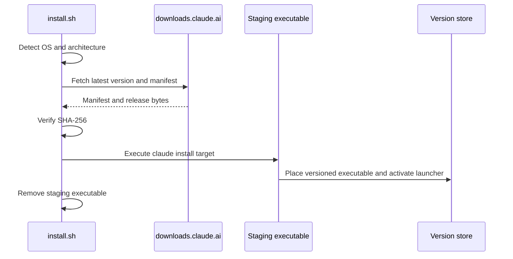

# Installer and Updater

Claude Code’s native installation uses version-named executables and an active launcher symlink. The captured bootstrap installer delegates final installation to the downloaded executable itself.

## Captured installation flow



<span class="evidence-label observed">Observed</span> The installer behavior and its capture-time SHA-256 are recorded in [`provenance.json`](https://github.com/swyxio/claude-code-internals/blob/main/evidence/provenance.json).

<span class="evidence-label derived">Derived</span> Anchor [`updates.release-origin`](https://github.com/swyxio/claude-code-internals/blob/main/evidence/anchors.json) supports Anthropic’s Claude Code release origin as the native-release source.

## Local layout

At capture time:

```text
$HOME/.local/bin/claude
  -> $HOME/.local/share/claude/versions/2.1.177

$HOME/.local/share/claude/versions/
  2.1.174
  2.1.175
  2.1.177
```

<span class="evidence-label derived">Derived</span> A symlink switch can activate a fully written version without rewriting the executable in place. Retained older files make manual rollback possible, but the public evidence does not establish an official rollback command, automatic rollback, retention count, or pruning policy.

## Integrity layers

There are at least three separable checks:

1. **Transport retrieval** obtains a manifest and artifact.
2. **Manifest checksum** verifies downloaded bytes against the release metadata.
3. **macOS code signature** identifies the signer and protects signed content on disk.

The captured `2.1.177` release matched its manifest and verified under the Anthropic Developer ID. A checksum alone does not authenticate a manifest, and a valid signature alone does not guarantee the update channel selected the intended version. Defense depends on the composition of these checks.

## Command surface

`claude install [stable|latest|version]` installs a native build and accepts `--force`. `claude update|upgrade` checks for and installs updates. `doctor` checks updater health, but its help warns that it skips the workspace-trust dialog and can spawn stdio MCP servers from `.mcp.json` while health-checking.

That doctor behavior couples updater diagnostics to project extension configuration. Run it only in a trusted directory or from a neutral directory without project-scoped MCP configuration.

## Snapshot drift

The installer reported `2.1.204` as latest when evidence was captured, while the active executable was `2.1.177`. The atlas intentionally documents the active binary rather than silently switching to the latest download.

For a new version:

1. copy neither the old claims nor offsets;
2. capture the new artifact hash and signature;
3. regenerate the module inventory and help captures;
4. resolve anchors against the new main-module hash;
5. mark claims confirmed, changed, absent, or unresolved;
6. review security-sensitive diffs privately before publishing.

Patch diffing can reveal vulnerabilities. Version comparisons should summarize behavior and disclose sensitive changes only under the process in [Threat Model and Disclosure](../security/threat-model-disclosure.md).
