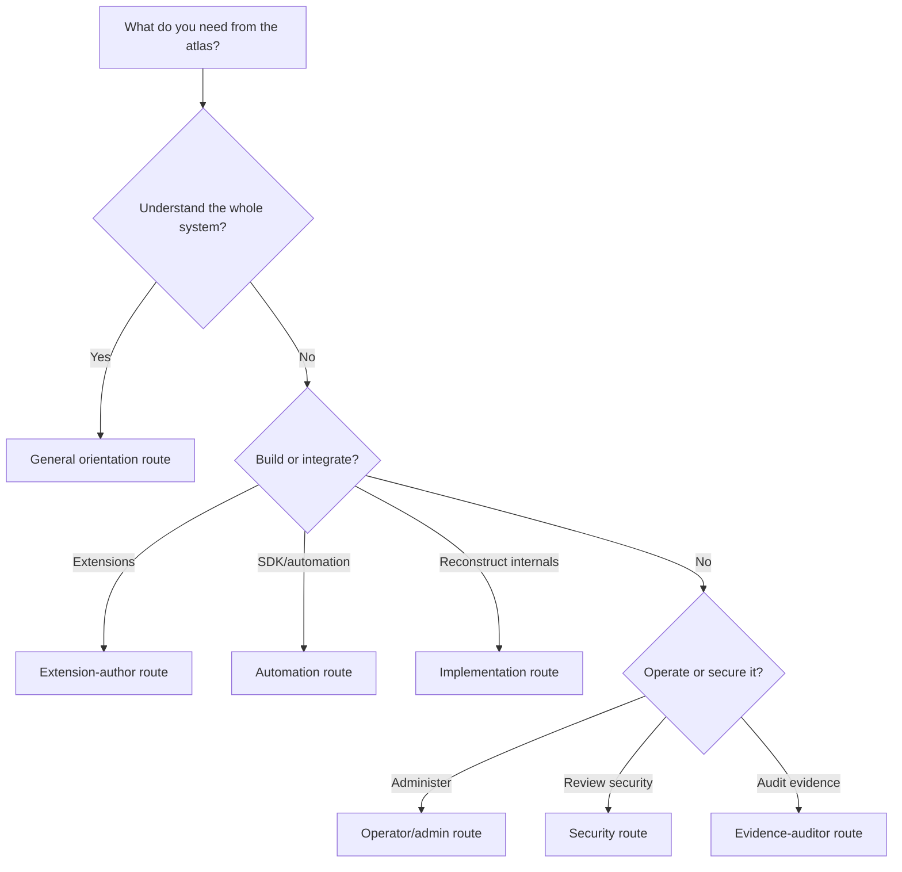

# Audience Reading Paths

Choose a route by the decision you need to make, not by repository folder order. Each route starts with a visual map, then links to long-form explanation, reconstructed contracts, and evidence.

## Route selector

This diagram is editorial navigation, not a statement about runtime behavior, so the maps’ O/D/H evidence markers do not apply to its branches.

## Reading-path matrix

| Audience | 10-minute route | 30-minute route | Deep route / source |
|---|---|---|---|
| Product or technical leader | [System map](../maps/system-map.md) → [threat summary](../maps/threat-model.md#threat-and-control-register) | Add [`D:scope`](https://github.com/swyxio/claude-code-internals/blob/main/docs/scope-and-method.md) and [`D:snapshot`](https://github.com/swyxio/claude-code-internals/blob/main/docs/snapshot-2.1.177.md) | [`E:claims`](https://github.com/swyxio/claude-code-internals/blob/main/evidence/claims.ndjson) for what is actually established |
| New implementation contributor | [Execution flow](../maps/execution-flow.md) → [evidence/code cross-reference](../maps/evidence-code-cross-reference.md) | Add [`D:architecture`](https://github.com/swyxio/claude-code-internals/blob/main/docs/architecture/index.md) | [`R:reconstruction-index`](https://github.com/swyxio/claude-code-internals/blob/main/reconstructed/README.md), then source files in call order |
| Extension or plugin author | [Extension surfaces](../maps/extension-surfaces.md) → [settings/permissions](../maps/settings-permissions.md) | Add [`D:plugins`](https://github.com/swyxio/claude-code-internals/blob/main/docs/extensibility/plugins.md), [`D:hooks`](https://github.com/swyxio/claude-code-internals/blob/main/docs/extensibility/hooks.md), and [`D:MCP`](https://github.com/swyxio/claude-code-internals/blob/main/docs/extensibility/mcp.md) | [`R:plugins`](https://github.com/swyxio/claude-code-internals/blob/main/reconstructed/plugins/loader.ts), [`R:hooks`](https://github.com/swyxio/claude-code-internals/blob/main/reconstructed/hooks/dispatcher.ts), [`R:MCP`](https://github.com/swyxio/claude-code-internals/blob/main/reconstructed/mcp/client-manager.ts) |
| Operator or administrator | [Settings/permissions](../maps/settings-permissions.md) → [provider/network](../maps/provider-network.md) | Add [persistence map](../maps/persistence-dataflow.md) and [`D:runtime modes`](https://github.com/swyxio/claude-code-internals/blob/main/docs/security/runtime-modes.md) | [`R:settings`](https://github.com/swyxio/claude-code-internals/blob/main/reconstructed/settings/resolution.ts), [`R:sandbox`](https://github.com/swyxio/claude-code-internals/blob/main/reconstructed/sandbox/runtime.ts) |
| Security or privacy reviewer | [Threat model](../maps/threat-model.md) → [provider/network](../maps/provider-network.md) → [persistence](../maps/persistence-dataflow.md) | Add [`D:trust boundaries`](https://github.com/swyxio/claude-code-internals/blob/main/docs/security/index.md) and [`D:supply chain`](https://github.com/swyxio/claude-code-internals/blob/main/docs/security/extension-supply-chain.md) | Trace every control through [evidence/code cross-reference](../maps/evidence-code-cross-reference.md) and [`E:claims`](https://github.com/swyxio/claude-code-internals/blob/main/evidence/claims.ndjson) |
| SDK or CI automation integrator | [Execution flow](../maps/execution-flow.md) → [provider/network](../maps/provider-network.md) | Add [`D:CLI reference`](https://github.com/swyxio/claude-code-internals/blob/main/docs/reference/cli.md) and [`D:headless`](https://github.com/swyxio/claude-code-internals/blob/main/docs/extensibility/headless-integrations.md) | [`H:root`](https://github.com/swyxio/claude-code-internals/blob/main/evidence/cli-help/root.txt), [`R:startup`](https://github.com/swyxio/claude-code-internals/blob/main/reconstructed/startup/cli-bootstrap.ts), [`R:model-stream`](https://github.com/swyxio/claude-code-internals/blob/main/reconstructed/engine/model-stream.ts) |
| Evidence or legal auditor | [Evidence/code cross-reference](../maps/evidence-code-cross-reference.md) → [`D:methodology`](https://github.com/swyxio/claude-code-internals/blob/main/docs/evidence/methodology.md) | Add [`D:claim ledger`](https://github.com/swyxio/claude-code-internals/blob/main/docs/evidence/claim-ledger.md) and [`D:limitations`](https://github.com/swyxio/claude-code-internals/blob/main/docs/evidence/versions-limitations.md) | [`E:provenance`](https://github.com/swyxio/claude-code-internals/blob/main/evidence/provenance.json), [`E:inventory`](https://github.com/swyxio/claude-code-internals/blob/main/evidence/binary-inventory.json), [`E:anchors`](https://github.com/swyxio/claude-code-internals/blob/main/evidence/anchors.json), [`E:claims`](https://github.com/swyxio/claude-code-internals/blob/main/evidence/claims.ndjson) |

## Questions the atlas can answer quickly

| Question | Start here | Source-of-truth follow-up |
|---|---|---|
| Why did a tool not run? | [Execution flow](../maps/execution-flow.md#tool-call-pipeline) | [`R:tool-pipeline`](https://github.com/swyxio/claude-code-internals/blob/main/reconstructed/tools/execution-pipeline.ts), [`R:permissions`](https://github.com/swyxio/claude-code-internals/blob/main/reconstructed/permissions/engine.ts) |
| Can project settings override managed policy? | [Settings/permissions](../maps/settings-permissions.md#known-constraints-versus-unknown-precedence) | Claims `security.managed-permission-rules` and `security.disable-bypass-mode` in [`E:claims`](https://github.com/swyxio/claude-code-internals/blob/main/evidence/claims.ndjson) |
| Which extension can execute local code? | [Extension matrix](../maps/extension-surfaces.md#surface-matrix) | [`R:hooks`](https://github.com/swyxio/claude-code-internals/blob/main/reconstructed/hooks/dispatcher.ts), [`R:plugins`](https://github.com/swyxio/claude-code-internals/blob/main/reconstructed/plugins/loader.ts), [`R:MCP`](https://github.com/swyxio/claude-code-internals/blob/main/reconstructed/mcp/client-manager.ts) |
| What leaves the machine? | [Provider/network map](../maps/provider-network.md#network-surface-matrix) | [`R:providers-http`](https://github.com/swyxio/claude-code-internals/blob/main/reconstructed/auth/providers-http.ts), [`R:telemetry`](https://github.com/swyxio/claude-code-internals/blob/main/reconstructed/telemetry/telemetry.ts) |
| What persists after a turn? | [Persistence map](../maps/persistence-dataflow.md) | [`R:sessions`](https://github.com/swyxio/claude-code-internals/blob/main/reconstructed/persistence/sessions.ts), [`R:memory`](https://github.com/swyxio/claude-code-internals/blob/main/reconstructed/memory/auto-memory.ts) |
| Is a map edge fact or interpretation? | [Map legend](../maps/index.md#epistemic-legend) | Basis field in [`E:claims`](https://github.com/swyxio/claude-code-internals/blob/main/evidence/claims.ndjson) |

## Recommended baseline for every reader

Read the [map legend](../maps/index.md#epistemic-legend), the [`2.1.177` snapshot](https://github.com/swyxio/claude-code-internals/blob/main/docs/snapshot-2.1.177.md), and the [limitations](https://github.com/swyxio/claude-code-internals/blob/main/docs/evidence/versions-limitations.md) before treating a relationship as current product behavior.
