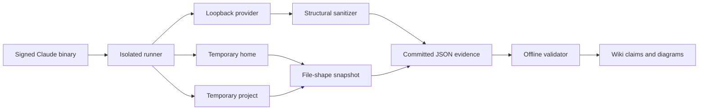

# Runtime Observations

Static anchors show that a string, schema, or branch exists. Dynamic probes show
which boundaries the installed executable actually crosses under a controlled
scenario. This section combines both forms without treating one successful run
as universal proof.

## Safety envelope

Every committed probe runs the exact binary identified by the
[artifact provenance](../snapshot-2.1.177.md) with:

- a fresh temporary `HOME`, `CLAUDE_CONFIG_DIR`, and project;
- an allowlisted environment and dummy credential;
- provider traffic redirected to a loopback fixture;
- telemetry and nonessential traffic disabled;
- bounded stdout, stderr, and request-body capture;
- structural sanitization before anything enters `evidence/dynamic/`;
- no retained system prompts, message text, tool descriptions, credentials, or
  user configuration.

The reusable implementation is split into the
[probe runner](https://github.com/swyxio/claude-code-internals/blob/main/tools/probes/lib/probe-runner.mjs),
[loopback Anthropic fixture](https://github.com/swyxio/claude-code-internals/blob/main/tools/probes/lib/fake-anthropic-server.mjs),
and [request sanitizer](https://github.com/swyxio/claude-code-internals/blob/main/tools/probes/lib/sanitize-request.mjs).

## Evidence classes

| Label | Meaning | Appropriate conclusion |
| --- | --- | --- |
| **Observed dynamically** | Recorded at a named boundary in a committed probe | This version did it in this scenario |
| **Derived** | Best explanation combining dynamic and static evidence | Likely mechanism, not direct execution proof |
| **Unexercised** | Present in static evidence but not reached by a probe | Implementation surface exists; behavior remains open |

## Probe map

## Current probes

- [Provider protocol smoke test](protocol-smoke.md) — startup reachability,
  Messages API request shape, stream event ordering, and bare-mode filesystem
  side effects.
- [Runtime probe method](runtime-probe-method.md) — allowlisted environments,
  loopback fixtures, an OS-enforced network boundary, and publication rules.
- [Runtime startup and provider turn](runtime-startup-provider.md) — an
  invocation path that reaches `POST /v1/messages` without the smoke probe's
  `HEAD /` preflight.
- [Runtime tool loop and sessions](runtime-tool-session.md) — a three-request
  `Read` → `Bash` feedback loop and sanitized transcript event structure.
- [Extension runtime dynamics](extensions-runtime.md) — scalar settings
  precedence, concurrent sibling hooks, MCP stdio dispatch, and explicit
  agent/skill/plugin discovery.
- [Permission and sandbox dynamics](security-permissions-sandbox.md) —
  `dontAsk` denial versus an explicit allow rule and a bounded fail-closed
  sandbox write test.

Additional runtime, tool-loop, session, hook, MCP, plugin, skill, agent, and
security probes are added here only after their sanitizers and offline
validators pass.
