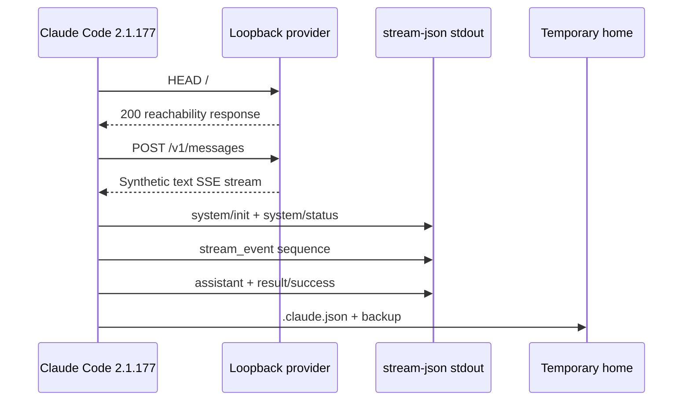

# Provider Protocol Smoke Test

**Observed dynamically — Claude Code 2.1.177, artifact
`eb073035…e40ed9`.** The real signed executable completed one text-only turn
against a loopback Anthropic-compatible endpoint in `--bare --print` mode.

[Probe source](https://github.com/swyxio/claude-code-internals/blob/main/tools/probes/core/protocol-smoke.mjs)
· [sanitized report](https://github.com/swyxio/claude-code-internals/blob/main/evidence/dynamic/core/protocol-smoke.json)
· [offline validator](https://github.com/swyxio/claude-code-internals/blob/main/tools/validate-dynamic-evidence.mjs)

## Boundary sequence

## Transport observations

The CLI first issued an unauthenticated `HEAD /` using the `Bun/1.3.14` user
agent. It then sent one authenticated `POST /v1/messages` using
`claude-cli/2.1.177 (external, sdk-cli)`. The credential itself was discarded;
the report retains only that `x-api-key` was present and `authorization` was
absent.

The Messages request exposed these top-level fields:

`context_management`, `max_tokens`, `messages`, `metadata`, `model`, `stream`,
`system`, `thinking`, and `tools`.

The request advertised protocol families for Claude Code, interleaved thinking,
context management, and prompt-caching scope through `anthropic-beta`. The exact
header names and safe protocol values remain searchable in the report.

!!! note "Content boundary"
    The three system blocks and two user-content blocks are represented by type,
    byte length, and SHA-256 only. The atlas does not publish their text.

## Output stream

With partial messages enabled, the observed order was:

1. `system/init`
2. `system/status`
3. `message_start`
4. `content_block_start`
5. `content_block_delta`
6. aggregate `assistant`
7. `content_block_stop`
8. `message_delta`
9. `message_stop`
10. `result/success`

The init record named the model, tools, agents, skills, plugins, MCP servers,
permission mode, output style, and CLI version as public SDK fields. This probe
disabled tools, so both the init tool list and API `tools` array were empty.

## Filesystem observation

`--no-session-persistence` prevented a conversation transcript, but did not
make the invocation write-free. Under the new temporary home the process still
created:

- `.claude/.claude.json`
- `.claude/backups/.claude.json.backup.$EPOCH_MS`

This narrows the meaning of the flag: it suppresses session persistence, not
all application-state writes. The committed report stores only normalized
relative paths, sizes, and hashes.

## What this does not establish

- It does not show the authenticated OAuth path or third-party providers.
- It does not exercise retries, errors, tool calls, hooks, MCP, or compaction.
- A loopback endpoint cannot prove all production network destinations.
- `--bare` intentionally omits several normal-mode customization paths.

Those are separate probes so each conclusion retains a small, reviewable test
surface.
