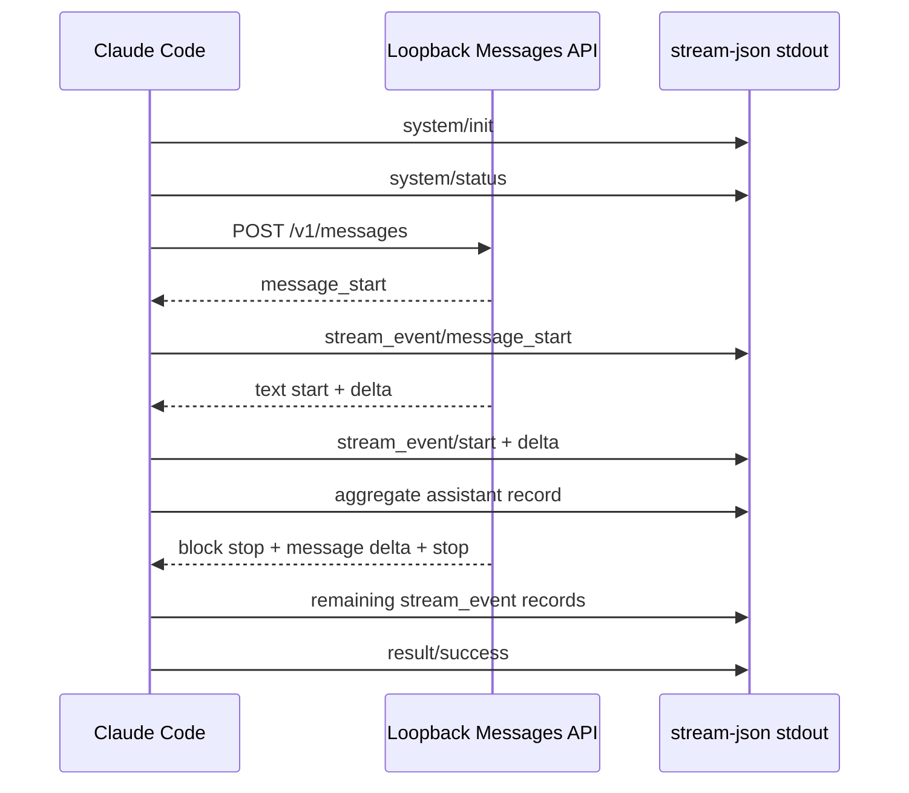

# Runtime Startup and Provider Turn

**Observed dynamically — Claude Code 2.1.177, artifact
`eb073035…e40ed9`.** A bare-and-safe print invocation completed one synthetic
text turn against a loopback Anthropic-compatible endpoint while macOS denied
all non-loopback outbound networking.

[Probe method](runtime-probe-method.md)
· [sanitized report](https://github.com/swyxio/claude-code-internals/blob/main/evidence/dynamic/runtime/runtime-dynamics.json)

## Invocation-sensitive provider preflight

The first and only HTTP request in this case was `POST /v1/messages`. There was
no preceding `HEAD /` request.

This differs from the separate [provider protocol smoke test](protocol-smoke.md),
where a bare invocation issued `HEAD /` and then `POST /v1/messages`. The runtime
case additionally enabled safe mode and supplied a synthetic system prompt, so
the comparison proves only that the reachability preflight is
invocation-sensitive. It does not isolate which flag or startup state controls
the difference.

## Messages request shape

The POST carried a dummy `x-api-key`; the report retains the header name but not
its value. Its top-level JSON fields were:

`context_management`, `max_tokens`, `messages`, `metadata`, `model`,
`output_config`, `stream`, `system`, `thinking`, and `tools`.

The request used streaming with a numeric `max_tokens`. The custom system input
was expanded into three text blocks, two of which had `cache_control`. The
single user message contained two text blocks, with `cache_control` on the
second. Text is represented only by length and digest. Because this case passed
an empty tool selection, the provider request contained zero tools.

## Provider-to-CLI event adaptation

The fake provider returned the standard six-event text sequence:

1. `message_start`
2. `content_block_start` with a text block
3. `content_block_delta` with a text delta
4. `content_block_stop`
5. `message_delta`
6. `message_stop`

The stream-JSON boundary added orchestration records around it:

The aggregate `assistant` record appeared after the text delta and before the
provider’s block-stop record was exposed. This ordering is an observation of
partial-message print mode, not a universal buffering contract.

## File behavior without session persistence

`--no-session-persistence` produced no transcript JSONL. It did not make
startup write-free: the temporary home gained `.claude/.claude.json` and one
timestamped backup, both mode `0600`. This independently reproduces the file
boundary seen by the core smoke probe.
