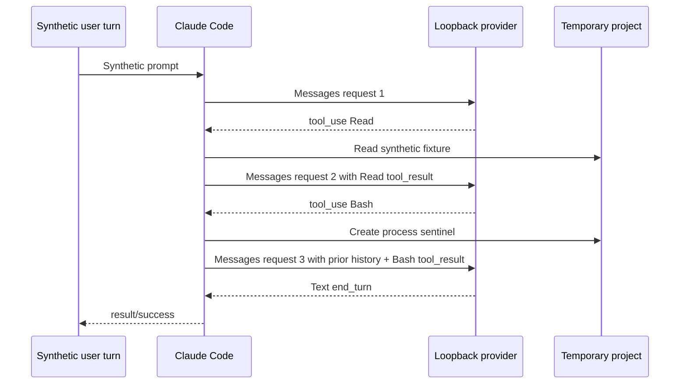

# Runtime Tool Loop and Session Persistence

**Observed dynamically — Claude Code 2.1.177, artifact
`eb073035…e40ed9`.** One synthetic user turn executed `Read`, fed its result
back to the model, executed `Bash`, fed that result back, and completed on the
third Messages response.

[Probe method](runtime-probe-method.md)
· [sanitized report](https://github.com/swyxio/claude-code-internals/blob/main/evidence/dynamic/runtime/runtime-dynamics.json)

## Three-request feedback loop

The effective provider tool list contained `Bash` and `Read`. The loop proceeded
as follows:

Request 2 contained the original user message, the assistant `Read` tool-use
block, and a user `tool_result`. Request 3 retained that history and appended
the assistant `Bash` tool-use block plus its user `tool_result`. This directly
demonstrates that tool feedback becomes conversation history before the next
provider request.

## Moving cache boundary

In request 2, the newly appended `Read` result carried `cache_control`. In
request 3, that older result no longer carried the field, while the newly
appended `Bash` result did.

Derived In this run, the client
repositioned a cache marker to the newest tool-result boundary rather than
leaving it on every historical result. One success trace does not establish the
complete prompt-caching policy or behavior under parallel tool calls.

## Stream-JSON turn boundaries

Each model response emitted the provider stream events and an aggregate
`assistant` record. After each tool completed, stream JSON emitted a `user`
record for the tool result, followed by `system/status` before the next provider
stream. The final response ended with `result/success`.

The sanitized event sequence therefore exposes three distinct layers:

- provider SSE events wrapped as `stream_event`;
- aggregate assistant and tool-result user messages;
- orchestration status and final result records.

## Transcript record sequence

With persistence enabled and a fixed synthetic session ID, the process created
one mode-`0600` JSONL transcript. Its nine records were:

1. `queue-operation`
2. `queue-operation`
3. `user`
4. `assistant` with `Read` tool use
5. `user` with `Read` tool result
6. `assistant` with `Bash` tool use
7. `user` with non-error `Bash` tool result
8. `assistant` with final text
9. `last-prompt`

The report publishes record types, field names, block types, lengths, and
hashes—not transcript values. The presence of `queue-operation` records before
the conversational records shows that the local transcript is an event log,
not merely a serialized message array.

## Process and file effects

The `Read` input named only a synthetic fixture in the temporary project. The
fixed `Bash` command created a sentinel of 18 bytes with mode `0644`; only its
hash and metadata were retained. Both the CLI and its child process inherited
the OS policy denying non-loopback outbound sockets.

As in the text-only case, the temporary home also gained a mode-`0600` Claude
state file and backup. Session persistence added the transcript; tool execution
added the project sentinel.

## Limits

The run intentionally used bypass permissions inside the isolated harness so
it did not exercise interactive approval, denial, or `PermissionRequest`.
Safe/bare mode disabled hooks, plugins, MCP, skills, and normal project
customizations. The trace establishes sequential `Read` → `Bash` behavior only;
parallel tool scheduling remains untested.
