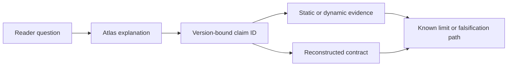

# Evidence and Traceability

This section is the atlas's audit surface. Use it to distinguish a directly
captured fact from an interpretation, reproduce the safe parts of the analysis,
or move from a prose statement to its supporting artifact and explanatory
contract.

## Follow a claim

| Need | Start here | Continue to |
|---|---|---|
| Understand how observations were collected | [Evidence method and reproduction](methodology.md) | [Scope and publication boundaries](../scope-and-method.md) |
| Browse all established claims | [Claim catalog](claim-ledger.md) | [`evidence/claims.ndjson`](https://github.com/swyxio/claude-code-internals/blob/main/evidence/claims.ndjson) |
| Find the code model behind a claim | [Evidence-to-code index](../maps/evidence-code-cross-reference.md) | [`reconstructed/`](https://github.com/swyxio/claude-code-internals/tree/main/reconstructed) |
| Check what remains unknown | [Version scope and open gaps](versions-limitations.md) | [Runtime observations](../dynamics/index.md) |
| Review the publication boundary | [Legal and ethics](../legal-and-ethics.md) | [Security research and disclosure](../security/threat-model-disclosure.md) |

## Evidence vocabulary

Observed values were captured from
the version-matched artifact, signed metadata, CLI output, or a controlled
dynamic boundary.

Derived interpretations connect
multiple observations without claiming to recover Anthropic's original module
boundaries.

Hypothesis models are explicitly
open and include a path for confirmation or rejection.
