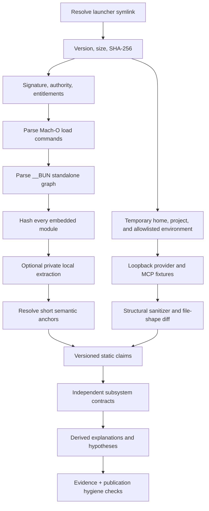

# Reconstruction Methodology

Browse the result through the
[evidence-to-code cross-reference](../maps/evidence-code-cross-reference.md).

The project uses an evidence-preserving pipeline: identify one artifact, derive
bounded metadata, locate short semantic anchors privately, exercise selected
runtime boundaries under temporary isolation, write an independent architecture,
and publish only claims that can point back to sanitized evidence.

## Pipeline



## 1. Artifact identity

The launcher is resolved to its real file before hashing. Version output, byte size, platform, release manifest URL, manifest-checksum result, signature identity, and build metadata are recorded in [`provenance.json`](https://github.com/swyxio/claude-code-internals/blob/main/evidence/provenance.json).

The SHA-256 is the primary snapshot key. Version strings are labels and can be ambiguous if a vendor republishes bytes or platforms differ.

## 2. Container parsing

[`inspect-binary.mjs`](https://github.com/swyxio/claude-code-internals/blob/main/tools/inspect-binary.mjs) reads a thin little-endian 64-bit Mach-O, walks bounded load commands, finds exactly one `__BUN,__bun` section, validates the payload size/trailer, and decodes Bun’s standalone module table.

<span class="evidence-label observed">Observed</span> The executable literally embeds Bun version string `1.3.14+2a41ca974`, whose revision portion is a nine-character prefix.

<span class="evidence-label derived">Derived</span> That prefix resolves upstream to commit `2a41ca974b7302952252a20eddbb3b5c3f2dee9b`. The parser follows the resolved revision’s MIT-licensed [`StandaloneModuleGraph.zig`](https://github.com/oven-sh/bun/blob/2a41ca974b7302952252a20eddbb3b5c3f2dee9b/src/standalone_graph/StandaloneModuleGraph.zig) layout rather than a mutable `main`-branch implementation. It rejects out-of-range offsets, unsafe integer sizes, malformed module tables, and path traversal in local extraction destinations.

The public [`binary-inventory.json`](https://github.com/swyxio/claude-code-internals/blob/main/evidence/binary-inventory.json) contains virtual module names, formats, sides, offsets, lengths, and content hashes—not module bytes.

## 3. Private extraction and anchors

Local extraction is optional and writes to an ignored work directory. It is used to find small non-substantial identifiers or messages that distinguish a subsystem. [`anchor-spec.json`](https://github.com/swyxio/claude-code-internals/blob/main/evidence/anchor-spec.json) defines expected anchor IDs and search terms. [`anchors.json`](https://github.com/swyxio/claude-code-internals/blob/main/evidence/anchors.json) records:

- artifact and entry-module hashes;
- subsystem and independently written claim;
- short search needle;
- occurrence count;
- main-module and absolute file offsets.

An occurrence count is not a confidence score. A frequently repeated string may come from duplicated schema or vendor code; a unique message can be more diagnostic. The canonical machine-readable interpretations are separate records in [`claims.ndjson`](https://github.com/swyxio/claude-code-internals/blob/main/evidence/claims.ndjson), where each statement receives an observed, derived, or hypothesis basis.

## 4. Controlled runtime probes

Dynamic probes run the exact artifact under a fresh temporary `HOME`,
configuration directory, and project with dummy credentials, disabled
nonessential traffic, bounded output, and loopback fixtures. Core and extension
scenarios inherit an OS policy that denies non-loopback network access; the
nested product-sandbox scenario omits the outer policy so it can test the
product boundary without confounding it.

Only structural summaries enter `evidence/dynamic/`: field names, value types,
counts, event ordering, hashes, modes, and relative file shapes. Raw prompts,
tool descriptions, command text, provider content, credentials, user settings,
and transcript content are rejected by sanitizers and offline validators. See
the [runtime probe method](../dynamics/runtime-probe-method.md) and
[observation index](../dynamics/index.md) for scenario-specific limits.

## 5. Independent reconstruction

The [`reconstructed/`](https://github.com/swyxio/claude-code-internals/tree/main/reconstructed) files describe contracts, state transitions, side effects, trust boundaries, and unresolved questions. Names such as `turn-engine.ts` or `permissions/engine.ts` are analytical names unless a virtual path or preserved source filename is explicitly anchored.

The reconstruction does not need to compile. Fidelity is measured by traceability and explanatory power, not by reproducing proprietary implementation.

## 6. Claim classes

| Class | Required support | Example |
|---|---|---|
| Observed | Literal artifact metadata, CLI text, parsed value, or anchor occurrence/offset | The `strictMcpConfig` needle has recorded offsets and an occurrence count |
| Derived | Named observations plus explicit inference | Strict MCP mode excludes non-explicit sources |
| Hypothesis | Plausible model and falsification path | All IPC messages use a shared authenticated envelope |

When a page mixes classes, labels are placed at paragraph level. “Observed” never means independently security-audited.

## 7. Reproduction

Against the exact installed artifact:

```sh
export CLAUDE_BINARY="$HOME/.local/share/claude/versions/2.1.177"
expected_sha256="eb0730351be2f02b482b1855870f5877489085aac86b0c4c1db4e458d9e40ed9"
actual_sha256="$(shasum -a 256 "$CLAUDE_BINARY" | awk '{print $1}')"
test "$actual_sha256" = "$expected_sha256"
npm run check
```

Do not regenerate the `2.1.177` evidence files unless this exact fixture-hash check succeeds. A binary with the same version label but a different digest is a new subject and needs separate provenance rather than overwriting this snapshot.

To regenerate public metadata in a working copy:

```sh
npm run inspect -- --out evidence/binary-inventory.json
npm run anchors -- --out evidence/anchors.json
npm run capture-help
npm run check
```

The explicit `--out` arguments write the inventory and anchor ledger. Without `--out`, those two commands are previews printed to stdout and do not regenerate the committed files. `capture-help` writes its documented help captures and index from a temporary clean home/config and allowlisted environment. Review every diff before committing, and never add `.work/` extraction output.

Dynamic evidence has a separate safety contract. Read the
[probe method](../dynamics/runtime-probe-method.md) before running
`npm run probe:core`, `npm run probe:runtime`, or
`npm run probe:extensions`; then use `npm run validate:dynamic` to verify the
sanitized report shapes. Do not redirect those probes to a production provider
or reuse a real user home/configuration.

## 8. Hygiene validation

`npm run validate` exercises the parser against a synthetic Mach-O/Bun graph,
reconciles cross-file hashes, pointers, CLI captures, claims, and generated
anchor coordinates, validates dynamic report invariants and presentation
routes, then scans the publication set. The scan rejects known recovered-module
hashes, executable/archive magic, private-key and token patterns, native
executable extensions, and unexpectedly large files—even when a file is
force-added inside an ignored directory. `npm run check` adds exact-fixture
malformed-metadata tests and verifies every anchor occurrence against the
private entry-module bytes. Documentation adds a strict MkDocs build plus a
generated route/asset audit before deployment.

## Reproducibility limits

Code signature verification and installer capture use platform tools and current network state, while the committed evidence is a dated snapshot. A fully reproducible future capture should also record tool versions, command transcripts, locale, and the fetched manifest body hash.
