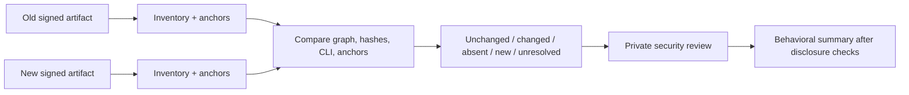

# Versions and Limitations

The atlas is a detailed snapshot, not a timeless specification. Its strongest claims are limited to one file digest and one platform.

## Captured version

| Property | Value |
|---|---|
| Version | `2.1.177` |
| Platform | macOS arm64 |
| Artifact SHA-256 | `eb0730351be2f02b482b1855870f5877489085aac86b0c4c1db4e458d9e40ed9` |
| Entry-module SHA-256 | `45cb1eaa2b7e274ce87b1df0a1729f017ac06fffe782fac8acb42ab186243573` |
| Capture date | 2026-07-08 |
| Latest reported by installer at capture | `2.1.204` |

The capture host retained three versioned executables:

| Version | Size | SHA-256 |
|---|---:|---|
| `2.1.174` | 224,051,232 | `20c5380b4423be9963c510f5464cc1f443235a9b4423179f9c01f28021b81bad` |
| `2.1.175` | 224,216,352 | `6b75bf132c866ed409bf913c318ca32011e73ffb12d3cd67ecc37bc4ee9ec65d` |
| `2.1.177` | 225,124,512 | `eb0730351be2f02b482b1855870f5877489085aac86b0c4c1db4e458d9e40ed9` |

These identities are recorded in [`installed-versions.json`](https://github.com/swyxio/claude-code-internals/blob/main/evidence/installed-versions.json), but only `2.1.177` has a committed full inventory and anchor set. The older files have not yet been interpreted as a behavioral version diff.

## Major limitations

### Platform coverage

Only the macOS arm64 native build was parsed. Linux, Windows, x86_64, WSL, and package-manager distributions may have different native modules, sandbox implementations, paths, signatures, and integration code.

### Server-side opacity

The artifact does not reveal model implementation, server authorization, account flags, remote policy, retention, or provider infrastructure. Endpoint and client-schema anchors are not server source.

### No production runtime probing

Published evidence comes from static inspection and read-only help. The project did not log into accounts, run tools, connect MCP servers, invoke remote control, capture network traffic, or mutate settings to produce this documentation.

### Bundling and minification

Most application logic is one bundled CJS module with no source map in the Bun graph. Descriptive reconstruction boundaries are ours. An anchor can identify a behavior without recovering original names or file topology.

### Feature gating

Code can be dormant, experiment-gated, account-gated, platform-specific, or unreachable in the selected entrypoint. String presence is not activation. CLI presence is not account entitlement.

### Configuration variability

Managed policy, user/project/local settings, environment, plugins, MCP servers, cloud credentials, and remote state can materially change effective behavior with identical executable bytes.

## Confidence erosion over time

Documentation can become stale in three ways:

1. a new executable changes local behavior;
2. a server changes behavior used by the old executable;
3. legal terms or public product documentation change.

Artifact facts remain historically valid, while deployment advice and legal links require periodic review.

## Version-diff procedure

Do not diff only pretty-printed bundle text. Stable layers include signature/build metadata, module graph, content hashes, help captures, semantic anchor resolution, and independently reconstructed contracts.

## Known research gaps

- Complete configuration schema and source precedence.
- Runtime tool registry and tool schemas by mode.
- Permission-rule grammar and canonicalization.
- Hook payload/result contracts and ordering.
- Stream-JSON event schemas.
- IDE, Chrome, and remote-control IPC framing/authentication.
- Native add-on interfaces and OS permission flows.
- Session storage locations, encryption, and retention.
- Provider-specific retry, fallback, and error normalization.
- Effective telemetry payloads and redaction.

Each gap should be addressed with synthetic data and minimal authority. Security-relevant results must pass disclosure review before publication.
