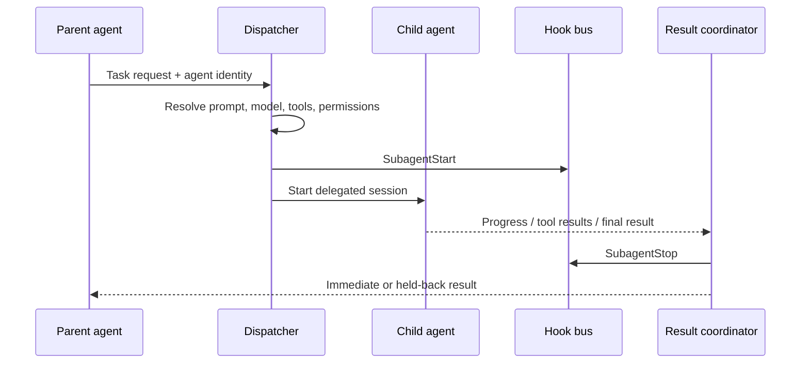

# Agents and Skills

Custom agents and skills both specialize model behavior, but at different granularity. A skill is a named procedure loaded into a session; an agent is a delegated execution context with its own prompt, model, tools, and lifecycle.

## Custom-agent inputs

The CLI supports:

- `--agent <name>` to select an agent for the current session;
- `--agents <json>` to define agents inline, with at least description and prompt fields;
- agent settings loaded from configured sources and plugins;
- `agents` view defaults for model, effort, permissions, directories, MCP, and plugins.

Derived An agent definition is a policy bundle, not just a prompt. Its effective behavior depends on inherited and overridden tools, model, directories, extensions, and permission mode.

Observed dynamically Selecting one
inline synthetic agent increased the init agent catalog by one, added its
prompt marker at the request system boundary, and narrowed advertised tools to
the agent's `Read` allowlist. This proves selected-agent assembly for the
fixture, not complete parent/child inheritance.

## Delegation flow

Derived [`agents.lifecycle-hook`](https://github.com/swyxio/claude-code-internals/blob/main/evidence/anchors.json) establishes `SubagentStart`; the global event vocabulary includes `SubagentStop`.

Derived [`agents.append-prompt`](https://github.com/swyxio/claude-code-internals/blob/main/evidence/anchors.json) says an optional prompt fragment propagates to Task subagents and nested subagents. This is explicit prompt inheritance, not evidence that the full parent system prompt is copied.

## Background agents

The `agents --json` command reports active sessions and can include completed ones. Dispatch defaults can set cwd, additional directories, model, effort, permission mode, plugin directories, and MCP configuration. `--strict-mcp-config` can keep delegated sessions from acquiring other MCP sources.

[`agents.pending-turn-state`](https://github.com/swyxio/claude-code-internals/blob/main/evidence/anchors.json) records pending background-agent and workflow counts when a turn completes. Clients should model a delegated task as asynchronously reportable work, not assume it ends before the parent emits text.

## Skills

Skills provide named procedures that can be resolved with `/skill-name`. Root help says bare mode still resolves skills even while automatic plugin sync and `CLAUDE.md` discovery are skipped. Skills can originate from directories or plugin packages.

Derived [`skills.dynamic-refresh`](https://github.com/swyxio/claude-code-internals/blob/main/evidence/anchors.json) records `commands_changed`, allowing the engine to replace the slash-command list when discovery changes mid-session.

An isolated user-home skill appeared in both skill and slash-command catalogs;
an explicit local plugin contributed one namespaced plugin skill. See the
[discovery probe](../dynamics/extensions-runtime.md#agent-skill-and-plugin-discovery)
and [sanitized report](https://github.com/swyxio/claude-code-internals/blob/main/evidence/dynamic/extensions/discovery.json).

## Security inheritance

A child agent should receive no more authority than the resolved combination of parent/session policy, child definition, and managed restrictions. Passing `--dangerously-skip-permissions` to the agent view makes bypass available to dispatched sessions; it is explicitly not a harmless convenience flag.

Skills are instructions, but they can direct agents toward tool calls or external sources. Review bundled scripts and assets even when the skill entrypoint is Markdown. Plugin-provided agents and skills inherit plugin supply-chain risk.

## Open questions

- Exact parent/child transcript linkage and persistence.
- Whether cancellation always cascades to nested agents and child processes.
- Tool-result ordering when several agents finish together.
- How permission prompts are routed when the child has no foreground UI.
- Which context sections are copied, summarized, or regenerated for a child.

These are marked as research gaps rather than filled with assumptions from other agent frameworks.
