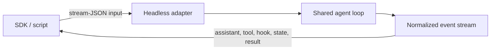

# Headless and Integrations

Claude Code can operate as a terminal application, a pipe-friendly process, a stream-JSON endpoint, an MCP server, a remote-controlled session, or a bridge to IDE, browser, and worktree tooling. These adapters share orchestration but differ in trust and lifecycle.

## Print and stream-JSON

`--print` runs non-interactively. It supports:

- input as text or realtime stream-JSON;
- output as text, one-shot JSON, or realtime stream-JSON;
- partial assistant-message chunks;
- hook lifecycle events;
- prompt-suggestion messages;
- replay of streamed user messages;
- JSON Schema validation for structured final output;
- maximum budget and fallback model controls;
- optional session persistence.

The workspace-trust dialog is skipped in print mode. Invalid settings are silently ignored rather than shown in an interactive error dialog. Automation must therefore choose a trusted cwd and validate its configuration before launching.

## Protocol boundary

Derived Stream output multiplexes multiple event families. A consumer should dispatch by explicit type, preserve unknown fields for forward compatibility, and wait for a documented result/idle boundary rather than counting text chunks.

## IDE and browser bridges

`--ide` auto-connects when exactly one valid IDE is available. `--chrome` and `--no-chrome` control browser integration. These bridges can expose application state and actions that do not fit ordinary filesystem tools.

The anchor ledger does not yet contain dedicated IDE or Chrome protocol anchors. Their presence is **observed through CLI help**, while socket authentication, message framing, and extension-version negotiation remain open research areas.

Derived [`socket.directory-mode`](https://github.com/swyxio/claude-code-internals/blob/main/evidence/anchors.json) supports a local IPC requirement for a socket directory with mode `0700`. This defends against other local users attaching through an overly permissive directory, but does not by itself authenticate every message peer.

## Remote control

`--remote-control [name]` starts an interactive remote-controlled session, with a configurable generated-name prefix. [`remote.startup`](https://github.com/swyxio/claude-code-internals/blob/main/evidence/anchors.json) records automatic startup configuration. [`remote.peer-isolation`](https://github.com/swyxio/claude-code-internals/blob/main/evidence/anchors.json) records optional explicit approval for cross-machine messages.

Remote control crosses a machine boundary and must not rely solely on local workspace trust. Session authentication, peer identity, message authorization, and local tool permissions remain separate controls.

## Worktree and terminal integration

`--worktree` creates a session worktree. `--tmux` can place worktree sessions in iTerm2 panes or classic tmux. These are orchestration integrations, not security sandboxes. Processes can still share home-directory credentials, network access, and operating-system identity unless other controls intervene.

## File resources

`--file file_id:relative_path` downloads remote file resources at startup. A secure implementation must constrain the relative destination, reject path traversal, handle collisions, and record provenance. The CLI syntax establishes the feature; the current evidence ledger does not yet anchor the normalization algorithm.

## Integration design rules

- Authenticate both endpoints of local and remote IPC.
- Bind authorization to the session and workspace, not just a socket path.
- Version message contracts and tolerate unknown events.
- Make cancellation and disconnect behavior explicit.
- Keep downloaded paths inside an approved root.
- Ensure headless defaults do not silently broaden trust because no prompt is available.
