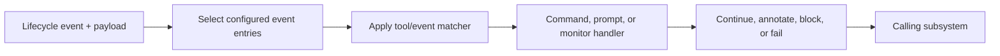

# Hooks

Hooks observe lifecycle boundaries and can run custom handlers. They are one of the highest-authority extension surfaces because command and monitor handlers execute local code outside the model’s ordinary tool-selection path.

## Observed lifecycle vocabulary

Anchor [`hooks.lifecycle`](https://github.com/swyxio/claude-code-internals/blob/main/evidence/anchors.json) resolves a lifecycle event table containing:

| Area | Events observed in `2.1.177` |
|---|---|
| Tool use | `PreToolUse`, `PostToolUse`, `PostToolUseFailure`, `PostToolBatch` |
| User/session | `UserPromptSubmit`, `UserPromptExpansion`, `SessionStart`, `SessionEnd` |
| Stop/error | `Stop`, `StopFailure`, `Notification`, `MessageDisplay` |
| Delegation | `SubagentStart`, `SubagentStop`, `TeammateIdle`, `TaskCreated`, `TaskCompleted` |
| Context | `PreCompact`, `PostCompact`, `InstructionsLoaded` |
| Permission | `PermissionRequest`, `PermissionDenied` |
| Extension/protocol | `Setup`, `Elicitation`, `ElicitationResult`, `ConfigChange` |
| Workspace | `WorktreeCreate`, `WorktreeRemove`, `CwdChanged`, `FileChanged` |

Observed These names exist in the global event vocabulary. Presence does not guarantee that every event is configurable in every hook source, exposed to every plugin, or stable public API. Plugin settings contain a narrower accepted set in this build.

## Matching and execution

The reconstructed hook path separates event selection, optional matching, handler execution, and result interpretation:

The main bundle’s validation guidance describes a matcher plus a hooks array and examples matching a tool name or pipe-separated tool names. That is a short behavioral anchor, not a complete grammar; regex, escaping, and payload mutation semantics require dedicated tests.

## Trust level

Derived [`plugins.monitor-trust`](https://github.com/swyxio/claude-code-internals/blob/main/evidence/anchors.json) says plugin monitor scripts run unsandboxed at the same trust tier as hooks.

This has several consequences:

- A command hook can read ambient environment and files available to the process unless it self-restricts.
- A hook can run because an event fired, even when the model did not request a shell tool.
- A malicious repository should not be able to activate project hooks before workspace trust.
- Safe mode and bare mode both suppress hooks, making them useful isolation controls.

## Ordering and failure

Hypothesis Multiple matching hooks probably run in a deterministic configured order, but the public ledger does not establish concurrency, timeout, or error-composition rules for every hook type. A safe extension must not depend on another hook having run unless ordering is explicitly documented and tested.

Pre-tool hooks are part of control, not permission authority. A hook returning “continue” should not bypass managed policy. Conversely, a hook may impose an additional block or validation step even after a tool is otherwise allowable.

## Stream visibility

`--include-hook-events` adds hook lifecycle events to stream-JSON output. This makes hook activity observable to SDK consumers, but may expose command names, paths, payload fragments, or extension metadata. Logs and recordings should be redacted before publication.

## Author checklist

- Use the narrowest event and matcher.
- Treat all payload fields as untrusted input.
- Avoid shell interpolation; prefer explicit executable and argument arrays where supported.
- Bound runtime and output.
- Never print tokens, headers, or full environment dumps.
- Handle cancellation and repeated delivery safely.
- Fail closed only when the operator has explicitly chosen that availability tradeoff.
