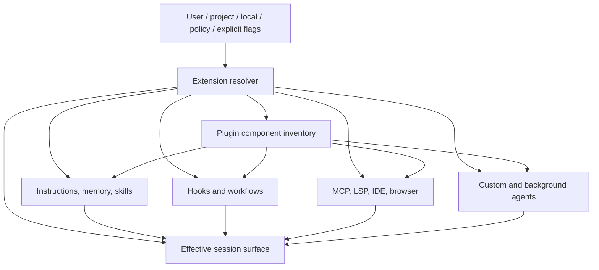

# Extensions and Integrations

Visual companion: [linked extension-surface map](../maps/extension-surfaces.md).

Claude Code has no single extension API. It composes instructions, lifecycle callbacks, tool providers, agents, plugins, protocol adapters, and external integrations. A useful extension model identifies both **what is extended** and **what authority the extension receives**.

## Surface matrix

| Surface | Contributes | Can execute locally? | Discovery / activation |
|---|---|---:|---|
| `CLAUDE.md` and rules | Instructions and context | No, not by loading alone | User, project, added directories |
| Memory | Retrieved and persisted context | Indirectly through agent behavior | Automatic or configured store |
| Skills / commands | Prompted procedures and optional assets | Indirectly; may direct tool use | Skill directories, plugins, explicit invocation |
| Custom agents | Prompt, model, tools, delegated session | Through granted tools | Settings, JSON flag, plugins |
| Hooks | Lifecycle handlers | Yes for command/monitor handlers | Settings and plugins |
| MCP servers | Tools, resources, prompts, elicitation | Yes, in server or child process | Settings, `.mcp.json`, explicit config, plugins |
| Plugins | Composite package | Depends on included components | Directories, zip/URL, marketplaces |
| LSP / IDE / browser | Editor or application capabilities | Yes through bridge | Auto-connect, flags, plugins |
| Stream-JSON / SDK | Programmatic session control | Yes through exposed tools | CLI protocol and entrypoint identity |

“Can execute” describes capability, not automatic permission. A model still encounters the permission layer for tool calls, but a command hook may run because a lifecycle event fired rather than because the model selected a tool.

## Continue by authority

| If the extension needs to… | Start with | Verify against |
|---|---|---|
| Add instructions or reusable procedures | [Instructions and memory](instructions-memory.md) → [agents and skills](agents-skills.md) | [Extension discovery observation](../dynamics/extensions-runtime.md#agent-skill-and-plugin-discovery) |
| React to lifecycle events or run local commands | [Hooks](hooks.md) | [Concurrent hook observation](../dynamics/extensions-runtime.md#hook-scheduling-and-payloads) |
| Expose tools, resources, or prompts across a process boundary | [Model Context Protocol](mcp.md) | [Observed stdio sequence](../dynamics/extensions-runtime.md#mcp-stdio-handshake-and-dispatch) |
| Ship several component types together | [Plugins and marketplaces](plugins.md) | [Extension supply-chain review](../security/extension-supply-chain.md) |
| Drive sessions from another program or application | [Headless, SDK, IDE, and remote integration](headless-integrations.md) | [CLI and protocol reference](../reference/protocols-native.md) |

## Composition model



<span class="evidence-label derived">Derived</span> The resolver is an analytical boundary. It emphasizes that plugin content and standalone configuration eventually populate the same classes of runtime behavior.

## Refresh and lifetime

Extensions have different lifetimes:

- Bootstrap-only switches can determine whether a loader runs at all.
- Files such as instructions or skills may be rediscovered during a session.
- MCP connections have connection and approval state.
- Hooks subscribe to lifecycle events throughout a session.
- Session-only `--plugin-dir`, `--plugin-url`, `--agents`, and `--mcp-config` inputs need not change persisted configuration.

<span class="evidence-label derived">Derived</span> [`skills.dynamic-refresh`](https://github.com/swyxio/claude-code-internals/blob/main/evidence/anchors.json) describes replacement of the slash-command list when skills are discovered mid-session. The event vocabulary includes `ConfigChange`, `InstructionsLoaded`, and file/cwd changes, supporting a live-refresh architecture.

## Extension identity

Every extension should have a stable origin tuple:

```text
component type + declared name + source scope + resolved path/URL + content version/hash
```

Names alone are insufficient. An MCP server named `github` from a checked-in `.mcp.json` is not equivalent to a user-managed server with the same name. A plugin installed from a marketplace can change when the marketplace updates. A session-only zip can shadow persisted content.

## Design guidance

Extension authors should minimize requested tools, avoid implicit network calls, validate all cross-process messages, honor cancellation, and expose deterministic schemas. Operators should pin sources, review executable components, separate trusted user configuration from repository-controlled configuration, and use safe mode when diagnosing extension failures.

The [extension supply-chain review](../security/extension-supply-chain.md) analyzes the security consequences of these surfaces.
