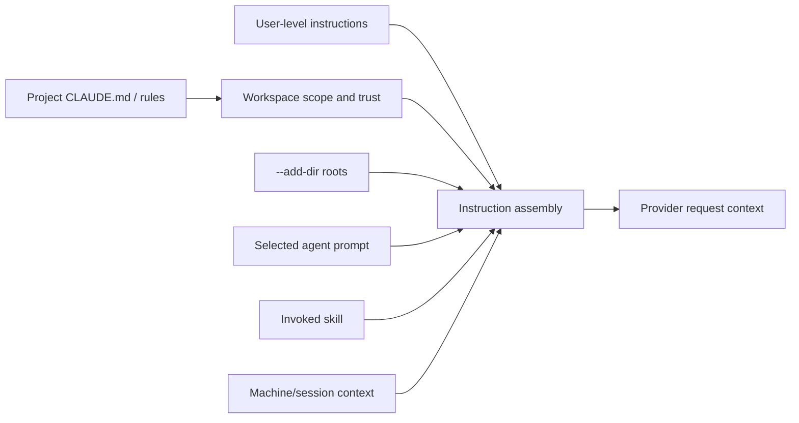

# Instructions and Memory

Instructions and memory shape model behavior without directly adding executable code. They are nevertheless security-relevant because they influence which tools the model requests, what data it includes in prompts, and how delegated agents interpret a task.

## Instruction sources

The CLI surface establishes several instruction paths:

- default system prompt;
- `--system-prompt` or a system-prompt file, which replaces that default;
- `--append-system-prompt` or file, which extends it;
- automatically discovered `CLAUDE.md` files;
- additional directories supplied with `--add-dir`;
- selected custom-agent prompts;
- skill content invoked by name;
- dynamic machine sections such as cwd, environment, memory paths, and Git state.

<span class="evidence-label observed">Observed</span> Root help says `--exclude-dynamic-system-prompt-sections` moves per-machine dynamic sections to the first user message when the default system prompt is used.

<span class="evidence-label derived">Derived</span> Content placement is therefore configurable independently from whether those sections are collected.

## Discovery and scope



<span class="evidence-label derived">Derived</span> Instruction assembly needs provenance even when the final model input is plain text. Without provenance, a user cannot distinguish an organization rule, repository instruction, skill procedure, and generated memory.

Safe mode disables automatic instruction customizations, while bare mode disables automatic `CLAUDE.md` discovery but permits explicit directories and named skills. Therefore “no project instructions” and “no extensions” are different postures.

## Automatic memory

<span class="evidence-label derived">Derived</span> [`memory.enable`](https://github.com/swyxio/claude-code-internals/blob/main/evidence/anchors.json) says automatic memory reads and writes are independently configurable. This supports at least four states: neither, read-only, write-only, or read/write.

<span class="evidence-label derived">Derived</span> [`memory.project-path-hardening`](https://github.com/swyxio/claude-code-internals/blob/main/evidence/anchors.json) says a custom memory directory is ignored when supplied by checked-in project settings. The repository cannot use that setting source to redirect automatic memory to an arbitrary path.

<span class="evidence-label derived">Derived</span> Memory is a persisted context store distinct from the transcript. It may summarize durable facts rather than replay every turn, and its read/write controls imply separate ingestion and retrieval paths.

## Skills versus instructions

A skill is a named, discoverable procedure that may include supporting assets and can be explicitly invoked. A `CLAUDE.md` file is automatically assembled instruction context within its discovery rules. Both ultimately influence the model, but they differ in activation, namespace, refresh, and packaging.

[`skills.dynamic-refresh`](https://github.com/swyxio/claude-code-internals/blob/main/evidence/anchors.json) records a `commands_changed` update when discovered skills alter the callable list. A client integrating with stream output should expect the available command catalog to change without restarting the process.

## Prompt-injection boundary

Instruction text from a repository is untrusted until the workspace is trusted. Even after trust, instructions are not authority: they should not override managed permission policy or grant a tool. A secure mental model is:

```text
instructions propose behavior; permissions authorize effects
```

Review memory and instructions before sharing traces because they can contain repository paths, code, personal preferences, or secrets copied from prior context. Bare mode is the strongest advertised option for suppressing automatic memory and instruction discovery while retaining explicit context control.
