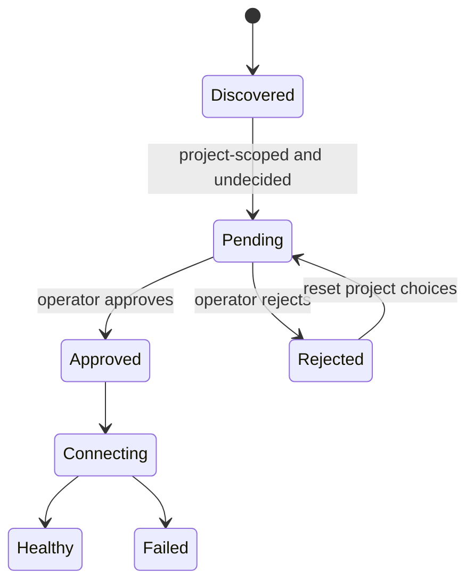

# Model Context Protocol

Claude Code acts as an MCP client and can also expose an MCP server. MCP is a capability boundary: a configured server can contribute callable tools and other protocol objects, while a served Claude Code instance can make selected local capabilities available to another client.

## Configuration and transports

The `mcp` command advertises:

- adding an HTTP server by URL and optional headers;
- adding a stdio server by command, arguments, and environment;
- adding a server from a JSON record;
- importing from Claude Desktop on supported systems;
- listing, inspecting, and removing servers;
- resetting project approval choices;
- starting Claude Code’s MCP server with `mcp serve`.

The help mentions HTTP, stdio, and SSE configuration shapes. <span class="evidence-label derived">Derived</span> Anchor [`mcp.settings`](https://github.com/swyxio/claude-code-internals/blob/main/evidence/anchors.json) supports a typed `mcpServers` settings record.

[`mcp.transports`](https://github.com/swyxio/claude-code-internals/blob/main/evidence/anchors.json) broadens the internal transport inventory to stdio, SSE, IDE-SSE, HTTP, WebSocket, and SDK families. Internal recognition does not imply every transport is accepted by every CLI command.

## Source and approval model

Project-scoped `.mcp.json` servers have an approval state. `mcp list` and `mcp get` show unapproved project servers as pending and do not connect to them; approved servers are health-checked.

<span class="evidence-label derived">Derived</span> [`mcp.project-approval`](https://github.com/swyxio/claude-code-internals/blob/main/evidence/anchors.json) says project approval is persisted separately from server discovery.



This state machine is directly suggested by CLI behavior, although the persistence location and exact retry policy are not established here.

## Strict mode

`--mcp-config` supplies one or more explicit configuration files or JSON strings. `--strict-mcp-config` ignores every other MCP source.

<span class="evidence-label derived">Derived</span> [`mcp.strict-mode`](https://github.com/swyxio/claude-code-internals/blob/main/evidence/anchors.json) supports source exclusion rather than simple priority. Strict mode is useful for reproducible automation because user, project, and plugin servers cannot silently enlarge the capability set.

[`plugins.cli-loader`](https://github.com/swyxio/claude-code-internals/blob/main/evidence/anchors.json) records a plugin-directory loading path that suppresses the plugin’s MCP contribution. This is another composition control: operators can use non-MCP plugin components without connecting its servers.

## Dynamically observed stdio flow

<span class="evidence-label observed">Observed dynamically</span> A strict,
isolated stdio fixture received:

```text
initialize → notifications/initialized → tools/list → tools/call
```

The client proposed protocol version `2025-11-25`, advertised `elicitation` and
`roots` capabilities, exposed remote `probe_echo` to the model as
`mcp__probe__probe_echo`, and sent `claudecode/toolUseId` plus `progressToken`
inside the call `_meta`. [Probe details](../dynamics/extensions-runtime.md#mcp-stdio-handshake-and-dispatch)
· [sanitized report](https://github.com/swyxio/claude-code-internals/blob/main/evidence/dynamic/extensions/mcp-protocol.json).

This is one stdio path; other transports, OAuth, retries, cancellation,
resources, prompts, and elicitation responses remain open.

## Stdio risk

A stdio server is a child process. Its configuration can choose an executable, arguments, and environment variables. Starting it crosses the same broad trust boundary as running a command hook, even if its subsequent protocol is structured JSON-RPC.

The `doctor` warning is especially important: it can spawn stdio servers from `.mcp.json` while checking health and skips the interactive workspace-trust dialog. Run it from a trusted or neutral directory.

## Remote-server risk

HTTP/SSE servers can receive tool arguments, prompts, resource identifiers, and authentication headers. Review destination ownership, TLS, redirects, proxy behavior, OAuth scopes, and data retention. Server-supplied tool descriptions are untrusted text and can influence model behavior.

## Names and collisions

<span class="evidence-label observed">Observed dynamically</span> The exercised
server/tool pair became `mcp__probe__probe_echo`. Collision handling and
normalization for arbitrary names or other entrypoints remain unknown.
Reconstructions should retain both server identity and remote tool name rather
than flattening to one opaque string.

## Server mode

`claude mcp serve` starts a Claude Code MCP server with debug and verbose options. This reverses the usual direction: another MCP client becomes the caller. The served capability set, auth, and permission inheritance require separate runtime capture; the existence of server mode alone does not imply that every interactive tool is exported.
