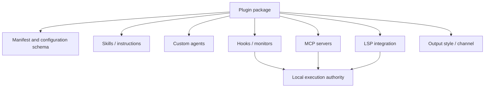

# Plugins and Marketplaces

Plugins package multiple extension components behind one installable identity. They can therefore combine passive context with executable hooks, processes, or MCP servers. Review the component inventory, not just the plugin name.

## CLI lifecycle

The `plugin` command exposes:

- `init` / `new` to scaffold a plugin;
- `validate` to check a plugin or marketplace manifest;
- `details` to show component inventory and projected token cost;
- `install`, `enable`, `disable`, `update`, and `uninstall`;
- `list` and `prune` / `autoremove`;
- `tag` for release validation;
- marketplace add, list, remove, and update operations.

<span class="evidence-label observed">Observed</span> The version-matched [`plugin init --help` capture](https://github.com/swyxio/claude-code-internals/blob/main/evidence/cli-help/plugin-init.txt) advertises scaffold categories for skills, agents, hooks, MCP, LSP, output styles, and channels.

<span class="evidence-label derived">Derived</span> [`plugins.component-inventory`](https://github.com/swyxio/claude-code-internals/blob/main/evidence/anchors.json) supports the same categories in the runtime’s plugin inventory.

## Loading paths

Plugins can enter a session through persisted installation, marketplace resolution, a local directory or zip passed with `--plugin-dir`, or a remote zip passed with `--plugin-url`. Session-only loading is useful for testing but does not make a source trustworthy.

<span class="evidence-label derived">Derived</span> [`plugins.cli-loader`](https://github.com/swyxio/claude-code-internals/blob/main/evidence/anchors.json) records a directory loader variant that excludes MCP contributions. That demonstrates component-level loading policy within a plugin.

## Composite trust



The trust of the whole package is at least as high as its most privileged enabled component. A safe marketplace description cannot compensate for an unreviewed command hook.

<span class="evidence-label derived">Derived</span> [`plugins.monitor-trust`](https://github.com/swyxio/claude-code-internals/blob/main/evidence/anchors.json) says monitor scripts execute unsandboxed at hook trust level.

## Installation scope and configuration

<span class="evidence-label observed">Observed</span> The [`plugin install --help` capture](https://github.com/swyxio/claude-code-internals/blob/main/evidence/cli-help/plugin-install.txt) advertises user, project, and local scopes plus repeatable manifest-declared `key=value` configuration validated against the plugin schema.

Scope controls discovery and sharing, not inherent privilege. A checked-in project plugin is more easily propagated to collaborators and should not execute before trust. A user plugin applies more broadly and has a larger blast radius if compromised.

## Marketplace updates

A marketplace is an additional indirection:

```text
marketplace source -> marketplace entry -> plugin release -> component files
```

Each edge can change. Reproducible deployments should record marketplace origin and revision, plugin identity and version, archive digest, manifest digest, and enabled components. `plugin tag` validating agreement between plugin metadata and an enclosing marketplace entry is a consistency check, not artifact signing.

## Validation limitations

<span class="evidence-label observed">Observed</span> The [`plugin validate --help` capture](https://github.com/swyxio/claude-code-internals/blob/main/evidence/cli-help/plugin-validate.txt) says `--strict` treats warnings as errors, including unrecognized fields and missing metadata.

<span class="evidence-label derived">Derived</span> Schema validity does not prove that scripts are safe, that URLs belong to the expected owner, or that an MCP server respects privacy. Validation and trust review are different stages.

## Disable and safe mode

Disabling a plugin should remove its active contributions after the relevant reload/restart boundary. Safe mode suppresses all custom plugins and is the preferred diagnostic path when plugin startup breaks a session. Bare mode skips plugin synchronization but can still load explicitly supplied plugin inputs, so it is not equivalent to “no plugins.”
