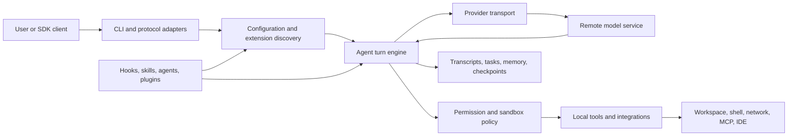

# Claude Code Internals Atlas

This site is an independent, evidence-backed map of the installed Claude Code native executable. It explains the runtime architecture, extension surfaces, trust boundaries, security controls, persistence model, provider routes, and update path of the `2.1.177` macOS arm64 build. Terminal rendering is covered only where it intersects those systems.

The atlas is not a source-code mirror. It contains independently written descriptions and reconstruction contracts linked to reproducible evidence: artifact hashes, Mach-O and Bun metadata, read-only CLI help captures, short semantic anchors, and byte offsets. The executable and its recovered bundle are not distributed.

!!! warning "Independent project"
    This project is not affiliated with, sponsored by, or endorsed by Anthropic. “Claude” and “Claude Code” are used only to identify the product being studied. See [Legal and Ethics](legal-and-ethics.md) before reproducing the analysis.

## What is established

Observed The active launcher resolves to a signed arm64 Mach-O at `~/.local/share/claude/versions/2.1.177`. Its SHA-256 is `eb0730351be2f02b482b1855870f5877489085aac86b0c4c1db4e458d9e40ed9`, and its download-manifest checksum matched at capture time. [Artifact provenance](https://github.com/swyxio/claude-code-internals/blob/main/evidence/provenance.json)

Observed The executable contains one `__BUN,__bun` section with an 11-module standalone graph: one large JavaScript entry module, five small JavaScript native-binding loaders, and five matching N-API modules. [Binary inventory](https://github.com/swyxio/claude-code-internals/blob/main/evidence/binary-inventory.json)

Observed The CLI advertises interactive, print, stream-JSON, MCP, plugin, custom-agent, background-agent, worktree, remote-control, IDE, and multiple authentication/provider paths. Captures used only `--help` under a temporary clean home/config and an allowlisted environment; only help output was retained. [CLI help index](https://github.com/swyxio/claude-code-internals/blob/main/evidence/cli-help-index.json)

Derived The executable is best understood as a local orchestration runtime around a remote model service. The client owns context assembly, extension discovery, permissions, tool execution, persistence, integrations, and transport selection; model inference remains remote.

## Reading the atlas

Every non-trivial technical statement is assigned one of three confidence classes:

| Label | Meaning | Appropriate use |
|---|---|---|
| **Observed** | Directly supported by the captured artifact, command output, or signed metadata. | Describe a version-pinned fact. |
| **Derived** | A documented interpretation that follows from multiple observations. | Explain architecture or likely control flow. |
| **Hypothesis** | A plausible model that is not yet uniquely established. | Guide further research, never assert a guarantee. |

Anchor names such as [`permissions.disable-bypass`](https://github.com/swyxio/claude-code-internals/blob/main/evidence/anchors.json) identify short strings in the private local extraction. The public ledger records their purpose, count, and byte locations without publishing surrounding proprietary code.

## System at a glance

Start with the [visual map index](maps/index.md) or choose an
[audience-specific reading path](audiences/index.md). The long-form
[architecture](architecture/index.md), [extension](extensibility/index.md), and
[trust-boundary](security/index.md) chapters provide the surrounding analysis.
The [evidence-to-code cross-reference](maps/evidence-code-cross-reference.md)
and [claim ledger](evidence/claim-ledger.md) are the shortest paths from prose
back to source-of-truth evidence and browsable reconstruction files.

## Deliberate omissions

The project does not publish the native executable, extracted JavaScript, native add-ons, deminified function bodies, authentication material, local configuration, transcripts, or private debug data. The reconstructed modules in the repository are independently authored explanatory contracts; they may be incomplete and are not represented as Anthropic’s original source tree.
