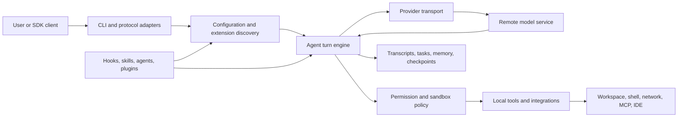

---
hide:
  - navigation
  - toc
---

<section class="atlas-hero">
  

    
Independent runtime research · snapshot 2.1.177

    <h1>A field atlas of one compiled agent runtime.</h1>
    

      Follow Claude Code from native container to provider stream, tool execution,
      persistence, extensions, and trust boundaries—then continue from each claim
      into committed evidence and independently authored reconstruction contracts.
    

    

      <a class="atlas-action atlas-action--primary" href="maps/system-map/">Open the system map →</a>
      <a class="atlas-action" href="audiences/">Choose by goal</a>
    

  

  <aside class="atlas-specimen" aria-label="Artifact identity">
    
Specimen register

    <dl>
      <dt>Artifact</dt><dd>Claude Code 2.1.177</dd>
      <dt>Target</dt><dd>darwin-arm64</dd>
      <dt>Size</dt><dd>225,124,512 bytes</dd>
      <dt>Graph</dt><dd>11 modules · entry 0 · flags 15</dd>
      <dt>SHA-256</dt><dd>eb073035…e40ed9</dd>
    </dl>
    

      
      
    

  </aside>

  

    

      Artifact address strip
      <code>0x00000000 → 0x0D6B20A0</code>
    

    

      Mach-O prefix
      __BUN,__bun
      
    

    

      Prefix · 72,368,128 B
      Bun section @ 0x04504000 · 150,764,738 B
      Suffix · 1,991,646 B
      <a href="https://github.com/swyxio/claude-code-internals/blob/main/evidence/binary-topology.json">Open derived topology</a>
    

  

</section>

  Independent research; not affiliated with or endorsed by Anthropic. The atlas
  publishes evidence summaries and explanatory contracts, not the executable or
  recovered proprietary source. <a href="legal-and-ethics/">Read the publication boundary.</a>

## Navigate by the question

  <a class="atlas-route" href="maps/execution-flow/">
    Trace
    <strong>Follow a tool call</strong>
    Startup → model stream → permission decision → local execution → tool result.
    →
  </a>
  <a class="atlas-route" href="maps/extension-surfaces/">
    Extend
    <strong>Choose an extension surface</strong>
    Compare instructions, skills, agents, hooks, plugins, MCP, and headless integration.
    →
  </a>
  <a class="atlas-route" href="maps/threat-model/">
    Secure
    <strong>Audit a trust boundary</strong>
    See what crosses the workspace, provider, extension, persistence, and update boundaries.
    →
  </a>
  <a class="atlas-route" href="maps/evidence-code-cross-reference/">
    Verify
    <strong>Follow a claim to proof</strong>
    Move from prose to claim ID, sanitized evidence, binary anchor, and reconstructed contract.
    →
  </a>

## Evidence posture

Every non-trivial statement carries one of three confidence classes. The visual
language is deliberately structural: text and shape identify the class, while
color is only a second signal.

  

  

    Observed 32 artifact or runtime facts
    Derived 52 bounded interpretations
    Hypothesis 1 explicit open model
  

  

    
Observed

    
The active launcher resolves to a signed arm64 Mach-O at <code>~/.local/share/claude/versions/2.1.177</code>. Its SHA-256 is <code>eb0730351be2f02b482b1855870f5877489085aac86b0c4c1db4e458d9e40ed9</code>. <a href="https://github.com/swyxio/claude-code-internals/blob/main/evidence/provenance.json">Artifact provenance</a>

  

  

    
Observed

    
The executable contains one <code>__BUN,__bun</code> section with an 11-module graph: one large JavaScript entry module, five native-binding loaders, and five matching N-API modules. <a href="https://github.com/swyxio/claude-code-internals/blob/main/evidence/binary-inventory.json">Binary inventory</a>

  

  

    
Observed

    
Isolated probes exercised provider streaming, a three-request <code>Read → Bash</code> loop, session persistence, settings precedence, concurrent hooks, MCP stdio, extension discovery, permissions, and sandbox containment. <a href="dynamics/">Browse runtime observations</a>

  

  

    
Derived

    
The executable is best modeled as a local orchestration runtime around a remote model service. The client owns context assembly, extension discovery, permissions, tool execution, persistence, integrations, and transport selection.

  

## System at a glance

Continue with the [one-page boundary map](maps/system-map.md), choose an
[audience-specific route](audiences/index.md), or inspect the
[evidence-to-code index](maps/evidence-code-cross-reference.md).

## Deliberate omissions

The project does not publish the native executable, extracted JavaScript,
native add-ons, deminified function bodies, authentication material, local
configuration, transcripts, or private debug data. Reconstructed modules are
independently authored explanatory contracts; they may be incomplete and are
not represented as Anthropic's original source tree.
