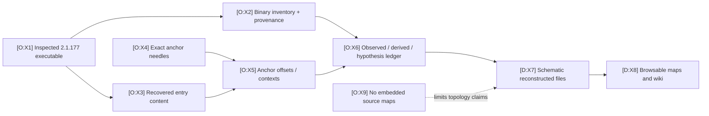

# Evidence-to-Code Cross-Reference

Use this page to travel from an exact recovered string or artifact fact to its normalized claim, schematic source file, and explanatory map. It is an index of **traceability**, not a claim that the schematic files reproduce Anthropic’s original module boundaries.

## Traceability chain

The static chain below is supplemented by sixteen `dynamic.*` observed claims.
Their sanitized reports exercise provider startup, stream adaptation, tool
feedback, transcripts, settings, hooks, MCP, discovery, permissions, and one
sandbox write boundary. Start at the [dynamic analysis index](../dynamics/index.md)
or search `dynamic.` in
[`E:claims`](https://github.com/swyxio/claude-code-internals/blob/main/evidence/claims.ndjson).

| ID | Basis | Artifact in the chain | Hosted source |
|---|---|---|---|
| X1 | O | The inspected executable is identified by version, size, SHA-256, launcher target, and signature metadata. | [`E:provenance`](https://github.com/swyxio/claude-code-internals/blob/main/evidence/provenance.json), claims `artifact.launcher-resolution` and `artifact.release-identity` in [`E:claims`](https://github.com/swyxio/claude-code-internals/blob/main/evidence/claims.ndjson) |
| X2 | O | Machine-readable parsing records the Bun section, graph, modules, hashes, installer flow, runtime revision, and code signature. | [`E:inventory`](https://github.com/swyxio/claude-code-internals/blob/main/evidence/binary-inventory.json), [`E:provenance`](https://github.com/swyxio/claude-code-internals/blob/main/evidence/provenance.json) |
| X3 | O | The entry record contains JavaScript content and bytecode for the same virtual origin. | Claim `container.bytecode-and-source`; [`E:inventory`](https://github.com/swyxio/claude-code-internals/blob/main/evidence/binary-inventory.json) |
| X4 | O | Fifty-one short, exact strings define independently described behavioral anchors. | [`E:anchor-spec`](https://github.com/swyxio/claude-code-internals/blob/main/evidence/anchor-spec.json) |
| X5 | O | Anchor output records match locations/context against the recovered entry content. | [`E:anchors`](https://github.com/swyxio/claude-code-internals/blob/main/evidence/anchors.json) |
| X6 | O | The claim ledger names basis, confidence, evidence pointers, and limits. | [`E:claims`](https://github.com/swyxio/claude-code-internals/blob/main/evidence/claims.ndjson) |
| X7 | D | Reconstructed files expose conservative interfaces and control flow with injected contracts where exact behavior is unknown. | [`R:README`](https://github.com/swyxio/claude-code-internals/blob/main/reconstructed/README.md) |
| X8 | D | The map layer cross-references responsibilities and boundaries to evidence and schematic files. | [Map index](index.md) |
| X9 | O | None of the embedded module records contains a source map. | Claim `container.no-source-maps`; [`E:inventory`](https://github.com/swyxio/claude-code-internals/blob/main/evidence/binary-inventory.json) |

## File-centric reconstruction index

Anchor IDs below link to [`E:anchor-spec`](https://github.com/swyxio/claude-code-internals/blob/main/evidence/anchor-spec.json); claim IDs link to [`E:claims`](https://github.com/swyxio/claude-code-internals/blob/main/evidence/claims.ndjson). Several files intentionally share an anchor because the same evidence constrains more than one seam.

| Schematic source | Primary responsibility | Principal anchor IDs | Principal claim IDs | Best maps |
|---|---|---|---|---|
| [`R:README`](https://github.com/swyxio/claude-code-internals/blob/main/reconstructed/README.md) | Epistemic contract, limitations, and file map. | All by reference. | `container.no-source-maps`, `architecture.control-plane-boundary`. | [Map index](index.md), this page |
| [`R:startup`](https://github.com/swyxio/claude-code-internals/blob/main/reconstructed/startup/cli-bootstrap.ts) | Entrypoint/mode selection and ordered startup phases. | `build.git-sha`, `entrypoint.routing`, `deeplink.argument-injection`, `workspace-trust.proxy-helper`, `mcp.strict-mode`. | `build.embedded-revision`, `architecture.entrypoint-routing`, `security.deeplink-argument-injection`, `security.workspace-trust-proxy-helper`, `extensibility.mcp-strict-mode`. | [System](system-map.md), [execution](execution-flow.md) |
| [`R:settings`](https://github.com/swyxio/claude-code-internals/blob/main/reconstructed/settings/resolution.ts) | Settings contributions/provenance and managed constraints. | `permissions.managed-only`, `permissions.disable-bypass`, `mcp.strict-mode`, `mcp.project-approval`, `memory.project-path-hardening`. | `security.managed-permission-rules`, `security.disable-bypass-mode`, `extensibility.mcp-strict-mode`, `security.mcp-project-approval`, `memory.project-path-hardening`. | [Settings/permissions](settings-permissions.md) |
| [`R:schema`](https://github.com/swyxio/claude-code-internals/blob/main/reconstructed/settings/schema.ts) | Typed security, sandbox, extension, MCP, memory, and remote settings surface. | `permissions.managed-only`, `sandbox.fail-closed`, `sandbox.no-escape`, `sandbox.auto-allow`, `sandbox.weaker-network`, `sandbox.weaker-nested`, `mcp.settings`, `mcp.transports`, `remote.startup`, `remote.peer-isolation`, `memory.enable`. | Corresponding `security.*`, `extensibility.*`, `remote.*`, and `memory.*` claims. | [Settings/permissions](settings-permissions.md), [extension surfaces](extension-surfaces.md) |
| [`R:model-stream`](https://github.com/swyxio/claude-code-internals/blob/main/reconstructed/engine/model-stream.ts) | Provider-stream normalization and retry/fallback boundary. | `agent-loop.core-generator`, `compaction.lifecycle`. | `agent-loop.core-generator`, `context.compaction-lifecycle`. | [Execution](execution-flow.md), [provider/network](provider-network.md) |
| [`R:turn`](https://github.com/swyxio/claude-code-internals/blob/main/reconstructed/engine/turn-engine.ts) | Async-generator turn lifecycle, tool dispatch, compaction, stop, and idle. | `agent-loop.core-generator`, `tools.execution-pipeline`, `agents.pending-turn-state`, `agent-loop.idle-boundary`, `compaction.lifecycle`. | `agent-loop.core-generator`, `tools.execution-pipeline`, `agents.pending-turn-state`, `agents.idle-boundary`, `context.compaction-lifecycle`. | [Execution](execution-flow.md), [persistence](persistence-dataflow.md) |
| [`R:catalog`](https://github.com/swyxio/claude-code-internals/blob/main/reconstructed/tools/catalog.ts) | Built-in/MCP tool assembly, alias resolution, and filtering. | `tools.registry`, `tools.aliases`, `tools.bash-readonly-source`, `mcp.settings`. | `tools.registry`, `extensibility.tool-aliases`, `tools.bash-readonly-source`, `extensibility.mcp-settings`. | [Execution](execution-flow.md), [extension surfaces](extension-surfaces.md) |
| [`R:tool-pipeline`](https://github.com/swyxio/claude-code-internals/blob/main/reconstructed/tools/execution-pipeline.ts) | Coercion, validation, hooks, permission, tool call, and post-hook flow. | `tools.execution-pipeline`, `hooks.lifecycle`, `auto-mode.anti-bypass`. | `tools.execution-pipeline`, `extensibility.hook-lifecycle`, `security.auto-mode-anti-bypass`. | [Execution](execution-flow.md), [threat model](threat-model.md) |
| [`R:permissions`](https://github.com/swyxio/claude-code-internals/blob/main/reconstructed/permissions/engine.ts) | Permission evidence composition and policy ceilings. | `permissions.managed-only`, `permissions.disable-bypass`, `permissions.subprocess-scrub`, `sandbox.auto-allow`, `auto-mode.anti-bypass`. | `security.managed-permission-rules`, `security.disable-bypass-mode`, `security.subprocess-environment-scrub`, `security.sandbox-auto-allow`, `security.auto-mode-anti-bypass`. | [Settings/permissions](settings-permissions.md), [threat model](threat-model.md) |
| [`R:sandbox`](https://github.com/swyxio/claude-code-internals/blob/main/reconstructed/sandbox/runtime.ts) | Cross-platform sandbox planning/fallback boundary. | `sandbox.fail-closed`, `sandbox.no-escape`, `sandbox.auto-allow`, `sandbox.weaker-network`, `sandbox.weaker-nested`. | `security.sandbox-fail-closed`, `security.sandbox-no-command-escape`, `security.sandbox-auto-allow`, `security.weaker-network-isolation`, `sandbox.weaker-nested-compatibility`. | [Settings/permissions](settings-permissions.md), [threat model](threat-model.md) |
| [`R:hooks`](https://github.com/swyxio/claude-code-internals/blob/main/reconstructed/hooks/dispatcher.ts) | Hook event matching, dispatch, timeout, and result combination seam. | `hooks.lifecycle`, `plugins.monitor-trust`, `agents.lifecycle-hook`, `compaction.lifecycle`. | `extensibility.hook-lifecycle`, `security.plugin-monitor-trust`, `agents.lifecycle-observability`, `context.compaction-lifecycle`. | [Execution](execution-flow.md), [extension surfaces](extension-surfaces.md), [threat model](threat-model.md) |
| [`R:MCP`](https://github.com/swyxio/claude-code-internals/blob/main/reconstructed/mcp/client-manager.ts) | MCP discovery, source restriction, project approval, transport, and client lifecycle. | `mcp.settings`, `mcp.strict-mode`, `mcp.transports`, `mcp.project-approval`. | `extensibility.mcp-settings`, `extensibility.mcp-strict-mode`, `extensibility.mcp-transports`, `security.mcp-project-approval`. | [Extension surfaces](extension-surfaces.md), [provider/network](provider-network.md) |
| [`R:plugins`](https://github.com/swyxio/claude-code-internals/blob/main/reconstructed/plugins/loader.ts) | Plugin package discovery/trust and component aggregation. | `plugins.cli-loader`, `plugins.monitor-trust`, `plugins.component-inventory`. | `extensibility.plugin-loader`, `security.plugin-monitor-trust`, `extensibility.plugin-component-inventory`. | [Extension surfaces](extension-surfaces.md), [threat model](threat-model.md) |
| [`R:skills`](https://github.com/swyxio/claude-code-internals/blob/main/reconstructed/skills/discovery.ts) | Skill source discovery, parsing, trust, and command-list refresh. | `skills.dynamic-refresh`, `workspace-trust.proxy-helper`. | `extensibility.skills-refresh`, `security.workspace-trust-proxy-helper`. | [Extension surfaces](extension-surfaces.md) |
| [`R:agents`](https://github.com/swyxio/claude-code-internals/blob/main/reconstructed/agents/subagents.ts) | Agent definition and delegated lifecycle/idle coordination. | `agents.append-prompt`, `agents.lifecycle-hook`, `agents.pending-turn-state`, `agent-loop.idle-boundary`. | `agents.appended-system-prompt`, `agents.lifecycle-observability`, `agents.pending-turn-state`, `agents.idle-boundary`. | [Extension surfaces](extension-surfaces.md), [execution](execution-flow.md), [persistence](persistence-dataflow.md) |
| [`R:remote`](https://github.com/swyxio/claude-code-internals/blob/main/reconstructed/remote/direct-connect.ts) | Remote Control/DirectConnect transport and peer-isolation seam. | `entrypoint.routing`, `socket.directory-mode`, `remote.startup`, `remote.peer-isolation`. | `architecture.entrypoint-routing`, `security.socket-directory-mode`, `remote.startup`, `remote.peer-isolation`. | [Provider/network](provider-network.md), [threat model](threat-model.md) |
| [`R:credentials`](https://github.com/swyxio/claude-code-internals/blob/main/reconstructed/auth/credentials.ts) | Credential source/backends, storage, and safe-log boundary. | `workspace-trust.proxy-helper`, `auth.api-key`, `auth.api-key-helper`, `auth.macos-keychain`, `auth.oauth-url`. | `security.workspace-trust-proxy-helper`, `auth.api-key`, `auth.api-key-helper`, `auth.macos-keychain`, `auth.oauth`. | [Provider/network](provider-network.md), [threat model](threat-model.md) |
| [`R:providers`](https://github.com/swyxio/claude-code-internals/blob/main/reconstructed/auth/providers-http.ts) | Provider selection and first-party/external HTTP partition. | `providers.bedrock`, `providers.vertex`, `providers.foundry`, `network.first-party-boundary`, `telemetry.nonessential-off`. | `providers.alternate-routes`, `network.first-party-boundary`, `telemetry.nonessential-control`. | [Provider/network](provider-network.md) |
| [`R:sessions`](https://github.com/swyxio/claude-code-internals/blob/main/reconstructed/persistence/sessions.ts) | Local transcript operations and bounded external SessionStore load. | `sessions.external-store`, `sessions.local-transcript`, `agent-loop.idle-boundary`. | `sessions.external-store`, `sessions.local-transcript`, `agents.idle-boundary`. | [Persistence](persistence-dataflow.md) |
| [`R:memory`](https://github.com/swyxio/claude-code-internals/blob/main/reconstructed/memory/auto-memory.ts) | Memory enable/path policy and filesystem/codec seams. | `memory.enable`, `memory.project-path-hardening`, `sessions.local-transcript`. | `memory.independent-controls`, `memory.project-path-hardening`, `sessions.local-transcript`. | [Persistence](persistence-dataflow.md), [settings/permissions](settings-permissions.md) |
| [`R:telemetry`](https://github.com/swyxio/claude-code-internals/blob/main/reconstructed/telemetry/telemetry.ts) | Telemetry controls, redaction/encoding seams, queue, and batch transport. | `telemetry.batch-endpoint`, `telemetry.disable`, `telemetry.nonessential-off`. | `telemetry.batch-endpoint`, `telemetry.disable`, `telemetry.nonessential-control`. | [Provider/network](provider-network.md), [threat model](threat-model.md) |
| [`R:updater`](https://github.com/swyxio/claude-code-internals/blob/main/reconstructed/update/updater.ts) | Release selection, manifest/checksum, install-method, and replacement seam. | `updates.release-origin`, `telemetry.nonessential-off`, `build.git-sha`. | `updates.release-origin`, `telemetry.nonessential-control`, `build.embedded-revision`, plus artifact integrity claims. | [Provider/network](provider-network.md), [threat model](threat-model.md) |
| [`R:native-boundaries`](https://github.com/swyxio/claude-code-internals/blob/main/reconstructed/native/runtime-boundaries.ts) | Signed container, Bun graph, and JavaScript/N-API pairing inventory. | `build.git-sha`, `entrypoint.routing`, `socket.directory-mode`. | `container.*`, `modules.*`, `signing.*`, `architecture.control-plane-boundary`. | [System](system-map.md), [threat model](threat-model.md) |

## Complete anchor routing

This grouped routing accounts for all 51 entries in [`E:anchor-spec`](https://github.com/swyxio/claude-code-internals/blob/main/evidence/anchor-spec.json). It answers “which schematic file should I open first?”; shared concerns may appear again in the file-centric table.

| Anchor range / subsystem | Anchor IDs | First schematic destination | Map destination |
|---|---|---|---|
| Build/startup/security preflight | `build.git-sha`; `entrypoint.routing`; `deeplink.argument-injection`; `workspace-trust.proxy-helper`; `socket.directory-mode` | [`R:startup`](https://github.com/swyxio/claude-code-internals/blob/main/reconstructed/startup/cli-bootstrap.ts), [`R:remote`](https://github.com/swyxio/claude-code-internals/blob/main/reconstructed/remote/direct-connect.ts) | [System](system-map.md), [threat model](threat-model.md) |
| Permission policy | `permissions.managed-only`; `permissions.disable-bypass`; `permissions.subprocess-scrub`; `auto-mode.anti-bypass` | [`R:permissions`](https://github.com/swyxio/claude-code-internals/blob/main/reconstructed/permissions/engine.ts) | [Settings/permissions](settings-permissions.md) |
| Sandbox | `sandbox.fail-closed`; `sandbox.no-escape`; `sandbox.auto-allow`; `sandbox.weaker-network`; `sandbox.weaker-nested` | [`R:sandbox`](https://github.com/swyxio/claude-code-internals/blob/main/reconstructed/sandbox/runtime.ts) | [Settings/permissions](settings-permissions.md), [threat model](threat-model.md) |
| Hooks/turn/tools | `hooks.lifecycle`; `agent-loop.core-generator`; `tools.registry`; `tools.execution-pipeline`; `tools.bash-readonly-source`; `tools.aliases`; `compaction.lifecycle` | [`R:hooks`](https://github.com/swyxio/claude-code-internals/blob/main/reconstructed/hooks/dispatcher.ts), [`R:turn`](https://github.com/swyxio/claude-code-internals/blob/main/reconstructed/engine/turn-engine.ts), [`R:catalog`](https://github.com/swyxio/claude-code-internals/blob/main/reconstructed/tools/catalog.ts), [`R:tool-pipeline`](https://github.com/swyxio/claude-code-internals/blob/main/reconstructed/tools/execution-pipeline.ts) | [Execution](execution-flow.md) |
| Plugin/MCP | `plugins.cli-loader`; `plugins.monitor-trust`; `plugins.component-inventory`; `mcp.settings`; `mcp.strict-mode`; `mcp.transports`; `mcp.project-approval` | [`R:plugins`](https://github.com/swyxio/claude-code-internals/blob/main/reconstructed/plugins/loader.ts), [`R:MCP`](https://github.com/swyxio/claude-code-internals/blob/main/reconstructed/mcp/client-manager.ts) | [Extension surfaces](extension-surfaces.md), [provider/network](provider-network.md) |
| Skills/agents | `skills.dynamic-refresh`; `agents.append-prompt`; `agents.lifecycle-hook`; `agents.pending-turn-state`; `agent-loop.idle-boundary` | [`R:skills`](https://github.com/swyxio/claude-code-internals/blob/main/reconstructed/skills/discovery.ts), [`R:agents`](https://github.com/swyxio/claude-code-internals/blob/main/reconstructed/agents/subagents.ts) | [Extension surfaces](extension-surfaces.md), [execution](execution-flow.md) |
| Remote control | `remote.startup`; `remote.peer-isolation` | [`R:remote`](https://github.com/swyxio/claude-code-internals/blob/main/reconstructed/remote/direct-connect.ts) | [Provider/network](provider-network.md), [threat model](threat-model.md) |
| Memory/persistence | `memory.enable`; `memory.project-path-hardening`; `sessions.external-store`; `sessions.local-transcript` | [`R:memory`](https://github.com/swyxio/claude-code-internals/blob/main/reconstructed/memory/auto-memory.ts), [`R:sessions`](https://github.com/swyxio/claude-code-internals/blob/main/reconstructed/persistence/sessions.ts) | [Persistence](persistence-dataflow.md) |
| Authentication/providers | `auth.api-key`; `auth.api-key-helper`; `auth.macos-keychain`; `auth.oauth-url`; `providers.bedrock`; `providers.vertex`; `providers.foundry` | [`R:credentials`](https://github.com/swyxio/claude-code-internals/blob/main/reconstructed/auth/credentials.ts), [`R:providers`](https://github.com/swyxio/claude-code-internals/blob/main/reconstructed/auth/providers-http.ts) | [Provider/network](provider-network.md) |
| Telemetry/update/network | `telemetry.batch-endpoint`; `telemetry.disable`; `telemetry.nonessential-off`; `updates.release-origin`; `network.first-party-boundary` | [`R:telemetry`](https://github.com/swyxio/claude-code-internals/blob/main/reconstructed/telemetry/telemetry.ts), [`R:updater`](https://github.com/swyxio/claude-code-internals/blob/main/reconstructed/update/updater.ts), [`R:providers`](https://github.com/swyxio/claude-code-internals/blob/main/reconstructed/auth/providers-http.ts) | [Provider/network](provider-network.md) |

## Artifact-only claims

These claims are grounded primarily in inventory/provenance rather than behavioral string anchors and therefore should not be reverse-mapped to one invented original module.

| Claim family | What it establishes | Evidence | Closest explanatory source/map |
|---|---|---|---|
| `artifact.*` | Launcher target, exact release identity, installer/manifest integrity flow, and capture-time version drift (`artifact.version-drift-at-capture`). | [`E:provenance`](https://github.com/swyxio/claude-code-internals/blob/main/evidence/provenance.json), [`E:inventory`](https://github.com/swyxio/claude-code-internals/blob/main/evidence/binary-inventory.json) | [`R:native-boundaries`](https://github.com/swyxio/claude-code-internals/blob/main/reconstructed/native/runtime-boundaries.ts), [system map](system-map.md) |
| `signing.*` | Developer identity, hardened runtime, entitlements, their control tradeoff, and absence of App Sandbox evidence. | [`E:provenance`](https://github.com/swyxio/claude-code-internals/blob/main/evidence/provenance.json) | [`R:native-boundaries`](https://github.com/swyxio/claude-code-internals/blob/main/reconstructed/native/runtime-boundaries.ts), [threat model](threat-model.md) |
| `container.*` | Bun payload/graph, entry content/bytecode, source-map absence, embedded runtime string (`container.bun-runtime-version`), and resolved upstream runtime revision (`container.bun-runtime-source-resolution`). | [`E:inventory`](https://github.com/swyxio/claude-code-internals/blob/main/evidence/binary-inventory.json), [`E:provenance`](https://github.com/swyxio/claude-code-internals/blob/main/evidence/provenance.json) | [`R:native-boundaries`](https://github.com/swyxio/claude-code-internals/blob/main/reconstructed/native/runtime-boundaries.ts), [system map](system-map.md) |
| `modules.*` | Six JavaScript and five N-API module records, including five name-paired loader/native boundaries. | [`E:inventory`](https://github.com/swyxio/claude-code-internals/blob/main/evidence/binary-inventory.json) | [`R:native-boundaries`](https://github.com/swyxio/claude-code-internals/blob/main/reconstructed/native/runtime-boundaries.ts), [system map](system-map.md) |

## Injected-contract gap register

| Schematic unknown | Why it is injected instead of asserted | Where to inspect | Evidence needed to resolve it |
|---|---|---|---|
| Per-key settings precedence and merge operator | Source names and policy ceilings do not authenticate one universal order. | [`R:settings`](https://github.com/swyxio/claude-code-internals/blob/main/reconstructed/settings/resolution.ts), [settings map](settings-permissions.md) | Focused dynamic tests across source combinations or authenticated upstream source. |
| Permission rule matching and decision composition | Anchors establish controls/outcomes, not grammar or short-circuit order. | [`R:permissions`](https://github.com/swyxio/claude-code-internals/blob/main/reconstructed/permissions/engine.ts), [settings map](settings-permissions.md) | Controlled tool requests with conflicting rule/hook/classifier evidence. |
| Sandbox backend selection and launch profiles | Setting names establish control points, not exact platform command lines. | [`R:sandbox`](https://github.com/swyxio/claude-code-internals/blob/main/reconstructed/sandbox/runtime.ts), [threat model](threat-model.md) | Runtime tracing on each supported platform/configuration. |
| Hook matching/composition/timeouts | Lifecycle names do not prove every matcher and reduction rule. | [`R:hooks`](https://github.com/swyxio/claude-code-internals/blob/main/reconstructed/hooks/dispatcher.ts), [execution map](execution-flow.md) | Instrumented multi-hook tests including rewrite, deny, defer, failure, and timeout. |
| MCP connection/auth/retry details | Transport enum and approval/source controls do not authenticate wire policy. | [`R:MCP`](https://github.com/swyxio/claude-code-internals/blob/main/reconstructed/mcp/client-manager.ts), [provider map](provider-network.md) | Transport captures and configuration-specific dynamic traces. |
| Session/memory paths, codecs, retention, and atomicity | Only concern names, control seams, and bounded load/path hardening are anchored. | [`R:sessions`](https://github.com/swyxio/claude-code-internals/blob/main/reconstructed/persistence/sessions.ts), [`R:memory`](https://github.com/swyxio/claude-code-internals/blob/main/reconstructed/memory/auto-memory.ts), [persistence map](persistence-dataflow.md) | Filesystem observation under isolated fixtures plus deletion/restart tests. |
| Credential precedence/cache and portable storage | Named credential seams do not establish order or storage mechanics. | [`R:credentials`](https://github.com/swyxio/claude-code-internals/blob/main/reconstructed/auth/credentials.ts), [provider map](provider-network.md) | Conflict tests, helper tracing, Keychain/file observation, and refresh tests. |
| Telemetry payload/redaction/retry | Endpoint and disable switches do not reveal event contents. | [`R:telemetry`](https://github.com/swyxio/claude-code-internals/blob/main/reconstructed/telemetry/telemetry.ts), [provider map](provider-network.md) | Consented network capture or authenticated event schema. |
| Remote endpoint/auth/codec/framing | Startup/peer settings and socket-mode check do not reveal protocol security. | [`R:remote`](https://github.com/swyxio/claude-code-internals/blob/main/reconstructed/remote/direct-connect.ts), [threat model](threat-model.md) | Local/remote channel traces and authenticated protocol documentation. |
| Update channel/locking/replacement/rollback | Origin and checksum flow do not authenticate all updater state transitions. | [`R:updater`](https://github.com/swyxio/claude-code-internals/blob/main/reconstructed/update/updater.ts), [threat model](threat-model.md) | Isolated update runs across channels/failure modes or upstream source. |

## Stable-link convention

Repository references use `https://github.com/swyxio/claude-code-internals/blob/main/<path>` so the hosted wiki remains usable outside the GitHub source browser. Shorthand prefixes used across the maps are documented in the [map index](index.md): `E:` evidence, `R:` reconstruction, `H:` captured CLI help, and `D:` explanatory docs. For exact reproducibility, pair those stable browsing URLs with the immutable artifact SHA-256 and embedded revision in [`E:provenance`](https://github.com/swyxio/claude-code-internals/blob/main/evidence/provenance.json).
