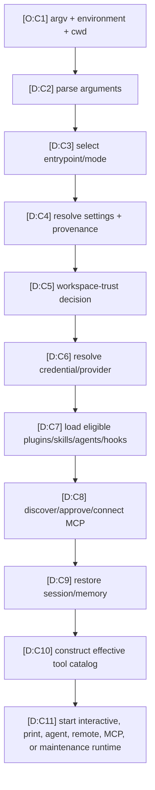
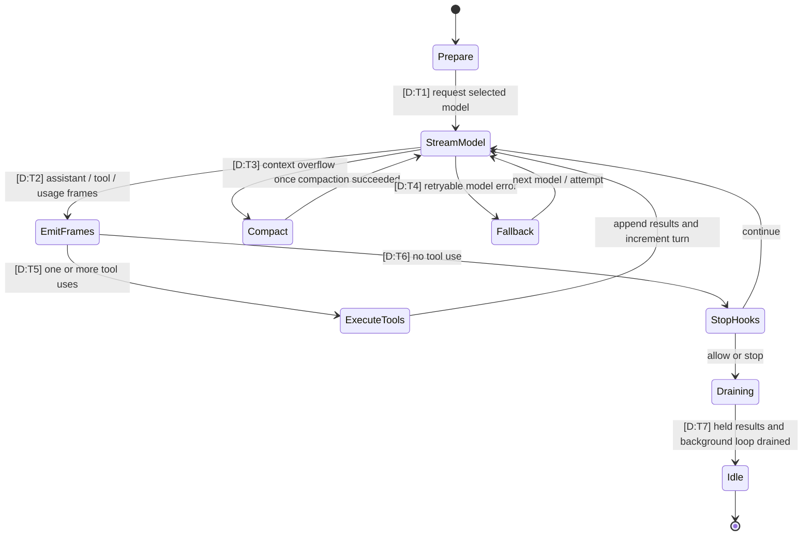
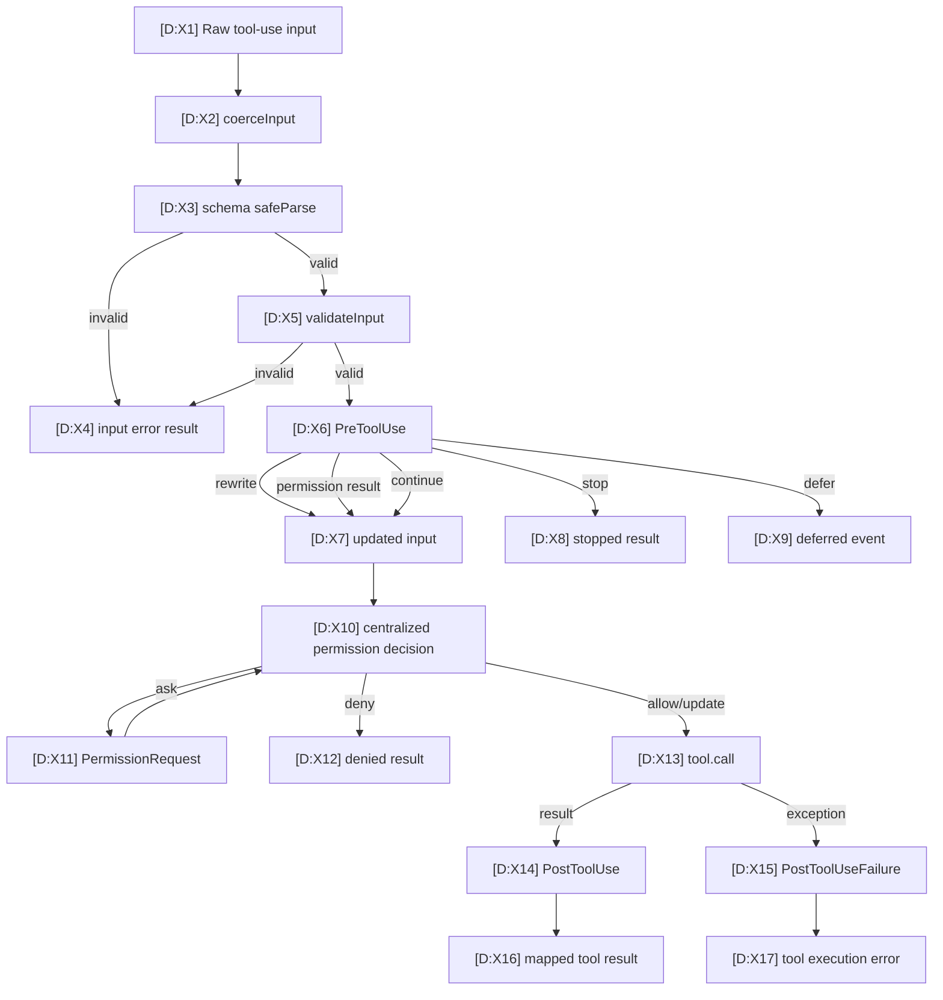

# Execution Call Graph and State Machines

This page follows one conversational request from process startup to session idle. It separates established sequence from reconstructed scheduling details.

## Startup call graph

| ID | Basis | Call or decision | Hosted sources |
|---|---|---|---|
| C1 | O | Root help exposes flags, subcommands, formats, settings sources, extension inputs, and permission modes. | [`H:root`](https://github.com/swyxio/claude-code-internals/blob/main/evidence/cli-help/root.txt) |
| C2–C3 | D | Argument parsing feeds entrypoint and mode selection. | [`R:startup`](https://github.com/swyxio/claude-code-internals/blob/main/reconstructed/startup/cli-bootstrap.ts), claim `architecture.entrypoint-routing` in [`E:claims`](https://github.com/swyxio/claude-code-internals/blob/main/evidence/claims.ndjson) |
| C4 | D | Settings are merged through injected per-key precedence while preserving source provenance. | [`R:settings`](https://github.com/swyxio/claude-code-internals/blob/main/reconstructed/settings/resolution.ts) |
| C5 | D | Trust is evaluated before project/local executable settings such as a proxy helper become eligible. | Claim `security.workspace-trust-proxy-helper` in [`E:claims`](https://github.com/swyxio/claude-code-internals/blob/main/evidence/claims.ndjson), [`R:startup`](https://github.com/swyxio/claude-code-internals/blob/main/reconstructed/startup/cli-bootstrap.ts) |
| C6 | D | Credential and provider resolution are separate decisions. | [`R:credentials`](https://github.com/swyxio/claude-code-internals/blob/main/reconstructed/auth/credentials.ts), [`R:providers`](https://github.com/swyxio/claude-code-internals/blob/main/reconstructed/auth/providers-http.ts) |
| C7 | D | Safe/bare modes and explicit inputs shape extension loading. | [`R:startup`](https://github.com/swyxio/claude-code-internals/blob/main/reconstructed/startup/cli-bootstrap.ts), [`H:root`](https://github.com/swyxio/claude-code-internals/blob/main/evidence/cli-help/root.txt) |
| C8 | D | MCP source filtering, project approval, and transport connection are distinct phases. | [`R:MCP`](https://github.com/swyxio/claude-code-internals/blob/main/reconstructed/mcp/client-manager.ts), claims `extensibility.mcp-strict-mode` and `security.mcp-project-approval` |
| C9 | D | Session transcript and automatic memory are separate restoration seams. | [`R:sessions`](https://github.com/swyxio/claude-code-internals/blob/main/reconstructed/persistence/sessions.ts), [`R:memory`](https://github.com/swyxio/claude-code-internals/blob/main/reconstructed/memory/auto-memory.ts) |
| C10 | D | Candidate built-ins, feature gates, aliases, and MCP tools yield an effective catalog. | [`R:catalog`](https://github.com/swyxio/claude-code-internals/blob/main/reconstructed/tools/catalog.ts) |
| C11 | D | The selected adapter starts after shared planning; many maintenance commands short-circuit before the conversational loop. | [`R:startup`](https://github.com/swyxio/claude-code-internals/blob/main/reconstructed/startup/cli-bootstrap.ts) |

The phase sequence is a readable reconstruction. Exact concurrent prefetch, helper ownership, and maintenance-command short-circuit points are not fully authenticated.

## Turn state machine

| ID | Basis | Transition | Hosted sources |
|---|---|---|---|
| T1 | D | The async-generator turn requests a normalized model stream with model, messages, system context, tools, limits, and abort signal. | [`R:turn`](https://github.com/swyxio/claude-code-internals/blob/main/reconstructed/engine/turn-engine.ts), [`R:model-stream`](https://github.com/swyxio/claude-code-internals/blob/main/reconstructed/engine/model-stream.ts) |
| T2 | D | Stream deltas become assistant, tool-use, usage, or error frames; exact wire events remain provider-specific. | [`R:model-stream`](https://github.com/swyxio/claude-code-internals/blob/main/reconstructed/engine/model-stream.ts), claim `agent-loop.core-generator` |
| T3 | D | Context overflow can trigger reactive compaction before a prompt-too-long exit. | [`R:turn`](https://github.com/swyxio/claude-code-internals/blob/main/reconstructed/engine/turn-engine.ts), claim `context.compaction-lifecycle` |
| T4 | D | Retryable failures can move through configured fallback models; precise retry values are injected. | [`R:model-stream`](https://github.com/swyxio/claude-code-internals/blob/main/reconstructed/engine/model-stream.ts), [`H:root`](https://github.com/swyxio/claude-code-internals/blob/main/evidence/cli-help/root.txt) |
| T5 | D | Tool-use frames enter the shared execution pipeline; results cause another model turn. | [`R:turn`](https://github.com/swyxio/claude-code-internals/blob/main/reconstructed/engine/turn-engine.ts), [`R:tool-pipeline`](https://github.com/swyxio/claude-code-internals/blob/main/reconstructed/tools/execution-pipeline.ts) |
| T6 | D | With no tool use, stop hooks determine completion, continuation, or hook stop. | [`R:turn`](https://github.com/swyxio/claude-code-internals/blob/main/reconstructed/engine/turn-engine.ts), [`R:hooks`](https://github.com/swyxio/claude-code-internals/blob/main/reconstructed/hooks/dispatcher.ts) |
| T7 | D | Session idle follows held-back result flush and background-agent loop exit. | Claim `agents.idle-boundary` in [`E:claims`](https://github.com/swyxio/claude-code-internals/blob/main/evidence/claims.ndjson), [`R:turn`](https://github.com/swyxio/claude-code-internals/blob/main/reconstructed/engine/turn-engine.ts) |

## Tool-call pipeline

| IDs | Basis | Grounding | Hosted sources |
|---|---|---|---|
| X1–X5 | D | The inspected shared path orders coercion, schema parsing, and semantic validation before hooks. | [`R:tool-pipeline`](https://github.com/swyxio/claude-code-internals/blob/main/reconstructed/tools/execution-pipeline.ts), anchor `tools.execution-pipeline` in [`E:anchors`](https://github.com/swyxio/claude-code-internals/blob/main/evidence/anchors.json) |
| X6–X9 | D | `PreToolUse` can emit messages, update input, provide permission evidence, stop, or defer. | [`R:tool-pipeline`](https://github.com/swyxio/claude-code-internals/blob/main/reconstructed/tools/execution-pipeline.ts), anchor `hooks.lifecycle` |
| X10–X12 | D | Central authorization occurs after `PreToolUse`; an ask path corresponds to `PermissionRequest`. Exact decision precedence remains injected. | [`R:tool-pipeline`](https://github.com/swyxio/claude-code-internals/blob/main/reconstructed/tools/execution-pipeline.ts), [`R:permissions`](https://github.com/swyxio/claude-code-internals/blob/main/reconstructed/permissions/engine.ts) |
| X13–X17 | D | Allowed calls stream progress/results, then dispatch success or failure hooks and return normalized results. | [`R:tool-pipeline`](https://github.com/swyxio/claude-code-internals/blob/main/reconstructed/tools/execution-pipeline.ts), claim `extensibility.hook-lifecycle` |

!!! warning "Post-hook rewrite boundary"
    The pre-hook can update input after the initial schema and semantic validation stages. This map does not assert a second validation pass. Permission and tool implementations must reason about the effective post-hook input. Source: [`R:tool-pipeline`](https://github.com/swyxio/claude-code-internals/blob/main/reconstructed/tools/execution-pipeline.ts).

## Exit and cancellation matrix

| Exit or branch | Basis | Trigger represented | Source |
|---|---|---|---|
| `completed` | D | No tool use and stop hooks allow completion. | [`R:turn`](https://github.com/swyxio/claude-code-internals/blob/main/reconstructed/engine/turn-engine.ts) |
| `hook_stopped` | D | Stop hook returns stop. | [`R:turn`](https://github.com/swyxio/claude-code-internals/blob/main/reconstructed/engine/turn-engine.ts) |
| `max_turns` / `max_budget_usd` | D | Configured guard reached before another turn. | [`R:turn`](https://github.com/swyxio/claude-code-internals/blob/main/reconstructed/engine/turn-engine.ts), [`H:root`](https://github.com/swyxio/claude-code-internals/blob/main/evidence/cli-help/root.txt) |
| `prompt_too_long` | D | Reactive compaction unavailable or already attempted. | [`R:turn`](https://github.com/swyxio/claude-code-internals/blob/main/reconstructed/engine/turn-engine.ts) |
| `image_error` / `model_error` | H | Readable error classes in the reconstruction; exact mapping is not authenticated. | [`R:turn`](https://github.com/swyxio/claude-code-internals/blob/main/reconstructed/engine/turn-engine.ts) |
| `aborted_streaming` | D | Abort signal terminates the loop. | [`R:turn`](https://github.com/swyxio/claude-code-internals/blob/main/reconstructed/engine/turn-engine.ts), [`R:model-stream`](https://github.com/swyxio/claude-code-internals/blob/main/reconstructed/engine/model-stream.ts) |
