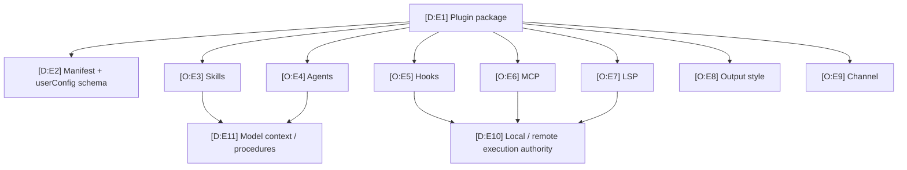

# Extension Surface Matrix

Claude Code’s extension model is compositional: instructions change context, hooks observe lifecycle, MCP adds remote/local capabilities, agents delegate work, and plugins package several of these together. The security review must follow the most privileged enabled component.

## Surface matrix

| Surface | Contribution | Discovery / activation | Direct local execution? | Refresh / lifetime | Isolation controls | Basis and hosted sources |
|---|---|---|---:|---|---|---|
| `CLAUDE.md` / rules | Prompt instructions and machine/project context | Automatic user/project/added-dir discovery unless suppressed | No; can influence model-selected tools | Startup and instruction/file change boundaries | Safe mode; bare disables automatic discovery | O CLI behavior: [`H:root`](https://github.com/swyxio/claude-code-internals/blob/main/evidence/cli-help/root.txt); D assembly: [`R:startup`](https://github.com/swyxio/claude-code-internals/blob/main/reconstructed/startup/cli-bootstrap.ts) |
| Automatic memory | Retrieved/persisted context | Settings-controlled store | No direct execution | Session/turn dependent; exact ranking unknown | Independent controls; project custom path ignored | D claims `memory.independent-controls`, `memory.project-path-hardening` in [`E:claims`](https://github.com/swyxio/claude-code-internals/blob/main/evidence/claims.ndjson); [`R:memory`](https://github.com/swyxio/claude-code-internals/blob/main/reconstructed/memory/auto-memory.ts) |
| Skills / commands | Named procedures, prompts, assets | Skill roots and plugins; explicit `/name` invocation | Indirect through tool requests or bundled assets | Can emit `commands_changed` mid-session | Safe mode disables; bare still resolves named skills | D claim `extensibility.skills-refresh`; [`R:skills`](https://github.com/swyxio/claude-code-internals/blob/main/reconstructed/skills/discovery.ts) |
| Custom agents | Delegated prompt/model/tools/permissions/memory/isolation | Settings, `--agents`, plugins, built-ins | Through the child’s granted tools | Child/background session lifetime | Tool restrictions, permission mode, worktree isolation | O flags: [`H:root`](https://github.com/swyxio/claude-code-internals/blob/main/evidence/cli-help/root.txt); D contracts: [`R:agents`](https://github.com/swyxio/claude-code-internals/blob/main/reconstructed/agents/subagents.ts) |
| Hooks | Lifecycle command, prompt, agent, HTTP, or MCP handlers | Settings, plugins, skills, SDK | Yes for command/agent/HTTP/MCP handlers | Per matching lifecycle event | Safe/bare suppress; matcher/ordering remain partly unknown | D claim `extensibility.hook-lifecycle`; [`R:hooks`](https://github.com/swyxio/claude-code-internals/blob/main/reconstructed/hooks/dispatcher.ts) |
| MCP servers | Tools, resources, prompts, elicitation | User/project/local/explicit/plugin sources | Stdio runs a child; remote transports execute elsewhere | Connection/session lifetime | Project approval, strict config, plugin MCP suppression | O CLI: [`H:MCP`](https://github.com/swyxio/claude-code-internals/blob/main/evidence/cli-help/mcp.txt); D: [`R:MCP`](https://github.com/swyxio/claude-code-internals/blob/main/reconstructed/mcp/client-manager.ts) |
| Plugins | Composite component package | Installed scope, marketplace, directory, zip, URL | Depends on hooks/MCP/LSP/monitor components | Installed or session-only; update/restart boundaries | Safe mode; component inventory; strict validation; MCP suppression | O CLI: [`H:plugin`](https://github.com/swyxio/claude-code-internals/blob/main/evidence/cli-help/plugin.txt), [`H:init`](https://github.com/swyxio/claude-code-internals/blob/main/evidence/cli-help/plugin-init.txt); D: [`R:plugins`](https://github.com/swyxio/claude-code-internals/blob/main/reconstructed/plugins/loader.ts) |
| LSP / IDE / Chrome | Editor/browser/application capabilities | Auto-connect or explicit flags/plugins | Yes through child process or bridge | Integration connection lifetime | Safe/bare suppress LSP/customizations; IPC details unknown | O flags: [`H:root`](https://github.com/swyxio/claude-code-internals/blob/main/evidence/cli-help/root.txt); D socket control: claim `security.socket-directory-mode` |
| Stream-JSON / SDK | Programmatic input, output, session and tool orchestration | `--print`, input/output format flags, entrypoint identity | Through the same effective tools | Process/session lifetime | Explicit tools, settings, strict MCP, no-session-persistence | O protocol flags: [`H:root`](https://github.com/swyxio/claude-code-internals/blob/main/evidence/cli-help/root.txt); D startup: [`R:startup`](https://github.com/swyxio/claude-code-internals/blob/main/reconstructed/startup/cli-bootstrap.ts) |
| Remote control | Remote session messages and control | CLI flag or startup setting | Can lead to local tools under session policy | Remote channel/session lifetime | Peer-machine approval option; local socket mode | D claims `remote.startup`, `remote.peer-isolation`; [`R:remote`](https://github.com/swyxio/claude-code-internals/blob/main/reconstructed/remote/direct-connect.ts) |

## Dynamically exercised extension paths

Observed dynamically Isolated
fixtures exercised three discovery surfaces: a selected inline agent narrowed
the advertised tool list, a user-home skill appeared in both skill and slash
command catalogs, and an explicit local plugin contributed a namespaced skill.
The same suite observed concurrent sibling `PreToolUse` dispatch and the MCP
stdio sequence `initialize → initialized → tools/list → tools/call`.

[Extension runtime report](../dynamics/extensions-runtime.md) · claims
`dynamic.discovery.explicit-components`, `dynamic.hooks.concurrent-siblings`,
and `dynamic.mcp.stdio-flow` in
[`E:claims`](https://github.com/swyxio/claude-code-internals/blob/main/evidence/claims.ndjson).

## Plugin composition map

| IDs | Basis | Mapping | Hosted sources |
|---|---|---|---|
| E1–E2 | D | A plugin groups manifest metadata, configuration, and components into one source identity. | [`R:plugins`](https://github.com/swyxio/claude-code-internals/blob/main/reconstructed/plugins/loader.ts), [`H:plugin-install`](https://github.com/swyxio/claude-code-internals/blob/main/evidence/cli-help/plugin-install.txt) |
| E3–E9 | O | `plugin init --with` advertises these seven component classes. | [`H:plugin-init`](https://github.com/swyxio/claude-code-internals/blob/main/evidence/cli-help/plugin-init.txt), claim `extensibility.plugin-component-inventory` |
| E10 | D | Hook monitors execute at hook trust; MCP/LSP can spawn or contact external capabilities. | Claims `security.plugin-monitor-trust` and `extensibility.mcp-transports` in [`E:claims`](https://github.com/swyxio/claude-code-internals/blob/main/evidence/claims.ndjson), [`R:hooks`](https://github.com/swyxio/claude-code-internals/blob/main/reconstructed/hooks/dispatcher.ts) |
| E11 | D | Skills and agents primarily specialize instructions and delegation, while authority remains mediated by effective tools/permissions. | [`R:skills`](https://github.com/swyxio/claude-code-internals/blob/main/reconstructed/skills/discovery.ts), [`R:agents`](https://github.com/swyxio/claude-code-internals/blob/main/reconstructed/agents/subagents.ts) |

## Lifecycle attachment points

| Phase | Relevant extension events or refresh | Basis | Sources |
|---|---|---|---|
| Startup | `Setup`, `SessionStart`, instructions/skills/plugins/MCP discovery | D | Anchor `hooks.lifecycle` in [`E:anchors`](https://github.com/swyxio/claude-code-internals/blob/main/evidence/anchors.json), [`R:startup`](https://github.com/swyxio/claude-code-internals/blob/main/reconstructed/startup/cli-bootstrap.ts) |
| User input | `UserPromptSubmit`, `UserPromptExpansion` | O event names; H payload/ordering | [`R:hooks`](https://github.com/swyxio/claude-code-internals/blob/main/reconstructed/hooks/dispatcher.ts), anchor `hooks.lifecycle` |
| Tool request | `PreToolUse`, `PermissionRequest`, `PermissionDenied` | D control boundaries | [`R:tool-pipeline`](https://github.com/swyxio/claude-code-internals/blob/main/reconstructed/tools/execution-pipeline.ts), [`R:permissions`](https://github.com/swyxio/claude-code-internals/blob/main/reconstructed/permissions/engine.ts) |
| Tool completion | `PostToolUse`, `PostToolUseFailure`, `PostToolBatch` | O event names; D attachment | [`R:hooks`](https://github.com/swyxio/claude-code-internals/blob/main/reconstructed/hooks/dispatcher.ts), [`R:tool-pipeline`](https://github.com/swyxio/claude-code-internals/blob/main/reconstructed/tools/execution-pipeline.ts) |
| Context change | `PreCompact`, `PostCompact`, `InstructionsLoaded`, `ConfigChange`, `FileChanged`, `CwdChanged` | O event names; H exact refresh scheduling | [`R:hooks`](https://github.com/swyxio/claude-code-internals/blob/main/reconstructed/hooks/dispatcher.ts), claim `context.compaction-lifecycle` |
| Delegation | `SubagentStart`, `SubagentStop`, `TeammateIdle`, task events | D lifecycle observability | [`R:agents`](https://github.com/swyxio/claude-code-internals/blob/main/reconstructed/agents/subagents.ts), claims `agents.lifecycle-observability`, `agents.pending-turn-state` |
| Shutdown | `Stop`, `StopFailure`, `SessionEnd`, `WorktreeRemove` | O event names; H handler order | [`R:hooks`](https://github.com/swyxio/claude-code-internals/blob/main/reconstructed/hooks/dispatcher.ts) |

## Trust review order

1. Identify origin, scope, immutable version/digest, and update channel.
2. Inventory every component rather than trusting the package label.
3. Review executable components first: command/agent/HTTP/MCP hooks, monitors, stdio MCP, LSP.
4. Review model-influencing text: skills, agents, tool descriptions, MCP prompts/resources.
5. Confirm safe/bare/strict-mode expectations and managed policy.
6. Verify actual effective catalog and connections at runtime; presence in a package is not proof of activation.

The exact marketplace signature model, cross-event hook composition, and every
plugin shadowing rule remain outside the authenticated evidence. Sibling
`PreToolUse` command hooks are no longer wholly unknown: the exercised pair was
dispatched concurrently, so authors must not coordinate through declaration
order.
