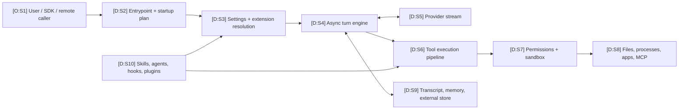

# Maps and Cross-References

This layer turns the atlas into a set of navigable technical maps. It is optimized for readers who need to answer “where does this happen?”, “what can extend it?”, “which boundary authorizes it?”, and “what evidence supports this edge?” without reading every chapter in order.

All maps describe the macOS arm64 `2.1.177` artifact with SHA-256 `eb0730351be2f02b482b1855870f5877489085aac86b0c4c1db4e458d9e40ed9`. They do not generalize silently to later builds.

## Epistemic legend

| Marker | Meaning in a node, edge, or table row | Required support |
|---|---|---|
| **O** / Observed | Literal value, CLI output, string occurrence, hash, offset, signature field, or parsed module record. | Committed evidence or a version-matched help capture. |
| **D** / Derived | Independently named boundary or relationship supported by one or more observations. | Claim/anchor references and reconstructed contract. |
| **H** / Hypothesis | Plausible detail not uniquely determined by the artifact. | Explicit unknown or injected interface plus a falsification path. |

Diagram labels such as `[D:S4]` combine basis and a local map ID. Mermaid nodes are deliberately not direct links because the site uses Mermaid’s strict security mode. The source ledger immediately below each diagram resolves every ID to hosted evidence and reconstructed code.

## Stable link convention

Every mapping uses repository URLs rooted at the merge target:

| Prefix | Target | Stable URL pattern |
|---|---|---|
| `E:` | Parsed evidence, anchors, claims, provenance | `https://github.com/swyxio/claude-code-internals/blob/main/evidence/...` |
| `R:` | Independently authored reconstruction | `https://github.com/swyxio/claude-code-internals/blob/main/reconstructed/...` |
| `H:` | Version-matched CLI help capture | `https://github.com/swyxio/claude-code-internals/blob/main/evidence/cli-help/...` |
| `D:` | Long-form explanation inside this atlas | Relative `.md` page link, rendered as an on-site route |

Anchor references use the exact `anchorId` from [`E:anchors`](https://github.com/swyxio/claude-code-internals/blob/main/evidence/anchors.json). Claim references use the exact `id` from [`E:claims`](https://github.com/swyxio/claude-code-internals/blob/main/evidence/claims.ndjson). Reconstructed filenames are explanatory boundaries, not recovered Anthropic source filenames.

## Map directory

| Map | Fast question it answers | Primary audience |
|---|---|---|
| [System map](system-map.md) | What are the major local, remote, enforcement, and persistence boundaries? | Everyone |
| [Execution flow](execution-flow.md) | What calls what from startup through model streaming and tool completion? | Implementers, debuggers |
| [Extension surfaces](extension-surfaces.md) | Which mechanisms add context, code, capabilities, or transport? | Extension authors, operators |
| [Settings and permissions](settings-permissions.md) | Which sources contribute policy, and what precedence is actually known? | Administrators, security reviewers |
| [Persistence and data flow](persistence-dataflow.md) | What can be stored, loaded, inherited, or sent across session boundaries? | Privacy reviewers, operators |
| [Providers and network](provider-network.md) | Which routes can leave the process and what controls each route? | Network/security teams |
| [Threat model](threat-model.md) | Which trust transitions create risk, and which controls are evidenced? | Security reviewers |
| [Evidence-to-code cross-reference](evidence-code-cross-reference.md) | Which evidence IDs ground each reconstructed source file? | Researchers, maintainers |
| [Audience reading paths](../audiences/index.md) | What should I read first for my role and available time? | Everyone |

## One-screen orientation

| ID | Basis | Mapping | Hosted sources |
|---|---|---|---|
| S1 | O | The root CLI exposes interactive, print/stream-JSON, agents, MCP, remote-control, IDE, and maintenance entrypoints. | [`H:root`](https://github.com/swyxio/claude-code-internals/blob/main/evidence/cli-help/root.txt), [`E:entrypoint.routing`](https://github.com/swyxio/claude-code-internals/blob/main/evidence/anchors.json) |
| S2 | D | Startup resolves mode, trust, settings, auth, extensions, MCP, session, and tool catalog before the selected runtime. | [`R:startup`](https://github.com/swyxio/claude-code-internals/blob/main/reconstructed/startup/cli-bootstrap.ts), claim `architecture.entrypoint-routing` in [`E:claims`](https://github.com/swyxio/claude-code-internals/blob/main/evidence/claims.ndjson) |
| S3 | D | Settings and extension sources are resolved with provenance; key-specific merge order remains injected. | [`R:settings-resolution`](https://github.com/swyxio/claude-code-internals/blob/main/reconstructed/settings/resolution.ts), [`R:settings-schema`](https://github.com/swyxio/claude-code-internals/blob/main/reconstructed/settings/schema.ts) |
| S4 | D | The central turn engine is represented as an async generator coordinating model frames, tools, compaction, stop hooks, and exit reasons. | [`R:turn-engine`](https://github.com/swyxio/claude-code-internals/blob/main/reconstructed/engine/turn-engine.ts), claim `agent-loop.core-generator` in [`E:claims`](https://github.com/swyxio/claude-code-internals/blob/main/evidence/claims.ndjson) |
| S5 | D | Provider adapters normalize streamed frames for Anthropic, Bedrock, Vertex, or Foundry routes. | [`R:model-stream`](https://github.com/swyxio/claude-code-internals/blob/main/reconstructed/engine/model-stream.ts), [`R:providers-http`](https://github.com/swyxio/claude-code-internals/blob/main/reconstructed/auth/providers-http.ts) |
| S6 | D | A shared pipeline performs coercion, validation, pre-hook handling, centralized authorization, tool call, and post hooks. | [`R:tool-pipeline`](https://github.com/swyxio/claude-code-internals/blob/main/reconstructed/tools/execution-pipeline.ts), claim `tools.execution-pipeline` in [`E:claims`](https://github.com/swyxio/claude-code-internals/blob/main/evidence/claims.ndjson) |
| S7 | D | Managed constraints, permission mode/rules/classifier, and sandbox planning form separate enforcement layers. | [`R:permissions`](https://github.com/swyxio/claude-code-internals/blob/main/reconstructed/permissions/engine.ts), [`R:sandbox`](https://github.com/swyxio/claude-code-internals/blob/main/reconstructed/sandbox/runtime.ts) |
| S8 | D | Approved capabilities cross into files, child processes, local applications, MCP processes/endpoints, or native modules. | [`R:tool-catalog`](https://github.com/swyxio/claude-code-internals/blob/main/reconstructed/tools/catalog.ts), [`R:native-boundaries`](https://github.com/swyxio/claude-code-internals/blob/main/reconstructed/native/runtime-boundaries.ts) |
| S9 | D | Local transcript, bounded external session load, and automatic memory are distinct persistence seams. | [`R:sessions`](https://github.com/swyxio/claude-code-internals/blob/main/reconstructed/persistence/sessions.ts), [`R:memory`](https://github.com/swyxio/claude-code-internals/blob/main/reconstructed/memory/auto-memory.ts) |
| S10 | D | Skills, agents, hooks, plugins, and MCP contribute different mixtures of context and executable authority. | [`R:skills`](https://github.com/swyxio/claude-code-internals/blob/main/reconstructed/skills/discovery.ts), [`R:agents`](https://github.com/swyxio/claude-code-internals/blob/main/reconstructed/agents/subagents.ts), [`R:plugins`](https://github.com/swyxio/claude-code-internals/blob/main/reconstructed/plugins/loader.ts) |

## Guardrails for using these maps

- A source edge shows an evidence-backed relationship, not original private module ownership.
- A setting name does not establish its default value or activation.
- An embedded feature path can be dormant, platform-gated, account-gated, or unreachable in a selected mode.
- “Permission allowed” and “sandbox contained” are independent decisions.
- A valid signature authenticates the outer executable; it does not attest user-installed extensions.
- Remote endpoint, payload, persistence encoding, hook ordering, and per-key precedence details remain unknown where the reconstruction injects an interface.

For the legal and publication boundary, use
[`D:legal-and-ethics`](../legal-and-ethics.md).
