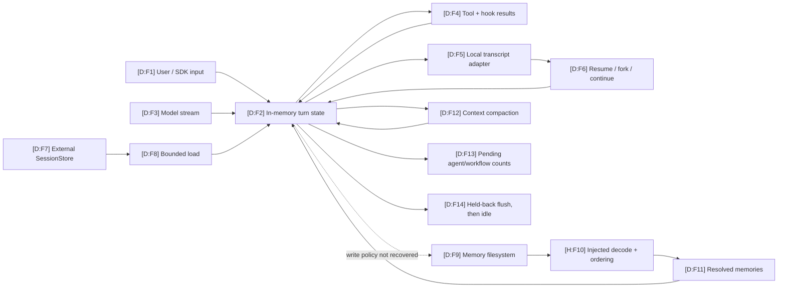

# Persistence and Data Flow

This map separates **turn context**, **local session transcripts**, **external session loading**, and **automatic memory**. Static anchors establish that these concerns exist. An isolated runtime probe additionally observed one normalized local JSONL transcript path and record sequence, but does not authenticate every path, encoding, retention period, or encryption behavior.

## State-flow map

| ID | Basis | Mapping | Hosted sources |
|---|---|---|---|
| F1–F4 | D | The async turn engine accepts input, consumes a normalized model stream, executes tool calls, and incorporates tool/hook results into subsequent turns. | [`R:turn`](https://github.com/swyxio/claude-code-internals/blob/main/reconstructed/engine/turn-engine.ts), [`R:model-stream`](https://github.com/swyxio/claude-code-internals/blob/main/reconstructed/engine/model-stream.ts), [`R:tool-pipeline`](https://github.com/swyxio/claude-code-internals/blob/main/reconstructed/tools/execution-pipeline.ts) |
| F5–F6 | D | Local transcript read, append, and remove operations are modeled separately from the engine; the CLI advertises resume, continue, and fork-session controls. | Claims `sessions.local-transcript` in [`E:claims`](https://github.com/swyxio/claude-code-internals/blob/main/evidence/claims.ndjson), [`R:sessions`](https://github.com/swyxio/claude-code-internals/blob/main/reconstructed/persistence/sessions.ts), [`H:root`](https://github.com/swyxio/claude-code-internals/blob/main/evidence/cli-help/root.txt) |
| F7–F8 | D | The recovered bundle exposes an external `SessionStore.load()` timeout boundary; the reconstruction limits its authenticated surface to bounded load. | Claim `sessions.external-store` in [`E:claims`](https://github.com/swyxio/claude-code-internals/blob/main/evidence/claims.ndjson), [`R:sessions`](https://github.com/swyxio/claude-code-internals/blob/main/reconstructed/persistence/sessions.ts) |
| F9 | D | Memory location and filesystem access are separate injected boundaries; checked-in project settings cannot redirect the custom automatic-memory directory. | Claims `memory.independent-controls` and `memory.project-path-hardening` in [`E:claims`](https://github.com/swyxio/claude-code-internals/blob/main/evidence/claims.ndjson), [`R:memory`](https://github.com/swyxio/claude-code-internals/blob/main/reconstructed/memory/auto-memory.ts) |
| F10 | H | Memory record format, manifest structure, decode behavior, and ordering/ranking are not recovered; the schematic injects them. | [`R:memory`](https://github.com/swyxio/claude-code-internals/blob/main/reconstructed/memory/auto-memory.ts), limitations in [`R:README`](https://github.com/swyxio/claude-code-internals/blob/main/reconstructed/README.md) |
| F11 | D | Resolved memory records can enter the working context through a store boundary; independent read/write controls are evidenced, not their defaults. | Claim `memory.independent-controls`; [`R:memory`](https://github.com/swyxio/claude-code-internals/blob/main/reconstructed/memory/auto-memory.ts) |
| F12 | D | Compaction has progress and completed-boundary events and feeds a compacted context back to the turn engine. | Claim `context.compaction-lifecycle`; [`R:turn`](https://github.com/swyxio/claude-code-internals/blob/main/reconstructed/engine/turn-engine.ts) |
| F13–F14 | D | Turn completion records pending background-agent/workflow counts; idle follows held-back-result flush and background-agent-loop exit. | Claims `agents.pending-turn-state` and `agents.idle-boundary`; [`R:agents`](https://github.com/swyxio/claude-code-internals/blob/main/reconstructed/agents/subagents.ts) |

## Data-class inventory

### Dynamic transcript overlay

Observed dynamically A
persistence-enabled `Read` → `Bash` turn created one mode-`0600` JSONL file
under temporary Claude project state. Its nine records were two
`queue-operation` entries, alternating user/assistant tool history, and a final
`last-prompt`. The matched no-session case created ordinary Claude state and a
backup but no transcript. [Runtime tool/session probe](../dynamics/runtime-tool-session.md)
· claims `dynamic.runtime.transcript-order` and
`dynamic.core.no-session-state-files`.

| Data class | Producer | Consumer / use | Persistence status supported by evidence | Unknowns that must stay unknown | Hosted sources |
|---|---|---|---|---|---|
| User and assistant messages | Input surface and model stream | Turn engine and later model requests | A local `session_transcript` concern is present. | Exact record schema, whether every event is appended, encoding, redaction, and retention. | [`R:turn`](https://github.com/swyxio/claude-code-internals/blob/main/reconstructed/engine/turn-engine.ts), claim `sessions.local-transcript` |
| Tool requests and results | Model and tool pipeline | Turn engine, post-tool hooks, transcript boundary | The shared execution path returns structured events; transcript inclusion is not independently proven. | Persisted fields, truncation, binary payload handling, and secret filtering. | [`R:tool-pipeline`](https://github.com/swyxio/claude-code-internals/blob/main/reconstructed/tools/execution-pipeline.ts), claim `tools.execution-pipeline` |
| Hook inputs and outputs | Lifecycle dispatcher | Tool/session/subagent/compaction flows | Hooks are runtime events; no separate hook log format is authenticated. | Whether hook stdout/stderr or rewritten input is persisted and for how long. | [`R:hooks`](https://github.com/swyxio/claude-code-internals/blob/main/reconstructed/hooks/dispatcher.ts), claim `extensibility.hook-lifecycle` |
| Session reference and transcript records | Session adapter | Resume/continue/fork and external load | Local transcript and external-load seams are separate; one isolated local run produced a mode-`0600` JSONL event log. | General path/format stability, indexes, locking, atomicity, retention, and external write/mirroring. | [`R:sessions`](https://github.com/swyxio/claude-code-internals/blob/main/reconstructed/persistence/sessions.ts), [dynamic runtime report](https://github.com/swyxio/claude-code-internals/blob/main/evidence/dynamic/runtime/runtime-dynamics.json) |
| Automatic-memory records | Memory subsystem | Future context assembly | Read and write controls are independent; project custom-path redirection is constrained. | Defaults, path layout, file mode, format, ranking, deduplication, expiry, and provenance fields. | [`R:memory`](https://github.com/swyxio/claude-code-internals/blob/main/reconstructed/memory/auto-memory.ts), claims `memory.independent-controls` and `memory.project-path-hardening` |
| Compacted context | Compaction subsystem | A subsequent model turn | Progress and completion events are established. | Algorithm, summarization provider, preservation guarantees, and whether compacted output replaces or supplements transcript records. | [`R:turn`](https://github.com/swyxio/claude-code-internals/blob/main/reconstructed/engine/turn-engine.ts), claim `context.compaction-lifecycle` |
| Agent/task coordination state | Subagent runtime | Parent turn and idle boundary | Pending background-agent and workflow counts are exposed at turn completion. | Durable storage, restart recovery, queue schema, result ordering, and worktree metadata retention. | [`R:agents`](https://github.com/swyxio/claude-code-internals/blob/main/reconstructed/agents/subagents.ts), claims `agents.pending-turn-state` and `agents.idle-boundary` |
| Credentials | Environment, helper, OAuth/profile, Keychain/file adapters | Provider authentication | Named credential seams and macOS Keychain invocation are present. | Effective precedence, portable file format/mode, cache duration, token rotation, and transcript exclusion. | [`R:credentials`](https://github.com/swyxio/claude-code-internals/blob/main/reconstructed/auth/credentials.ts), claims `auth.api-key`, `auth.api-key-helper`, `auth.oauth`, and `auth.macos-keychain` |
| Telemetry queue/batch | Runtime event facade | First-party event endpoint | Disable switches and a versioned batch path are present. | Event inventory, attributes, redaction, encoding, retry, local queue persistence, and deletion. | [`R:telemetry`](https://github.com/swyxio/claude-code-internals/blob/main/reconstructed/telemetry/telemetry.ts), claims `telemetry.batch-endpoint` and `telemetry.disable` |

## Session versus memory

| Property | Session transcript | Automatic memory | Evidence-safe conclusion |
|---|---|---|---|
| Primary purpose | Recover conversational/session context. | Reintroduce selected information across context boundaries. | They are distinct adapters and controls; do not describe memory as merely an alias for transcripts. |
| Read path | Local read or bounded external `SessionStore.load`. | Resolve a memory location, list entries, decode, and order through injected contracts. | External session loading does not prove remote memory synchronization. |
| Write path | Local append/remove exist in the schematic. | A filesystem write contract exists, but the recovered write selection policy is not asserted. | Neither schematic authenticates the binary's exact write timing or atomicity. |
| Path hardening | Exact local transcript path is unknown. | Project settings cannot supply the custom automatic-memory directory. | The memory rule must not be generalized into a transcript-path rule. |
| Format | One exercised local path was JSONL mode `0600`; universality is unknown. | Unknown. | Do not generalize the dynamic session format to automatic memory or every session adapter. |

Sources: [`R:sessions`](https://github.com/swyxio/claude-code-internals/blob/main/reconstructed/persistence/sessions.ts), [`R:memory`](https://github.com/swyxio/claude-code-internals/blob/main/reconstructed/memory/auto-memory.ts), and the corresponding claims in [`E:claims`](https://github.com/swyxio/claude-code-internals/blob/main/evidence/claims.ndjson).

## Control semantics that are easy to overstate

| Control | Literal/evidenced meaning | Do not infer | Source |
|---|---|---|---|
| `--no-session-persistence` | Root help describes disabling session persistence in print mode. | A machine-wide guarantee that no files, logs, memory, credentials, caches, or telemetry are written. | [`H:root`](https://github.com/swyxio/claude-code-internals/blob/main/evidence/cli-help/root.txt) |
| `--resume`, `--continue`, `--fork-session` | Session selection and fork controls exist. | The precise parent/child storage representation or copy-on-write behavior. | [`H:root`](https://github.com/swyxio/claude-code-internals/blob/main/evidence/cli-help/root.txt), [`R:sessions`](https://github.com/swyxio/claude-code-internals/blob/main/reconstructed/persistence/sessions.ts) |
| Automatic-memory enable controls | Reads and writes can be configured independently. | Their default values in every deployment, or a complete data-deletion guarantee. | Claim `memory.independent-controls` in [`E:claims`](https://github.com/swyxio/claude-code-internals/blob/main/evidence/claims.ndjson) |
| Nonessential-traffic and telemetry switches | Separate outbound controls exist. | Their effect on local transcript/memory persistence or on essential provider calls. | [`R:telemetry`](https://github.com/swyxio/claude-code-internals/blob/main/reconstructed/telemetry/telemetry.ts), claims `telemetry.disable` and `telemetry.nonessential-control` |

## Audit questions for an operator

1. Which session and memory settings sources are active, and which are managed?
2. Is automatic-memory read enabled, write enabled, both, or neither in the deployed policy?
3. Is an external SessionStore configured, and if so, what is its retention and access-control policy?
4. Does the selected execution mode advertise or require local session persistence?
5. Are tool output, hook output, and secrets filtered before any durable or outbound sink?

The first four questions are motivated by evidenced control surfaces; the fifth remains a deployment audit question because payload filtering is not authenticated by this reconstruction. See the [provider/network map](provider-network.md) for outbound sinks and the [threat model](threat-model.md) for trust-boundary consequences.
