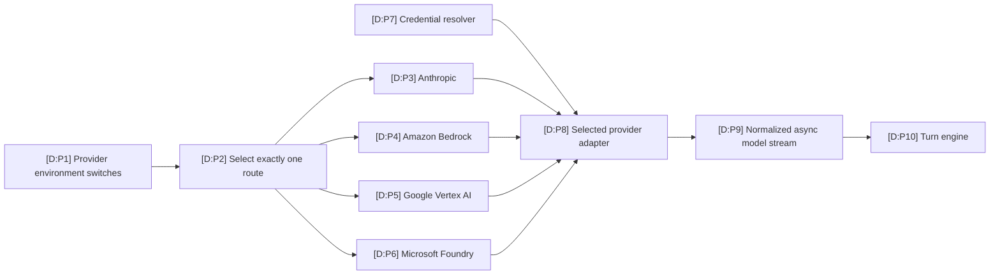
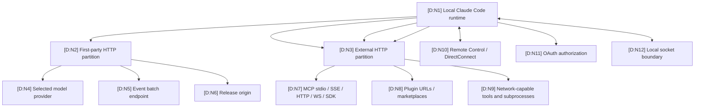

# Providers and Network Surfaces

This map inventories network-capable seams without claiming that each one is active in every session. Provider selection, authentication, MCP configuration, plugins, tools, telemetry, updates, and Remote Control each have different triggers and controls.

## Model-provider selection

| ID | Basis | Mapping | Hosted sources |
|---|---|---|---|
| P1–P2 | D | The reconstruction recognizes Bedrock, Vertex, and Foundry switches, rejects multiple simultaneous alternate routes, and otherwise selects Anthropic. Exact conflict handling is schematic. | [`R:providers`](https://github.com/swyxio/claude-code-internals/blob/main/reconstructed/auth/providers-http.ts), claim `providers.alternate-routes` in [`E:claims`](https://github.com/swyxio/claude-code-internals/blob/main/evidence/claims.ndjson) |
| P3 | D | Direct Anthropic API-key and Claude.ai OAuth seams are evidenced; an Anthropic adapter is the default route in the schematic. | Claims `auth.api-key` and `auth.oauth`; [`R:credentials`](https://github.com/swyxio/claude-code-internals/blob/main/reconstructed/auth/credentials.ts) |
| P4–P6 | D | Embedded anchors identify alternate routes for Amazon Bedrock, Google Vertex AI, and Microsoft Foundry. | Claim `providers.alternate-routes`; anchors `providers.bedrock`, `providers.vertex`, and `providers.foundry` in [`E:anchors`](https://github.com/swyxio/claude-code-internals/blob/main/evidence/anchors.json) |
| P7 | D | Credentials can come through named environment, helper, OAuth/profile, Keychain, and portable-store seams; precise precedence and storage details are not authenticated. | [`R:credentials`](https://github.com/swyxio/claude-code-internals/blob/main/reconstructed/auth/credentials.ts), claims `auth.api-key`, `auth.api-key-helper`, `auth.oauth`, and `auth.macos-keychain` |
| P8–P10 | D | A selected adapter produces an async iterable normalized into model events for the async-generator turn engine. | [`R:providers`](https://github.com/swyxio/claude-code-internals/blob/main/reconstructed/auth/providers-http.ts), [`R:model-stream`](https://github.com/swyxio/claude-code-internals/blob/main/reconstructed/engine/model-stream.ts), claim `agent-loop.core-generator` |

## Egress and ingress topology

| ID | Basis | Mapping | Hosted sources |
|---|---|---|---|
| N1 | D | One local runtime coordinates model, extension, persistence, and control surfaces. | [`R:startup`](https://github.com/swyxio/claude-code-internals/blob/main/reconstructed/startup/cli-bootstrap.ts), claim `architecture.entrypoint-routing` |
| N2–N3 | D | The HTTP layer distinguishes Anthropic-operated destinations from external HTTP destinations; exact middleware composition is injected. | Claim `network.first-party-boundary`; [`R:providers`](https://github.com/swyxio/claude-code-internals/blob/main/reconstructed/auth/providers-http.ts) |
| N4 | D | Provider traffic can route to Anthropic, Bedrock, Vertex, or Foundry depending on configuration. | Claim `providers.alternate-routes`; [`R:providers`](https://github.com/swyxio/claude-code-internals/blob/main/reconstructed/auth/providers-http.ts) |
| N5 | D | First-party event logging includes `/api/event_logging/v2/batch`; telemetry and nonessential-traffic switches exist. Payload and host are not authenticated by that path alone. | Claims `telemetry.batch-endpoint`, `telemetry.disable`, and `telemetry.nonessential-control`; [`R:telemetry`](https://github.com/swyxio/claude-code-internals/blob/main/reconstructed/telemetry/telemetry.ts) |
| N6 | D | Native releases use the `downloads.claude.ai/claude-code-releases` origin; the captured installer verifies a manifest checksum before execution. | Claims `updates.release-origin` and `artifact.installer-integrity-flow`; [`R:updater`](https://github.com/swyxio/claude-code-internals/blob/main/reconstructed/update/updater.ts), [`E:provenance`](https://github.com/swyxio/claude-code-internals/blob/main/evidence/provenance.json) |
| N7 | D | MCP recognizes stdio, SSE, IDE-SSE, HTTP, WebSocket, and SDK transport families. Stdio is local process I/O but the server it launches can perform network traffic. | Claim `extensibility.mcp-transports`; [`R:MCP`](https://github.com/swyxio/claude-code-internals/blob/main/reconstructed/mcp/client-manager.ts) |
| N8 | O + D | Root help exposes session-only plugin ZIP fetch by URL; plugin commands expose marketplace operations. Download/auth/cache protocol details are not recovered. | [`H:root`](https://github.com/swyxio/claude-code-internals/blob/main/evidence/cli-help/root.txt), [`H:plugin`](https://github.com/swyxio/claude-code-internals/blob/main/evidence/cli-help/plugin.txt), [`R:plugins`](https://github.com/swyxio/claude-code-internals/blob/main/reconstructed/plugins/loader.ts) |
| N9 | D | Tools resolve through a common registry and pipeline; network effects depend on the selected tool, subprocess, permission, and sandbox policy. | [`R:catalog`](https://github.com/swyxio/claude-code-internals/blob/main/reconstructed/tools/catalog.ts), [`R:tool-pipeline`](https://github.com/swyxio/claude-code-internals/blob/main/reconstructed/tools/execution-pipeline.ts), [`R:sandbox`](https://github.com/swyxio/claude-code-internals/blob/main/reconstructed/sandbox/runtime.ts) |
| N10 | D | Remote Control has startup and peer-isolation controls, while endpoint, authentication, framing, and codec remain injected unknowns. | Claims `remote.startup` and `remote.peer-isolation`; [`R:remote`](https://github.com/swyxio/claude-code-internals/blob/main/reconstructed/remote/direct-connect.ts) |
| N11 | D | Claude.ai OAuth uses an explicit authorization endpoint constant; the full redirect/token exchange is not reconstructed. | Claim `auth.oauth`; [`R:credentials`](https://github.com/swyxio/claude-code-internals/blob/main/reconstructed/auth/credentials.ts) |
| N12 | D | A local IPC check requires a socket directory with mode `0700`; protocol and peer authentication are not established by that check. | Claim `security.socket-directory-mode`; [`R:remote`](https://github.com/swyxio/claude-code-internals/blob/main/reconstructed/remote/direct-connect.ts) |

## Network surface matrix

### Dynamically observed provider boundary

Two loopback suites exercised the direct Anthropic-compatible client without
publishing request content. The core bare-print case issued `HEAD /` then
`POST /v1/messages`; the bare-and-safe custom-system-prompt cases went directly
to `POST`. Runtime and extension suites inherited an OS policy denying
non-loopback outbound sockets, except the nested product-sandbox case where a
second Seatbelt profile would confound the feature under test.

[Protocol smoke test](../dynamics/protocol-smoke.md) ·
[runtime provider turn](../dynamics/runtime-startup-provider.md) · claims
`dynamic.core.provider-preflight` and `dynamic.runtime.safe-direct-post`.

| Surface | Activation trigger | Potential data crossing boundary | Evidenced control or invariant | Unauthenticated details | Hosted sources |
|---|---|---|---|---|---|
| Anthropic model API | Default provider route plus valid credentials | Prompts/context, tool descriptions/results, model responses | First-party/external partition; direct API-key and OAuth paths. | Exact endpoint, request envelope, redaction, retry, proxy behavior, and data retention. | [`R:providers`](https://github.com/swyxio/claude-code-internals/blob/main/reconstructed/auth/providers-http.ts), [`R:model-stream`](https://github.com/swyxio/claude-code-internals/blob/main/reconstructed/engine/model-stream.ts), claims `auth.api-key`, `auth.oauth`, `network.first-party-boundary` |
| Amazon Bedrock | `CLAUDE_CODE_USE_BEDROCK` route | Similar model context via AWS infrastructure | Alternate route presence is anchored. | AWS credential chain, region, endpoint, signing, and feature parity. | Anchor `providers.bedrock` in [`E:anchors`](https://github.com/swyxio/claude-code-internals/blob/main/evidence/anchors.json), [`R:providers`](https://github.com/swyxio/claude-code-internals/blob/main/reconstructed/auth/providers-http.ts) |
| Google Vertex AI | `CLAUDE_CODE_USE_VERTEX` route | Similar model context via Google Cloud | Alternate route presence is anchored. | Project/region, ADC behavior, endpoint, auth, and feature parity. | Anchor `providers.vertex`; [`R:providers`](https://github.com/swyxio/claude-code-internals/blob/main/reconstructed/auth/providers-http.ts) |
| Microsoft Foundry | `CLAUDE_CODE_USE_FOUNDRY` route | Similar model context via Microsoft infrastructure | Alternate route presence is anchored. | Tenant/deployment selection, auth, endpoint, and feature parity. | Anchor `providers.foundry`; [`R:providers`](https://github.com/swyxio/claude-code-internals/blob/main/reconstructed/auth/providers-http.ts) |
| MCP server | Settings, CLI config, plugin contribution, or SDK transport | Tool arguments/results, resource requests, protocol metadata | Strict-config source restriction; project approval separate from discovery; recognized transports. | Server identity binding, TLS/auth defaults, allowlist semantics, timeouts, and payload filtering. | [`R:MCP`](https://github.com/swyxio/claude-code-internals/blob/main/reconstructed/mcp/client-manager.ts), claims `extensibility.mcp-strict-mode`, `security.mcp-project-approval`, `extensibility.mcp-transports` |
| Hook / plugin monitor | Matching lifecycle event or enabled plugin monitor | Event input, environment, stdout/stderr, arbitrary subprocess effects | Plugin monitors are explicitly described as unsandboxed at hook trust tier. | Environment scrubbing, working directory, network policy, secret exposure, and output persistence. | [`R:hooks`](https://github.com/swyxio/claude-code-internals/blob/main/reconstructed/hooks/dispatcher.ts), [`R:plugins`](https://github.com/swyxio/claude-code-internals/blob/main/reconstructed/plugins/loader.ts), claim `security.plugin-monitor-trust` |
| Built-in tool / Bash subprocess | Model tool call, user command, or workflow | Depends on tool; can include files, URLs, command output, and credentials in environment | Shared permission pipeline and sandbox controls, including explicit weaker-network compatibility option. | Tool-specific destinations, DNS/proxy rules, backend profiles, and effective defaults. | [`R:tool-pipeline`](https://github.com/swyxio/claude-code-internals/blob/main/reconstructed/tools/execution-pipeline.ts), [`R:sandbox`](https://github.com/swyxio/claude-code-internals/blob/main/reconstructed/sandbox/runtime.ts), claim `security.weaker-network-isolation` |
| Telemetry | Runtime event emission unless disabled | Event names/attributes in a batch | Direct telemetry-disable and nonessential-traffic controls; versioned first-party path. | Event catalog, payload, hashing/redaction, host, retries, drop policy, and local buffering. | [`R:telemetry`](https://github.com/swyxio/claude-code-internals/blob/main/reconstructed/telemetry/telemetry.ts), claims `telemetry.batch-endpoint`, `telemetry.disable`, `telemetry.nonessential-control` |
| Update service | Automatic or explicit update path | Current/channel/platform/version metadata; artifact download | Anthropic release origin; captured installer manifest checksum verification. | Poll cadence, channel policy, lock semantics, atomic replacement, rollback, and package-manager paths. | [`R:updater`](https://github.com/swyxio/claude-code-internals/blob/main/reconstructed/update/updater.ts), claims `updates.release-origin` and `artifact.installer-integrity-flow` |
| Remote Control | Startup setting or explicit remote entrypoint | Session/control messages | Optional cross-machine approval/isolation; local socket directory mode check. | Endpoint, authentication, encryption, message schema, codec, replay protection, and peer identity. | [`R:remote`](https://github.com/swyxio/claude-code-internals/blob/main/reconstructed/remote/direct-connect.ts), claims `remote.startup`, `remote.peer-isolation`, `security.socket-directory-mode` |
| OAuth | Authentication flow | Authorization request, redirect/code, token exchange | Explicit Claude.ai authorization URL constant is anchored. | PKCE/state storage, callback listener, scopes, token storage/refresh, and revocation. | [`R:credentials`](https://github.com/swyxio/claude-code-internals/blob/main/reconstructed/auth/credentials.ts), claim `auth.oauth` |

## Credential resolution boundary

The schematic names these potential credential sources: `ANTHROPIC_AUTH_TOKEN`, `CLAUDE_CODE_OAUTH_TOKEN`, an OAuth token file descriptor, `ANTHROPIC_API_KEY`, `apiKeyHelper`, a profile, Claude.ai OAuth, macOS Keychain, and a portable credentials file. Only the presence of direct API-key auth, an API-key helper, Claude.ai OAuth, and the macOS Keychain command is independently anchored. Source precedence, cache duration, helper execution policy, file representation, and token-refresh behavior therefore remain hypotheses. See [`R:credentials`](https://github.com/swyxio/claude-code-internals/blob/main/reconstructed/auth/credentials.ts) and claims `auth.api-key`, `auth.api-key-helper`, `auth.oauth`, and `auth.macos-keychain` in [`E:claims`](https://github.com/swyxio/claude-code-internals/blob/main/evidence/claims.ndjson).

## Control scope

| Control | Supported scope | Boundary it does not prove | Source |
|---|---|---|---|
| `DISABLE_TELEMETRY` | Direct telemetry emission control. | That all other first-party, provider, update, MCP, tool, or remote traffic is disabled. | Claim `telemetry.disable`; [`R:telemetry`](https://github.com/swyxio/claude-code-internals/blob/main/reconstructed/telemetry/telemetry.ts) |
| `CLAUDE_CODE_DISABLE_NONESSENTIAL_TRAFFIC` | Nonessential outbound control path. | A complete offline mode or the classification of every request as essential/nonessential. | Claim `telemetry.nonessential-control`; [`R:providers`](https://github.com/swyxio/claude-code-internals/blob/main/reconstructed/auth/providers-http.ts) |
| `--strict-mcp-config` | Excludes MCP sources other than explicitly supplied MCP config. | Authentication or safety of the explicitly supplied servers. | [`H:root`](https://github.com/swyxio/claude-code-internals/blob/main/evidence/cli-help/root.txt), claim `extensibility.mcp-strict-mode` |
| Sandbox network settings | Constrain subprocess/tool network according to selected backend policy. | Model-provider, updater, telemetry, or host-process extension traffic. | [`R:sandbox`](https://github.com/swyxio/claude-code-internals/blob/main/reconstructed/sandbox/runtime.ts), claims `security.weaker-network-isolation` and `sandbox.weaker-nested-compatibility` |
| First-party/external client partition | Keeps Anthropic-operated destinations on the first-party path in the schematic. | Destination authenticity, TLS pinning, proxy integrity, or payload minimization. | Claim `network.first-party-boundary`; [`R:providers`](https://github.com/swyxio/claude-code-internals/blob/main/reconstructed/auth/providers-http.ts) |

For security consequences, continue to the [threat model](threat-model.md). For local and durable state, see [persistence and data flow](persistence-dataflow.md).
