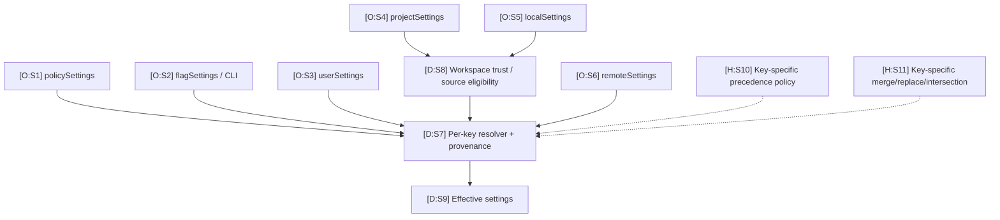
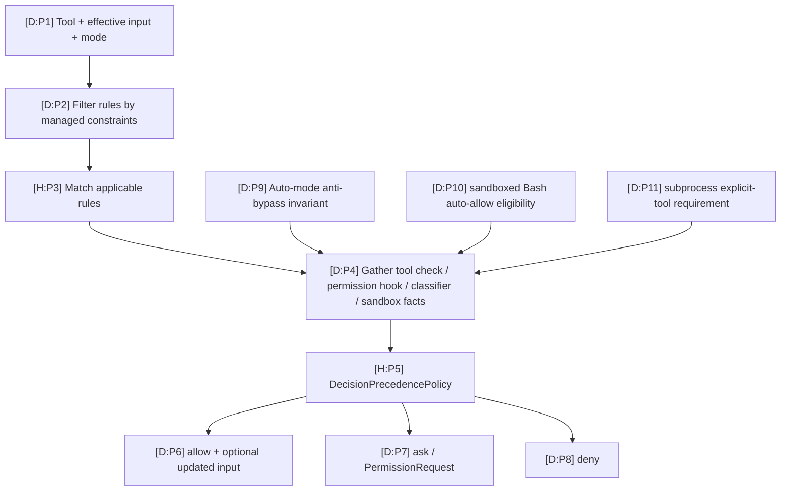

# Settings and Permissions Precedence

This map distinguishes **known source categories and hard constraints** from **unknown per-key precedence**. The reconstruction deliberately injects a precedence and merge policy because the current evidence does not authenticate one universal last-write-wins order.

## Settings contribution map

| ID | Basis | Mapping | Hosted sources |
|---|---|---|---|
| S1–S6 | O | These settings source names appear in the reconstructed schema/control paths; root help explicitly exposes user/project/local selection and additional settings. | [`R:settings`](https://github.com/swyxio/claude-code-internals/blob/main/reconstructed/settings/resolution.ts), [`H:root`](https://github.com/swyxio/claude-code-internals/blob/main/evidence/cli-help/root.txt) |
| S7 | D | Resolution is modeled per key with contribution provenance. | [`R:settings`](https://github.com/swyxio/claude-code-internals/blob/main/reconstructed/settings/resolution.ts) |
| S8 | D | At least some project/local executable settings are gated by workspace trust. | Claim `security.workspace-trust-proxy-helper` in [`E:claims`](https://github.com/swyxio/claude-code-internals/blob/main/evidence/claims.ndjson), [`R:startup`](https://github.com/swyxio/claude-code-internals/blob/main/reconstructed/startup/cli-bootstrap.ts) |
| S9 | D | Effective settings feed auth, permissions, sandbox, MCP, memory, plugins, updates, and runtime modes. | [`R:schema`](https://github.com/swyxio/claude-code-internals/blob/main/reconstructed/settings/schema.ts) |
| S10–S11 | H | One global source order and one universal merge operator are not established; both are injected interfaces. | [`R:settings`](https://github.com/swyxio/claude-code-internals/blob/main/reconstructed/settings/resolution.ts), limitations in [`R:README`](https://github.com/swyxio/claude-code-internals/blob/main/reconstructed/README.md) |

## Known constraints versus unknown precedence

Dynamic observation A focused
model-selection probe found that `local` won over persisted user and project
sources, an explicit `--settings` file won over those sources, and the
`--model` flag won last. This narrows one scalar key only; the map deliberately
keeps the general precedence and merge contracts open.
[Probe details](../dynamics/extensions-runtime.md#settings-precedence) · claim
`dynamic.settings.scalar-precedence` in
[`E:claims`](https://github.com/swyxio/claude-code-internals/blob/main/evidence/claims.ndjson).

| Setting/control | What is established | Basis | What is not established | Hosted sources |
|---|---|---|---|---|
| `allowManagedPermissionRulesOnly` | Non-policy permission rules can become ineffective. | D | Default, rollout, and every affected rule class. | Claim `security.managed-permission-rules`; [`R:settings`](https://github.com/swyxio/claude-code-internals/blob/main/reconstructed/settings/resolution.ts) |
| `disableBypassPermissionsMode` | Managed policy can make bypass mode unavailable. | D | Whether other sources can request but fail validation, or how UI presents it. | Claim `security.disable-bypass-mode`; [`R:permissions`](https://github.com/swyxio/claude-code-internals/blob/main/reconstructed/permissions/engine.ts) |
| `--strict-mcp-config` | Non-explicit MCP sources are excluded. | O help + D runtime interpretation | Ordering among multiple explicit configs and duplicate-name resolution. | [`H:root`](https://github.com/swyxio/claude-code-internals/blob/main/evidence/cli-help/root.txt), claim `extensibility.mcp-strict-mode` |
| Project MCP approval | Approval/rejection/pending state is separate from discovery. | D | Storage location, expiry, and identity binding across renamed servers. | Claim `security.mcp-project-approval`; [`R:settings`](https://github.com/swyxio/claude-code-internals/blob/main/reconstructed/settings/resolution.ts) |
| Project auto-memory directory | Checked-in project settings cannot redirect the custom memory directory. | D | Default path, other source precedence, format. | Claim `memory.project-path-hardening`; [`R:memory`](https://github.com/swyxio/claude-code-internals/blob/main/reconstructed/memory/auto-memory.ts) |
| Proxy auth helper before trust | A project/local helper is skipped until workspace trust. | D | Coverage of every executable setting and every noninteractive entrypoint. | Claim `security.workspace-trust-proxy-helper`; [`R:credentials`](https://github.com/swyxio/claude-code-internals/blob/main/reconstructed/auth/credentials.ts) |
| Sandbox fail-closed | Policy can make unavailable sandbox a startup/execution failure. | D | Platform backend selection and probe details. | Claim `security.sandbox-fail-closed`; [`R:sandbox`](https://github.com/swyxio/claude-code-internals/blob/main/reconstructed/sandbox/runtime.ts) |
| Per-command sandbox exclusion | Policy can make unsandboxed exclusion ineffective. | D | Exact command matching/canonicalization. | Claim `security.sandbox-no-command-escape`; [`R:sandbox`](https://github.com/swyxio/claude-code-internals/blob/main/reconstructed/sandbox/runtime.ts) |

## Permission decision composition

| IDs | Basis | Grounding | Hosted sources |
|---|---|---|---|
| P1–P2 | D | The decision request carries tool/input/mode/rules/constraints; managed-only policy filters rule sources. | [`R:permissions`](https://github.com/swyxio/claude-code-internals/blob/main/reconstructed/permissions/engine.ts), claim `security.managed-permission-rules` |
| P3 | H | Rule grammar, normalization, matching, and source precedence remain injected. | [`R:permissions`](https://github.com/swyxio/claude-code-internals/blob/main/reconstructed/permissions/engine.ts) |
| P4 | D | Tool checks, permission hooks, classifier result, sandbox state, working directory, and policy ceilings can contribute evidence. | [`R:permissions`](https://github.com/swyxio/claude-code-internals/blob/main/reconstructed/permissions/engine.ts), [`R:tool-pipeline`](https://github.com/swyxio/claude-code-internals/blob/main/reconstructed/tools/execution-pipeline.ts) |
| P5 | H | Exact composition and short-circuit order is not asserted; the reconstruction injects `DecisionPrecedencePolicy`. | [`R:permissions`](https://github.com/swyxio/claude-code-internals/blob/main/reconstructed/permissions/engine.ts) |
| P6–P8 | D | The normalized decision has allow/ask/deny outcomes; ask maps to the permission-request boundary in the execution path. | [`R:tool-pipeline`](https://github.com/swyxio/claude-code-internals/blob/main/reconstructed/tools/execution-pipeline.ts), [`R:permissions`](https://github.com/swyxio/claude-code-internals/blob/main/reconstructed/permissions/engine.ts) |
| P9 | D | An attempted denial bypass is forced into a blocking classifier result. | Claim `security.auto-mode-anti-bypass`; [`R:permissions`](https://github.com/swyxio/claude-code-internals/blob/main/reconstructed/permissions/engine.ts) |
| P10 | D | Explicit policy can mark sandboxed Bash as auto-allow eligible. | Claim `security.sandbox-auto-allow`; [`R:permissions`](https://github.com/swyxio/claude-code-internals/blob/main/reconstructed/permissions/engine.ts) |
| P11 | D | Subprocess hardening can require explicit tool allowance. | Claim `security.subprocess-environment-scrub`; [`R:permissions`](https://github.com/swyxio/claude-code-internals/blob/main/reconstructed/permissions/engine.ts) |

## Permission modes from CLI

| Mode | Literal CLI presence | Safe interpretation | Source |
|---|---:|---|---|
| `default` | O | Ordinary permission policy; exact defaults remain configuration-dependent. | [`H:root`](https://github.com/swyxio/claude-code-internals/blob/main/evidence/cli-help/root.txt) |
| `acceptEdits` | O | Edit-oriented relaxation, not blanket tool allowance. | [`H:root`](https://github.com/swyxio/claude-code-internals/blob/main/evidence/cli-help/root.txt), [`R:schema`](https://github.com/swyxio/claude-code-internals/blob/main/reconstructed/settings/schema.ts) |
| `plan` | O | Analysis posture; do not infer exact tool matrix from the name alone. | [`H:root`](https://github.com/swyxio/claude-code-internals/blob/main/evidence/cli-help/root.txt) |
| `dontAsk` | O + dynamic | Unresolved actions cannot depend on an interactive confirmation; it is not equivalent to bypass. One isolated Bash request was denied without an allow rule and succeeded with `--allowedTools Bash`. | [`H:root`](https://github.com/swyxio/claude-code-internals/blob/main/evidence/cli-help/root.txt), [dynamic permission probe](../dynamics/security-permissions-sandbox.md) |
| `bypassPermissions` | O | Skips checks when available; managed policy may disable it. | [`H:root`](https://github.com/swyxio/claude-code-internals/blob/main/evidence/cli-help/root.txt), claim `security.disable-bypass-mode` |
| `auto` | O | Uses classifier/rules; exact model, rules, and precedence remain outside the authenticated map. | [`H:auto-mode`](https://github.com/swyxio/claude-code-internals/blob/main/evidence/cli-help/auto-mode.txt), [`R:permissions`](https://github.com/swyxio/claude-code-internals/blob/main/reconstructed/permissions/engine.ts) |

## Sandbox is a second decision

After permission allows execution, the sandbox planner can select Seatbelt, bubblewrap, Windows SRT/WFP, or no backend in the reconstruction. Backend selection and launch specifications are hypotheses; the evidenced controls are fail-closed, no per-command escape, sandboxed Bash auto-allow eligibility, and explicit weaker network/nested compatibility options. Sources: [`R:sandbox`](https://github.com/swyxio/claude-code-internals/blob/main/reconstructed/sandbox/runtime.ts) and claims `security.sandbox-fail-closed`, `security.sandbox-no-command-escape`, `security.weaker-network-isolation`, `sandbox.weaker-nested-compatibility` in [`E:claims`](https://github.com/swyxio/claude-code-internals/blob/main/evidence/claims.ndjson).

The [bounded sandbox probe](../dynamics/security-permissions-sandbox.md)
additionally observed one allowed working-directory write and one denied parent
write. It does not convert schematic backend selection or broader containment
questions into established guarantees.
