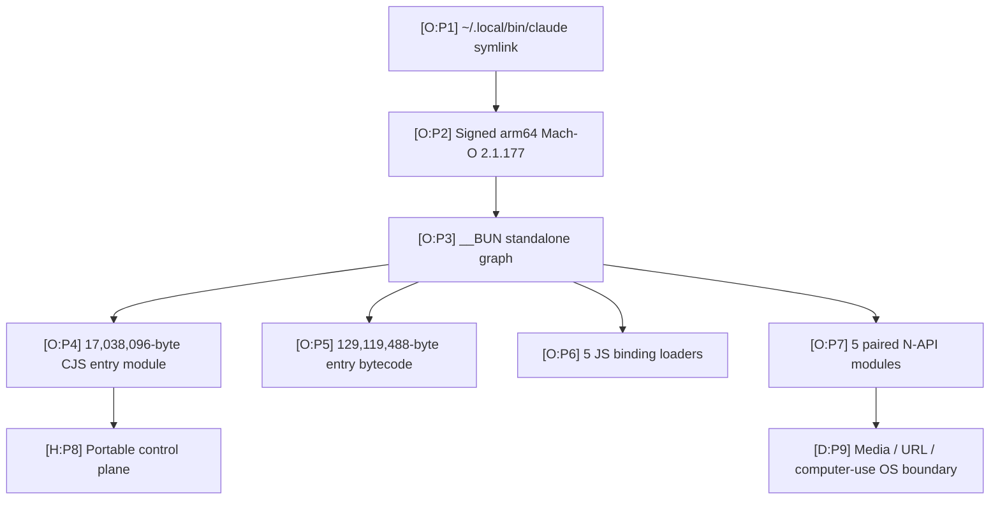
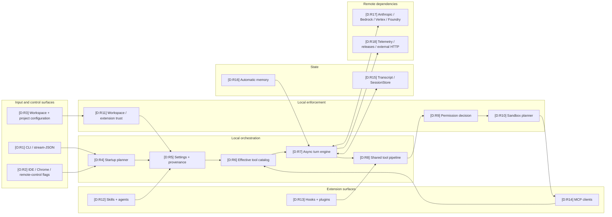

# System Map

This map separates the signed native container, portable orchestration control plane, enforcement boundaries, extensions, persistent state, and remote dependencies. Boxes are reconstructed responsibilities, not claims about Anthropic’s original source tree.

## Packaging and runtime boundary

| ID | Basis | Mapping | Hosted sources |
|---|---|---|---|
| P1 | O | The launcher resolves to the versioned executable. | Claims `artifact.launcher-resolution` and `artifact.release-identity` in [`E:claims`](https://github.com/swyxio/claude-code-internals/blob/main/evidence/claims.ndjson), [`E:provenance`](https://github.com/swyxio/claude-code-internals/blob/main/evidence/provenance.json) |
| P2 | O | The inspected file is a signed, hardened-runtime macOS arm64 Mach-O. | [`E:provenance`](https://github.com/swyxio/claude-code-internals/blob/main/evidence/provenance.json), claims `signing.developer-identity` and `signing.hardened-runtime` |
| P3 | O | The parsed `__BUN/__bun` payload contains an 11-module standalone graph. | [`E:inventory`](https://github.com/swyxio/claude-code-internals/blob/main/evidence/binary-inventory.json), claims `container.bun-section` and `container.graph-shape` |
| P4 | O | Module 0 is the 17,038,096-byte Latin-1 CommonJS entry at `/$bunfs/root/src/entrypoints/cli.js`. | Claim `container.entry-module` in [`E:claims`](https://github.com/swyxio/claude-code-internals/blob/main/evidence/claims.ndjson), [`E:inventory`](https://github.com/swyxio/claude-code-internals/blob/main/evidence/binary-inventory.json) |
| P5 | O | The same graph entry records a 129,119,488-byte bytecode region. | Claim `container.bytecode-and-source` in [`E:claims`](https://github.com/swyxio/claude-code-internals/blob/main/evidence/claims.ndjson) |
| P6 | O | Five small JavaScript modules load native boundaries. | Claim `modules.language-boundary` in [`E:claims`](https://github.com/swyxio/claude-code-internals/blob/main/evidence/claims.ndjson), [`E:inventory`](https://github.com/swyxio/claude-code-internals/blob/main/evidence/binary-inventory.json) |
| P7 | O | Five binary N-API modules are present. | [`E:inventory`](https://github.com/swyxio/claude-code-internals/blob/main/evidence/binary-inventory.json), claim `modules.language-boundary` |
| P8 | H | The large entry bundle likely contains the portable control plane; packaging alone does not prove the original architecture. | Hypothesis `architecture.control-plane-boundary` in [`E:claims`](https://github.com/swyxio/claude-code-internals/blob/main/evidence/claims.ndjson), [`R:native-boundaries`](https://github.com/swyxio/claude-code-internals/blob/main/reconstructed/native/runtime-boundaries.ts) |
| P9 | D | Virtual module names pair JavaScript loaders with image, audio, URL, and computer-use native modules. | Claim `modules.native-pairs` in [`E:claims`](https://github.com/swyxio/claude-code-internals/blob/main/evidence/claims.ndjson), [`R:native-boundaries`](https://github.com/swyxio/claude-code-internals/blob/main/reconstructed/native/runtime-boundaries.ts) |

## Runtime responsibility map

## Runtime node ledger

| ID | Basis | Responsibility | Hosted source and evidence |
|---|---|---|---|
| R1 | O | Interactive, print, JSON, and stream-JSON entry surfaces. | [`H:root`](https://github.com/swyxio/claude-code-internals/blob/main/evidence/cli-help/root.txt) |
| R2 | O | IDE, Chrome, remote control, worktree, and tmux switches are advertised. | [`H:root`](https://github.com/swyxio/claude-code-internals/blob/main/evidence/cli-help/root.txt) |
| R3 | D | Project files can contribute settings, instructions, MCP discovery, skills, and agent definitions, subject to trust-specific gates. | [`R:startup`](https://github.com/swyxio/claude-code-internals/blob/main/reconstructed/startup/cli-bootstrap.ts), [`R:settings`](https://github.com/swyxio/claude-code-internals/blob/main/reconstructed/settings/resolution.ts), claim `security.workspace-trust-proxy-helper` in [`E:claims`](https://github.com/swyxio/claude-code-internals/blob/main/evidence/claims.ndjson) |
| R4 | D | Startup selects mode and phases for settings, trust, auth, extensions, MCP, session, catalog, and runtime. | [`R:startup`](https://github.com/swyxio/claude-code-internals/blob/main/reconstructed/startup/cli-bootstrap.ts), claim `architecture.entrypoint-routing` |
| R5 | D | Settings retain source provenance while merge and per-key precedence are injected. | [`R:settings`](https://github.com/swyxio/claude-code-internals/blob/main/reconstructed/settings/resolution.ts), [`R:schema`](https://github.com/swyxio/claude-code-internals/blob/main/reconstructed/settings/schema.ts) |
| R6 | D | Candidate built-ins and MCP additions are filtered into an effective catalog. | [`R:catalog`](https://github.com/swyxio/claude-code-internals/blob/main/reconstructed/tools/catalog.ts), claim `tools.registry` |
| R7 | D | The turn engine coordinates streaming, tools, compaction, cost/turn limits, stop hooks, and exit. | [`R:turn`](https://github.com/swyxio/claude-code-internals/blob/main/reconstructed/engine/turn-engine.ts), claims `agent-loop.core-generator`, `context.compaction-lifecycle`, and `agents.idle-boundary` |
| R8 | D | Tool execution uses a shared coercion/validation/hook/permission/call/post-hook path. | [`R:tool-pipeline`](https://github.com/swyxio/claude-code-internals/blob/main/reconstructed/tools/execution-pipeline.ts), claim `tools.execution-pipeline` |
| R9 | D | Permission inputs include rules, mode, hooks, classifier, sandbox status, and managed constraints; exact precedence is injected. | [`R:permissions`](https://github.com/swyxio/claude-code-internals/blob/main/reconstructed/permissions/engine.ts) |
| R10 | D | Sandbox planning selects an available platform backend or fails/falls back according to policy. | [`R:sandbox`](https://github.com/swyxio/claude-code-internals/blob/main/reconstructed/sandbox/runtime.ts), claims `security.sandbox-fail-closed` and `security.sandbox-no-command-escape` |
| R11 | D | Workspace and extension trust determine whether project-controlled executable configuration is eligible. | [`R:startup`](https://github.com/swyxio/claude-code-internals/blob/main/reconstructed/startup/cli-bootstrap.ts), [`R:plugins`](https://github.com/swyxio/claude-code-internals/blob/main/reconstructed/plugins/loader.ts) |
| R12 | D | Skills contribute named procedures; agents contribute delegated prompts, tools, model, permission, memory, and isolation choices. | [`R:skills`](https://github.com/swyxio/claude-code-internals/blob/main/reconstructed/skills/discovery.ts), [`R:agents`](https://github.com/swyxio/claude-code-internals/blob/main/reconstructed/agents/subagents.ts) |
| R13 | D | Hooks and plugin monitors can execute around lifecycle events; plugin packages aggregate several component types. | [`R:hooks`](https://github.com/swyxio/claude-code-internals/blob/main/reconstructed/hooks/dispatcher.ts), [`R:plugins`](https://github.com/swyxio/claude-code-internals/blob/main/reconstructed/plugins/loader.ts), claim `security.plugin-monitor-trust` |
| R14 | D | MCP discovery, project approval, transport selection, and tool/resource exposure form a third-party capability boundary. | [`R:MCP`](https://github.com/swyxio/claude-code-internals/blob/main/reconstructed/mcp/client-manager.ts), claims `extensibility.mcp-transports` and `security.mcp-project-approval` |
| R15 | D | Local transcript operations and bounded external SessionStore load are distinct seams. | [`R:sessions`](https://github.com/swyxio/claude-code-internals/blob/main/reconstructed/persistence/sessions.ts), claims `sessions.local-transcript` and `sessions.external-store` |
| R16 | D | Memory is independently enabled and path-resolved, with project-supplied custom-directory hardening. | [`R:memory`](https://github.com/swyxio/claude-code-internals/blob/main/reconstructed/memory/auto-memory.ts), claims `memory.independent-controls` and `memory.project-path-hardening` |
| R17 | D | One selected provider adapter streams model output; alternate routes are embedded for Bedrock, Vertex, and Foundry. | [`R:providers`](https://github.com/swyxio/claude-code-internals/blob/main/reconstructed/auth/providers-http.ts), [`R:model-stream`](https://github.com/swyxio/claude-code-internals/blob/main/reconstructed/engine/model-stream.ts) |
| R18 | D | First-party, external, telemetry, and release traffic have separate control paths. | [`R:providers`](https://github.com/swyxio/claude-code-internals/blob/main/reconstructed/auth/providers-http.ts), [`R:telemetry`](https://github.com/swyxio/claude-code-internals/blob/main/reconstructed/telemetry/telemetry.ts), [`R:updater`](https://github.com/swyxio/claude-code-internals/blob/main/reconstructed/update/updater.ts) |

## Boundaries this map does not collapse

| Distinction | Why it matters | Source |
|---|---|---|
| Permission decision vs sandbox containment | A command may be allowed but constrained, or denied before any process starts. | [`R:permissions`](https://github.com/swyxio/claude-code-internals/blob/main/reconstructed/permissions/engine.ts), [`R:sandbox`](https://github.com/swyxio/claude-code-internals/blob/main/reconstructed/sandbox/runtime.ts) |
| Workspace trust vs plugin/MCP trust | Trusting files in a directory does not authenticate every remote endpoint or marketplace artifact. | [`R:plugins`](https://github.com/swyxio/claude-code-internals/blob/main/reconstructed/plugins/loader.ts), [`R:MCP`](https://github.com/swyxio/claude-code-internals/blob/main/reconstructed/mcp/client-manager.ts) |
| Local transcript vs automatic memory | The evidence exposes separate controls and adapters; formats and co-storage are not established. | [`R:sessions`](https://github.com/swyxio/claude-code-internals/blob/main/reconstructed/persistence/sessions.ts), [`R:memory`](https://github.com/swyxio/claude-code-internals/blob/main/reconstructed/memory/auto-memory.ts) |
| First-party model traffic vs external HTTP | The reconstructed HTTP boundary explicitly separates Anthropic-operated from external destinations. | Claim `network.first-party-boundary` in [`E:claims`](https://github.com/swyxio/claude-code-internals/blob/main/evidence/claims.ndjson), [`R:providers`](https://github.com/swyxio/claude-code-internals/blob/main/reconstructed/auth/providers-http.ts) |

For chronological control flow, continue to the [execution map](execution-flow.md).
