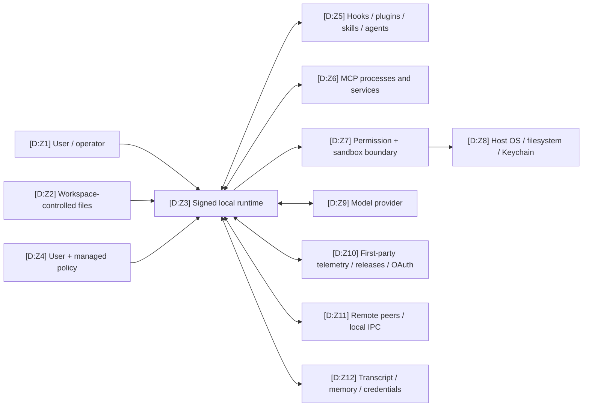
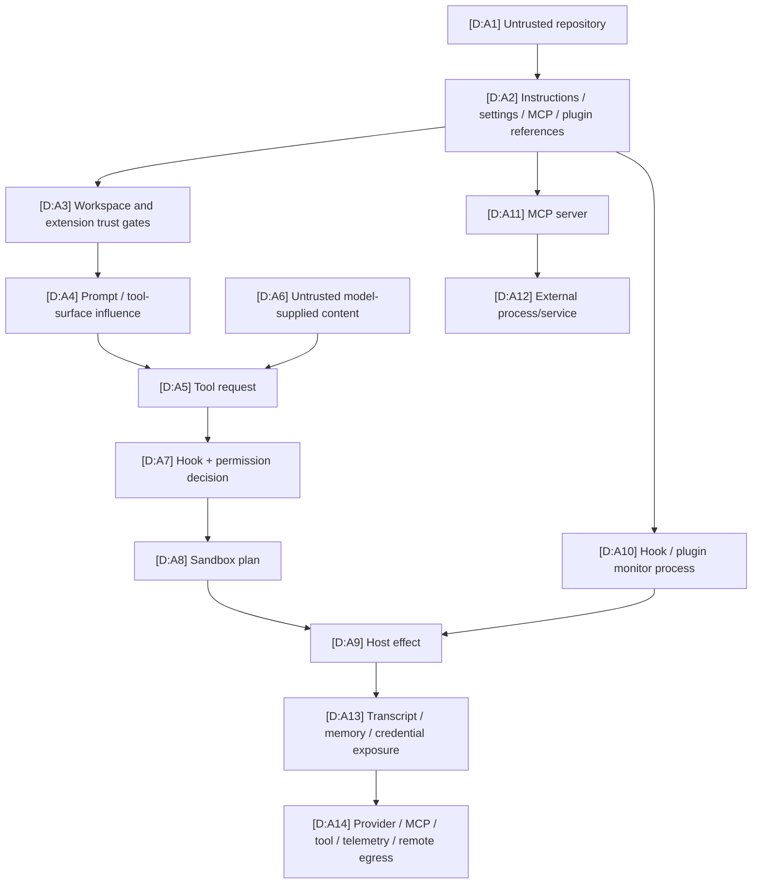

# Threat Model

This is an **architecture threat model for the inspected 2.1.177 artifact and the schematic reconstruction**, not a vulnerability report or a claim about Anthropic’s production service. It identifies trust transitions, evidenced controls, and questions that the static artifact evidence cannot answer.

## Scope and assets

The [permission and sandbox dynamic probe](../dynamics/security-permissions-sandbox.md)
provides bounded behavioral checks for the permission/sandbox boundary below;
it is supporting evidence, not a general containment certification.

| In scope | Security-relevant assets | Explicitly out of scope / unknown | Sources |
|---|---|---|---|
| Local `claude` launcher, signed Mach-O/Bun container, reconstructed control-plane seams, extensions, persistence, and documented network surfaces. | Source/workspace files, prompts and transcripts, memory, tool authority, credentials, provider/MCP data, local IPC, update integrity, and operator policy. | Anthropic backend implementation, cloud retention, active deployment configuration, exact runtime defaults, third-party MCP/plugin code, and unobserved dynamically downloaded content. | [`E:provenance`](https://github.com/swyxio/claude-code-internals/blob/main/evidence/provenance.json), [`E:inventory`](https://github.com/swyxio/claude-code-internals/blob/main/evidence/binary-inventory.json), [`R:README`](https://github.com/swyxio/claude-code-internals/blob/main/reconstructed/README.md) |

## Trust-zone data-flow diagram

| ID | Basis | Trust boundary | Hosted sources |
|---|---|---|---|
| Z1 | D | The operator chooses entrypoint, flags, configuration, approvals, and credentials. | [`H:root`](https://github.com/swyxio/claude-code-internals/blob/main/evidence/cli-help/root.txt), [`R:startup`](https://github.com/swyxio/claude-code-internals/blob/main/reconstructed/startup/cli-bootstrap.ts) |
| Z2 | D | A workspace can contribute instructions and executable-adjacent configuration; at least the project/local proxy helper is trust-gated. | Claim `security.workspace-trust-proxy-helper`; [`R:settings`](https://github.com/swyxio/claude-code-internals/blob/main/reconstructed/settings/resolution.ts) |
| Z3 | O + D | The outer artifact is signed and hardened-runtime enabled; its Bun graph carries the JavaScript control plane and native modules. | Claims `signing.developer-identity`, `signing.hardened-runtime`, `container.graph-shape`, and `modules.language-boundary` in [`E:claims`](https://github.com/swyxio/claude-code-internals/blob/main/evidence/claims.ndjson) |
| Z4 | D | Managed constraints can suppress non-managed permission rules and bypass mode; exact settings/rule precedence is not authenticated. | Claims `security.managed-permission-rules` and `security.disable-bypass-mode`; [`R:permissions`](https://github.com/swyxio/claude-code-internals/blob/main/reconstructed/permissions/engine.ts) |
| Z5 | D | Extensions can alter prompts/tool surfaces and hooks/monitors can execute; plugin monitors are explicitly unsandboxed at hook trust tier. | [`R:plugins`](https://github.com/swyxio/claude-code-internals/blob/main/reconstructed/plugins/loader.ts), [`R:hooks`](https://github.com/swyxio/claude-code-internals/blob/main/reconstructed/hooks/dispatcher.ts), claim `security.plugin-monitor-trust` |
| Z6 | D | MCP spans local and network transports and exposes third-party tools/resources after discovery/approval. | [`R:MCP`](https://github.com/swyxio/claude-code-internals/blob/main/reconstructed/mcp/client-manager.ts), claims `extensibility.mcp-transports` and `security.mcp-project-approval` |
| Z7 | D | Permission and sandbox are separate decisions; fail-closed/no-escape controls and weaker compatibility options exist. | [`R:permissions`](https://github.com/swyxio/claude-code-internals/blob/main/reconstructed/permissions/engine.ts), [`R:sandbox`](https://github.com/swyxio/claude-code-internals/blob/main/reconstructed/sandbox/runtime.ts) |
| Z8 | D | Allowed tools and native integrations can reach host resources; credentials can use the macOS Keychain seam. | [`R:native-boundaries`](https://github.com/swyxio/claude-code-internals/blob/main/reconstructed/native/runtime-boundaries.ts), claim `auth.macos-keychain` |
| Z9 | D | Model context crosses to the selected Anthropic, Bedrock, Vertex, or Foundry route. | [`R:providers`](https://github.com/swyxio/claude-code-internals/blob/main/reconstructed/auth/providers-http.ts), claim `providers.alternate-routes` |
| Z10 | D | First-party traffic includes telemetry, release, and OAuth surfaces with distinct controls. | [`R:telemetry`](https://github.com/swyxio/claude-code-internals/blob/main/reconstructed/telemetry/telemetry.ts), [`R:updater`](https://github.com/swyxio/claude-code-internals/blob/main/reconstructed/update/updater.ts), claims `telemetry.disable`, `updates.release-origin`, and `auth.oauth` |
| Z11 | D | Remote Control and local IPC are separate peer/message boundaries; peer isolation and a `0700` socket-directory check are evidenced. | [`R:remote`](https://github.com/swyxio/claude-code-internals/blob/main/reconstructed/remote/direct-connect.ts), claims `remote.peer-isolation` and `security.socket-directory-mode` |
| Z12 | D | Transcript, automatic memory, and credentials have distinct storage adapters and hardening rules. | [`R:sessions`](https://github.com/swyxio/claude-code-internals/blob/main/reconstructed/persistence/sessions.ts), [`R:memory`](https://github.com/swyxio/claude-code-internals/blob/main/reconstructed/memory/auto-memory.ts), [`R:credentials`](https://github.com/swyxio/claude-code-internals/blob/main/reconstructed/auth/credentials.ts) |

## Representative attack paths

| IDs | Basis | Interpretation | Hosted sources |
|---|---|---|---|
| A1–A4 | D | Repository content may influence instructions and extension discovery, but some executable project/local settings are workspace-trust gated. Coverage of every project surface is not proven. | [`R:startup`](https://github.com/swyxio/claude-code-internals/blob/main/reconstructed/startup/cli-bootstrap.ts), claim `security.workspace-trust-proxy-helper` |
| A5–A9 | D | Model-requested tools pass through a shared hook/permission pipeline and then a separate sandbox planner; anti-bypass, fail-closed, and no-command-escape controls exist. | [`R:tool-pipeline`](https://github.com/swyxio/claude-code-internals/blob/main/reconstructed/tools/execution-pipeline.ts), [`R:permissions`](https://github.com/swyxio/claude-code-internals/blob/main/reconstructed/permissions/engine.ts), [`R:sandbox`](https://github.com/swyxio/claude-code-internals/blob/main/reconstructed/sandbox/runtime.ts) |
| A10 | D | Hooks and plugin monitor scripts are executable surfaces; plugin monitors are described as unsandboxed at hook trust tier. | [`R:hooks`](https://github.com/swyxio/claude-code-internals/blob/main/reconstructed/hooks/dispatcher.ts), claim `security.plugin-monitor-trust` |
| A11–A12 | D | MCP can launch local stdio processes or connect over several network transports; strict source selection and project approval are separate controls. | [`R:MCP`](https://github.com/swyxio/claude-code-internals/blob/main/reconstructed/mcp/client-manager.ts), claims `extensibility.mcp-strict-mode`, `extensibility.mcp-transports`, and `security.mcp-project-approval` |
| A13–A14 | D | Local state can feed later turns and outbound surfaces, but exact secret filtering/redaction is not authenticated. | [`R:sessions`](https://github.com/swyxio/claude-code-internals/blob/main/reconstructed/persistence/sessions.ts), [`R:memory`](https://github.com/swyxio/claude-code-internals/blob/main/reconstructed/memory/auto-memory.ts), [`R:telemetry`](https://github.com/swyxio/claude-code-internals/blob/main/reconstructed/telemetry/telemetry.ts) |

## Threat and control register

The register intentionally omits numeric likelihood/severity: deployment settings, user approvals, third-party extension code, and service-side controls are not present in the static artifact evidence.

| ID | Threat scenario and boundary | Assets at risk | Evidenced or reconstructed controls | Residual unknown / audit action | Hosted sources |
|---|---|---|---|---|---|
| TM-01 | A malicious or merely untrusted repository supplies instructions or executable-adjacent configuration before the operator understands the workspace. | Tool authority, credentials, files, outbound access. | Project/local proxy-auth helper is skipped before workspace trust; project automatic-memory path redirection is ignored. | Determine which other settings, hooks, plugins, agents, skills, MCP files, and noninteractive modes are trust-gated. | Claims `security.workspace-trust-proxy-helper`, `memory.project-path-hardening`; [`R:startup`](https://github.com/swyxio/claude-code-internals/blob/main/reconstructed/startup/cli-bootstrap.ts) |
| TM-02 | Prompt/model content induces a harmful tool call or attempts to repackage a denied action. | Filesystem, subprocess, network, source integrity. | Shared tool pipeline, permission request boundary, automatic-mode anti-bypass result, managed-rule ceiling. | Authenticate exact rule grammar, classifier inputs/model, decision precedence, argument canonicalization, and defaults. | [`R:tool-pipeline`](https://github.com/swyxio/claude-code-internals/blob/main/reconstructed/tools/execution-pipeline.ts), [`R:permissions`](https://github.com/swyxio/claude-code-internals/blob/main/reconstructed/permissions/engine.ts), claims `security.auto-mode-anti-bypass`, `security.managed-permission-rules` |
| TM-03 | A hook rewrites tool input after schema validation, or a permission hook changes disposition unexpectedly. | Command arguments and authorization intent. | Hooks are explicit lifecycle boundaries; the reconstruction represents effective-input and permission-result outputs. | Verify whether rewritten input is revalidated, how multiple hook results compose, timeouts, and whether hook output is trusted/sanitized. | [`R:tool-pipeline`](https://github.com/swyxio/claude-code-internals/blob/main/reconstructed/tools/execution-pipeline.ts), [`R:hooks`](https://github.com/swyxio/claude-code-internals/blob/main/reconstructed/hooks/dispatcher.ts), claim `extensibility.hook-lifecycle` |
| TM-04 | Sandbox is unavailable, deliberately disabled for a command, or weakened for network/nested compatibility. | Host processes, filesystem, network. | Managed fail-if-unavailable and no-command-escape controls; explicit weaker-network and weaker-nested options reveal downgrade points. | Confirm active backend/profile, excluded-command matching, defaults, network allowlist semantics, fallback behavior, and managed-policy enforcement. | [`R:sandbox`](https://github.com/swyxio/claude-code-internals/blob/main/reconstructed/sandbox/runtime.ts), claims `security.sandbox-fail-closed`, `security.sandbox-no-command-escape`, `security.weaker-network-isolation`, `sandbox.weaker-nested-compatibility` |
| TM-05 | A plugin, hook, or monitor executes code with the host runtime’s ambient authority. | Workspace, credentials, network, persistence. | Plugins have an explicit component inventory; CLI can suppress a plugin’s MCP contribution; monitor scripts are called unsandboxed at hook trust tier. | Require provenance/review for plugin code, inspect hooks/monitors separately, and verify environment/secret scoping and update behavior. | [`R:plugins`](https://github.com/swyxio/claude-code-internals/blob/main/reconstructed/plugins/loader.ts), claims `extensibility.plugin-component-inventory`, `extensibility.plugin-loader`, `security.plugin-monitor-trust` |
| TM-06 | A project MCP server or changed endpoint gains tool/resource access, starts a process, or receives sensitive context. | Tool arguments/results, credentials, local process authority. | Project approval is distinct from discovery; strict mode excludes non-explicit config sources; transports are typed. | Inspect server command/URL, authentication, TLS, environment, approval identity/expiry, tool descriptions, and transport-specific timeout policy. | [`R:MCP`](https://github.com/swyxio/claude-code-internals/blob/main/reconstructed/mcp/client-manager.ts), claims `security.mcp-project-approval`, `extensibility.mcp-strict-mode`, `extensibility.mcp-transports` |
| TM-07 | A credential helper, environment variable, OAuth flow, Keychain path, or portable file leaks or selects the wrong credential. | API keys and OAuth tokens. | Workspace trust blocks at least the project/local proxy helper; named credential backends and safe metadata-only logging exist in the schematic; macOS Keychain invocation is anchored. | Authenticate precedence, helper shell semantics, environment inheritance, file mode/format, logging/redaction, refresh, revocation, and remote-host restrictions. | [`R:credentials`](https://github.com/swyxio/claude-code-internals/blob/main/reconstructed/auth/credentials.ts), claims `auth.api-key-helper`, `auth.macos-keychain`, `auth.oauth`, `security.workspace-trust-proxy-helper` |
| TM-08 | Local IPC or Remote Control accepts an unauthorized peer, cross-machine message, replay, or malformed frame. | Session control, prompts, tool authority, local data. | Socket-directory mode `0700`; optional peer-machine isolation/approval; abort-aware transport lifecycle in the schematic. | Endpoint, authentication, encryption, codec, peer identity, replay protection, socket ownership/symlink checks, and approval persistence remain unknown. | [`R:remote`](https://github.com/swyxio/claude-code-internals/blob/main/reconstructed/remote/direct-connect.ts), claims `security.socket-directory-mode`, `remote.peer-isolation` |
| TM-09 | Transcripts or automatic memory retain sensitive data longer or more broadly than expected. | Prompts, source, secrets, personal data. | Local transcript and external SessionStore are separate seams; memory reads/writes are independently controlled; project custom memory path is constrained. | Inspect exact paths, formats, file modes, encryption, record contents, retention/deletion, external store policy, backup/sync exposure, and `--no-session-persistence` scope. | [`R:sessions`](https://github.com/swyxio/claude-code-internals/blob/main/reconstructed/persistence/sessions.ts), [`R:memory`](https://github.com/swyxio/claude-code-internals/blob/main/reconstructed/memory/auto-memory.ts), claims `sessions.local-transcript`, `sessions.external-store`, `memory.independent-controls` |
| TM-10 | Telemetry or another outbound channel carries more context than the operator expects. | Usage metadata, paths, prompts/tool attributes, identifiers. | Telemetry-disable and nonessential-traffic controls; first-party/external HTTP partition; versioned event-batch path. | Event inventory, payload, redaction/hashing, host, retries, queue persistence, and whether controls cover every observability channel. | [`R:telemetry`](https://github.com/swyxio/claude-code-internals/blob/main/reconstructed/telemetry/telemetry.ts), [`R:providers`](https://github.com/swyxio/claude-code-internals/blob/main/reconstructed/auth/providers-http.ts), claims `telemetry.disable`, `telemetry.nonessential-control`, `network.first-party-boundary` |
| TM-11 | Update metadata or artifacts are substituted, downgraded, partially installed, or selected from an unexpected channel. | Executable integrity and availability. | Captured installer verifies SHA-256 before execution; inspected binary matches the manifest and is Developer ID signed; release origin is anchored. | Validate TLS/proxy assumptions, channel/version policy, signature verification during update, rollback, lock/atomic replacement, package-manager path, and downgrade handling. | Claims `artifact.installer-integrity-flow`, `artifact.manifest-integrity`, `signing.developer-identity`, `updates.release-origin`; [`R:updater`](https://github.com/swyxio/claude-code-internals/blob/main/reconstructed/update/updater.ts) |
| TM-12 | Reliance on the outer signature overstates process confinement despite executable-memory and library-validation entitlements. | Runtime code integrity. | Developer ID signature and hardened runtime are observed. The ledger explicitly notes entitlement tradeoffs and absence of App Sandbox evidence. | Determine actual dynamic-library loading, JIT use, N-API extraction/loading path, runtime verification, and application-layer sandbox coverage. | Claims `signing.entitlements`, `signing.entitlement-tradeoff`, and `signing.not-app-sandbox-evidence`; [`E:provenance`](https://github.com/swyxio/claude-code-internals/blob/main/evidence/provenance.json) |
| TM-13 | An analyst mistakes reconstructed module boundaries or injected contracts for authenticated original source, causing a faulty control assessment. | Audit conclusions and maintenance decisions. | Every reconstructed file is labeled schematic with provenance/confidence; claims distinguish observed, derived, and hypothesis. | Re-run anchors against the exact artifact, inspect ledger limits, and obtain runtime traces or upstream source before asserting exact order/defaults. | [`R:README`](https://github.com/swyxio/claude-code-internals/blob/main/reconstructed/README.md), [`E:claims`](https://github.com/swyxio/claude-code-internals/blob/main/evidence/claims.ndjson), claim `container.no-source-maps` |

## Control layers are additive, not interchangeable

| Layer | What it can constrain | What it cannot establish by itself | Source |
|---|---|---|---|
| Artifact integrity/signing | Origin/integrity properties of the inspected outer executable and captured installer artifact. | Safe runtime behavior, extension trust, cloud handling, or process confinement. | [`E:provenance`](https://github.com/swyxio/claude-code-internals/blob/main/evidence/provenance.json), claims `artifact.manifest-integrity`, `signing.developer-identity`, `signing.entitlement-tradeoff` |
| Workspace trust | Eligibility of project-controlled executable settings where the gate is implemented. | Safety of already trusted content or every extension/network endpoint. | Claim `security.workspace-trust-proxy-helper`; [`R:startup`](https://github.com/swyxio/claude-code-internals/blob/main/reconstructed/startup/cli-bootstrap.ts) |
| Permission decision | Whether a requested tool/input may proceed, ask, or deny. | Containment after allow, implementation safety of the tool, or destination privacy. | [`R:permissions`](https://github.com/swyxio/claude-code-internals/blob/main/reconstructed/permissions/engine.ts) |
| Sandbox | Host/process/network confinement according to the selected backend and policy. | Model-provider, host-process hook/plugin, telemetry, updater, or remote-channel confinement. | [`R:sandbox`](https://github.com/swyxio/claude-code-internals/blob/main/reconstructed/sandbox/runtime.ts) |
| MCP approval/strict source mode | Which discovered project server or config source becomes eligible. | Authenticity or least privilege of an approved server. | [`R:MCP`](https://github.com/swyxio/claude-code-internals/blob/main/reconstructed/mcp/client-manager.ts) |
| Telemetry/nonessential controls | Their named outbound categories. | Complete offline operation or local-data deletion. | [`R:telemetry`](https://github.com/swyxio/claude-code-internals/blob/main/reconstructed/telemetry/telemetry.ts) |

## Verification priorities

For a concrete deployment, verify in this order:

1. Effective managed settings, workspace trust, permission mode/rules, and bypass availability.
2. Enabled hooks/plugins/monitors, MCP servers/transports, skills/agents, and their provenance.
3. Actual sandbox backend, fail-closed state, exclusions, and weaker compatibility settings.
4. Credential source, provider route, proxy/base URL, and all expected egress destinations.
5. Transcript/memory paths and retention, external SessionStore use, telemetry controls, and Remote Control state.
6. Installed binary checksum/signature, update channel, and release provenance.

The first five are deployment-specific and cannot be answered from this artifact alone; the sixth can be compared with [`E:provenance`](https://github.com/swyxio/claude-code-internals/blob/main/evidence/provenance.json). See [settings and permissions](settings-permissions.md), [provider/network surfaces](provider-network.md), and [persistence/data flow](persistence-dataflow.md) for the underlying maps.
