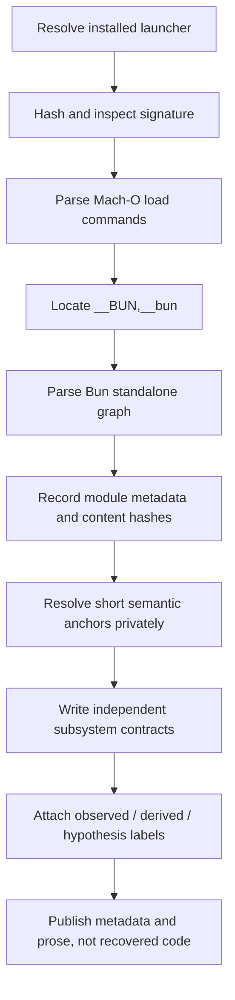

# Scope and Method

The atlas asks a narrow question: **what can be responsibly established about the internals and extension/security boundaries of one installed Claude Code artifact?** It does not attempt to recreate the service, bypass authentication, probe Anthropic infrastructure, or reproduce the product’s presentation layer.

## In scope

- Native installation and version-activation layout.
- Mach-O metadata, code signature, entitlements, linked system libraries, and Bun standalone-module graph.
- CLI-advertised commands, modes, protocols, and extension entry points.
- Independently reconstructed architecture for startup, configuration, the agent loop, tools, permissions, sessions, memory, providers, updates, and integrations.
- Security mechanisms and attack surfaces visible in the local client.
- Reproducible, read-only inspection tooling and a version-pinned evidence ledger.

## Out of scope

- Model weights, server-side implementation, account entitlements, or undocumented server behavior.
- Exploit development against live services.
- User interface replication, terminal styling, themes, marketing assets, or Anthropic trade dress.
- Claims about versions other than those explicitly captured.
- Distribution of Anthropic’s executable, extracted bundle, native add-ons, or substantial source excerpts.

## Research pipeline

The container parser follows the MIT-licensed [`StandaloneModuleGraph.zig`](https://github.com/oven-sh/bun/blob/2a41ca974b7302952252a20eddbb3b5c3f2dee9b/src/standalone_graph/StandaloneModuleGraph.zig) layout at the full upstream commit resolved from the artifact’s embedded Bun revision prefix. The repository’s [`inspect-binary.mjs`](https://github.com/swyxio/claude-code-internals/blob/main/tools/inspect-binary.mjs) locates the Mach-O section, bounds-checks every pointer, decodes the module table, and hashes module contents. Extraction is available for local study, but its default output is ignored by version control.

CLI surfaces are captured by invoking only `--help`. The capture index states the command, byte size, and digest for each output. Commands that can start servers, inspect project configuration, update the executable, authenticate, or delete state were not executed merely to document them.

## The reconstruction contract

Observed records should be reproducible from the same artifact hash.

Derived records must name the observations used and explain the inference. A data-flow edge, for example, may be derived from a CLI option, a settings anchor, and a lifecycle event without claiming the original function boundary.

Hypothesis records must be falsifiable. They should state what new observation would confirm or reject them.

The independently authored [`reconstructed/`](https://github.com/swyxio/claude-code-internals/tree/main/reconstructed) tree favors interfaces, state machines, side-effect inventories, and security boundaries. Descriptive module names are ours. They are not recovered original filenames except where the Bun graph itself supplies a virtual path.

## Source-of-truth hierarchy

When sources disagree, the project uses this order:

1. Cryptographic identity and signed artifact metadata.
2. Deterministically parsed binary structure.
3. Version-matched CLI output.
4. Short, version-matched semantic anchors.
5. Public documentation, used for context rather than to overwrite artifact evidence.
6. Architectural inference.

This hierarchy prevents a current web page or a later release from silently changing what the `2.1.177` snapshot actually contained.

## Privacy discipline

CLI captures run only `--help` under a temporary clean home/config, safe mode, an allowlisted environment, and disabled nonessential traffic. The research process did not intentionally inspect or publish macOS Keychain contents, transcripts, project settings, environment secrets, or network captures. Public path fields are normalized to `$HOME`.
