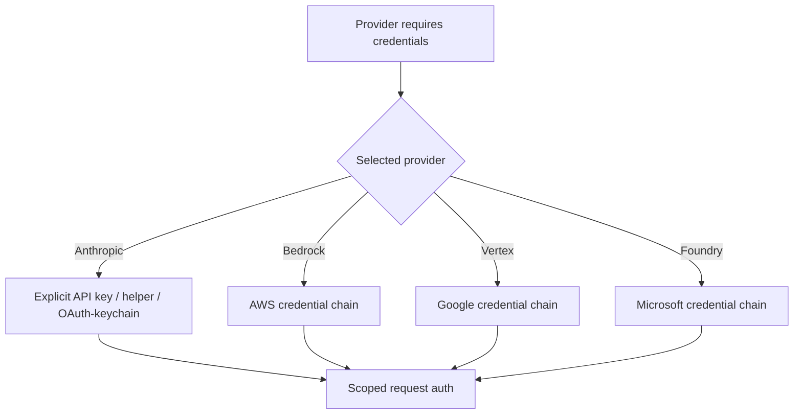

# Authentication and Secrets

Claude Code can authenticate to Anthropic, cloud providers, proxies, MCP servers, and remote integrations. Secret handling must be modeled per destination and per process boundary.

## First-party authentication

Derived [`auth.api-key`](https://github.com/swyxio/claude-code-internals/blob/main/evidence/anchors.json) supports direct `ANTHROPIC_API_KEY` authentication.

Derived [`auth.api-key-helper`](https://github.com/swyxio/claude-code-internals/blob/main/evidence/anchors.json) supports a shell helper that can supply the key.

Derived [`auth.oauth-url`](https://github.com/swyxio/claude-code-internals/blob/main/evidence/anchors.json) supports a Claude.ai OAuth authorization route using an explicit endpoint constant.

The `auth` command supports login, logout, and status; `setup-token` creates a long-lived token for a qualifying subscription. The current public dataset intentionally does not run these commands or inspect their storage.

## Credential resolution model

Derived Provider choice precedes credential-family resolution. Bare mode’s help confirms that third-party providers keep their own credential behavior even when first-party OAuth and Keychain reads are disabled.

## Helper risk

An API-key or proxy-auth helper is executable code. It can read environment and filesystem state, and its stdout becomes secret material. Helpers should be user- or policy-managed, invoked without shell interpolation where possible, time-bounded, and prevented from leaking stderr into shared logs.

[`workspace-trust.proxy-helper`](https://github.com/swyxio/claude-code-internals/blob/main/evidence/anchors.json) demonstrates a trust gate for project/local proxy helpers. The atlas has not established that project settings may configure an API-key helper; source eligibility should be documented key by key.

## Secret propagation

Potential propagation paths include:

- environment inherited by hooks, MCP stdio servers, tools, and agents;
- debug and error logs;
- request headers and proxy traces;
- session transcripts or tool results;
- stream-JSON events;
- plugin configuration;
- shell history and process listings;
- remote-control or IDE messages.

`CLAUDE_CODE_SUBPROCESS_ENV_SCRUB` is evidence of subprocess hardening, but its anchor concerns permission behavior. Do not infer a complete credential scrub list without direct tests.

## Safe and bare modes

Safe mode leaves authentication active while suppressing customizations. Bare mode goes further for first-party auth: it does not read OAuth or Keychain credentials and accepts only an API key or configured helper supplied through explicit settings. This is useful for reproducible CI and for separating account login state from a test environment.

## Storage and revocation

Derived [`auth.macos-keychain`](https://github.com/swyxio/claude-code-internals/blob/main/evidence/anchors.json) supports a macOS credential path that invokes the system Keychain command. The public evidence does not establish which credential types use that path or document item names, access groups, encryption properties, and refresh-token rotation.

If a secret appears in a transcript, log, issue, or repository, revoke it at the provider rather than relying on deletion. Removing local state does not invalidate an already issued remote credential.
