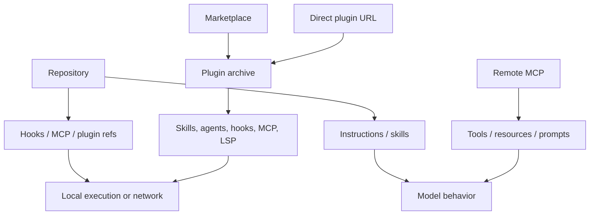

# Extension Supply Chain

Extensions can arrive from the user, repository, local project state, a plugin archive, a marketplace, an MCP endpoint, or a dynamically discovered skill directory. Their content and delivery path both matter.

## Threat paths

Instruction-only content can cause prompt injection. Executable components can directly run code. Remote servers can combine both by supplying persuasive descriptions and processing tool calls.

## Highest-risk components

Derived [`plugins.monitor-trust`](https://github.com/swyxio/claude-code-internals/blob/main/evidence/anchors.json) says plugin monitor scripts execute unsandboxed at hook trust level.

MCP stdio servers are child processes. LSP servers are generally child processes. Command hooks execute locally. These components require code review or a trusted publisher and pinned artifact.

Skills, agents, and instructions do not execute merely by loading, but can influence the model to request powerful tools. Their authority is mediated by permissions; that makes permission prompts a prompt-injection containment layer.

## Pinning model

For reproducibility, record:

| Source | Minimum identity to retain |
|---|---|
| Local directory | Canonical path and tree digest |
| Zip/archive | Source URL and archive SHA-256 |
| Git marketplace | Repository URL and immutable commit |
| Plugin | Name, version, manifest digest, component inventory |
| MCP stdio | Executable path/package lock, args, environment key names |
| MCP HTTP/SSE | Canonical URL, owner, auth method, TLS expectations |
| Skill/agent | Source scope, resolved path, content digest |

Version tags and marketplace metadata can be moved. Prefer immutable digests or commits.

## Containment controls

- Workspace trust before project-controlled executable settings.
- `--strict-mcp-config` to exclude implicit server sources.
- The plugin loader path represented by [`plugins.cli-loader`](https://github.com/swyxio/claude-code-internals/blob/main/evidence/anchors.json) to suppress plugin MCP contributions.
- `plugin validate --strict` for schema hygiene.
- Safe mode to disable customizations during diagnosis.
- Bare mode to skip automatic plugin synchronization and hooks.
- Managed policy to prevent bypass and require sandboxing.

No one control establishes package authenticity. Validation checks shape; trust and pinning check origin; sandboxing limits effect; permissions mediate model-selected actions.

## Update risk

Plugin and marketplace updates can change code after initial approval. Operators should review component-diff summaries and treat newly added hook, MCP, or LSP components as a privilege increase. Auto-installed dependencies should be included in the inventory even if `plugin prune` later removes them.

## Contribution hygiene

This repository does not accept extracted proprietary plugin or Claude Code source. Security reports involving an extension should identify the third-party owner as well as Anthropic when appropriate; Anthropic’s disclosure policy excludes systems controlled by third parties.
