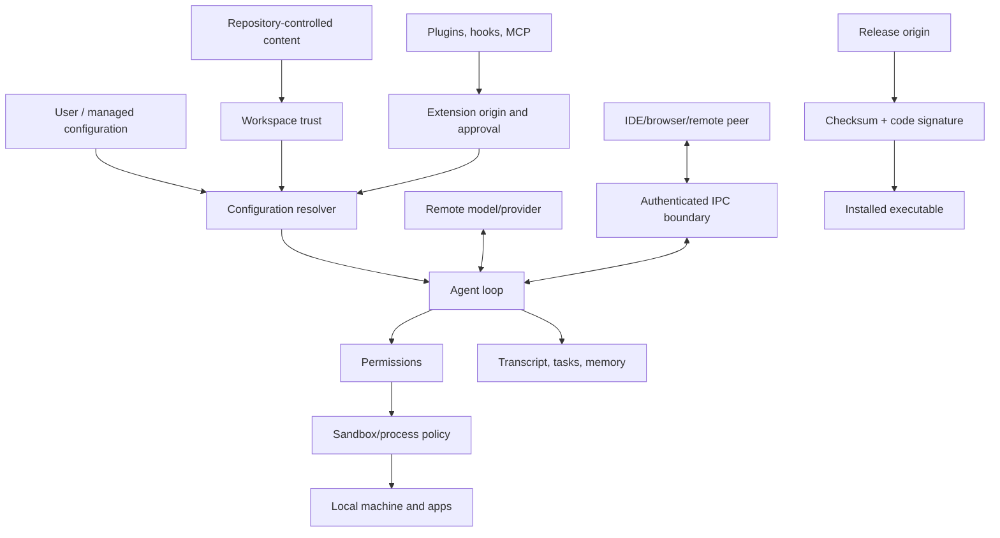

# Trust Boundaries

Visual companion: [threat model and control register](../maps/threat-model.md).

Claude Code runs with the user’s operating-system identity and coordinates content from a model, repository, local configuration, extensions, remote services, and other applications. Security depends on keeping those principals distinct even when they all contribute to one agent turn.

## Principals and assets

| Principal or source | Potentially untrusted input | Assets at risk |
|---|---|---|
| User and local shell | Prompts, flags, environment | Account, filesystem, credentials |
| Repository | Files, instructions, `.mcp.json`, settings | Workspace and ambient user data |
| Model/provider | Text and tool requests | Local capabilities and disclosed context |
| Plugin/marketplace | Manifests, hooks, processes, skills | Process authority, prompts, supply chain |
| MCP server | Tool schemas, resources, results | Prompt data, network and child processes |
| IDE/browser/remote peer | IPC messages and application state | Cross-application control |
| Update channel | Manifest and executable bytes | Entire client runtime |

The highest-value assets are API/OAuth/cloud credentials, source code, uncommitted changes, local personal files, transcripts and memory, signing identity, remote-control sessions, and the integrity of tool results returned to the model.

## Boundary map

## Controls visible in the artifact

The evidence ledger supports several concrete controls:

- project/local proxy helpers are gated before workspace trust ([`workspace-trust.proxy-helper`](https://github.com/swyxio/claude-code-internals/blob/main/evidence/anchors.json));
- local IPC requires a `0700` socket directory ([`socket.directory-mode`](https://github.com/swyxio/claude-code-internals/blob/main/evidence/anchors.json));
- managed policy can require managed-only rules and disable bypass mode;
- required sandboxes can fail closed;
- per-command sandbox escape can be disabled;
- subprocess permission state can be scrubbed;
- project-controlled memory path redirection is ignored;
- strict MCP mode excludes implicit server sources;
- peer-machine remote messages can require approval;
- auto mode looks for denial-bypass behavior.

These are evidence of defensive design, not a claim of complete mediation.

## Controls that must compose

Security properties often require more than one layer:

- **Workspace trust** decides whether repository-controlled configuration may become active.
- **Extension approval** decides whether an external component enters the runtime.
- **Permissions** decide whether a tool request may proceed.
- **Sandboxing** constrains what an allowed command can do.
- **OS security** controls Keychain, microphone, accessibility, files, and process identity.
- **Transport security** protects and authenticates remote connections.
- **Persistence controls** determine what remains after a session.

An allowed but sandboxed command differs from a denied command. A trusted workspace can still contain malicious dependencies. A validly signed executable can still load an unsafe user plugin.

## Evidence limits

Observed identifies a literal value, occurrence, offset, hash, signature field, or CLI-output fact in `2.1.177`.

Derived identifies an architectural consequence, such as the need to bind an IPC peer to a session.

Hypothesis identifies an unverified security assumption. Hypotheses must never be converted into deployment guarantees without runtime tests and current product documentation.

## Recommended operating posture

Use ordinary permissions in a trusted workspace, keep bypass disabled, pin extension sources, prefer strict MCP configuration for automation, review command hooks, use sandbox fail-closed where available, and run safe mode when diagnosing configuration. Use bare mode when a minimal explicit-input posture is needed. Avoid `--print` or `doctor` in an untrusted repository because their help text explicitly warns that workspace-trust interaction differs.
