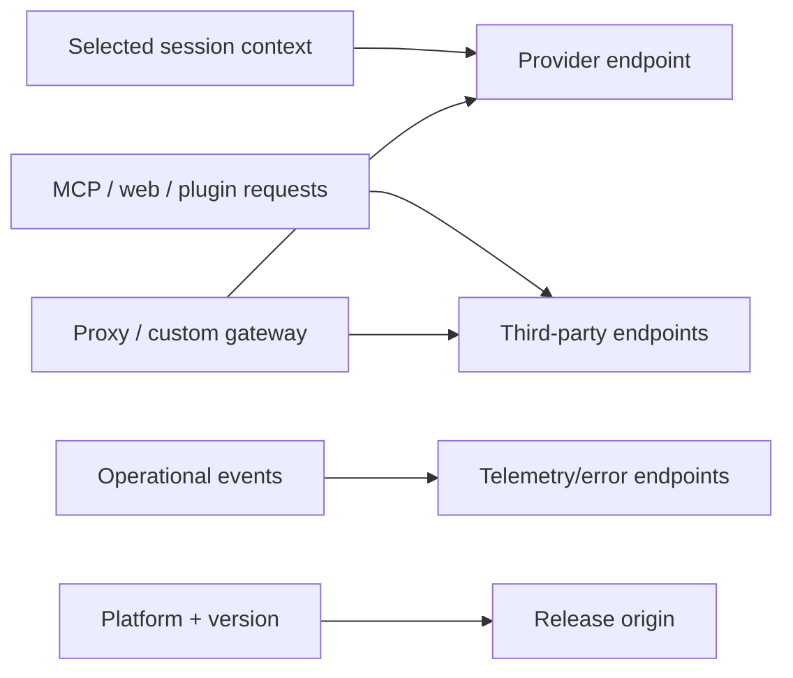

# Network and Telemetry

Visual companion: [providers and network map](../maps/provider-network.md).

Network activity is not limited to inference. Depending on configuration, the client can contact provider APIs, release infrastructure, telemetry/error services, remote MCP servers, plugin or marketplace origins, remote-control infrastructure, web tools, and linked applications.

## Traffic classes

| Class | Trigger | Likely sensitive inputs |
|---|---|---|
| Model provider | User turn, compaction, classifier, auxiliary model work | Prompts, selected context, tool schemas/results |
| MCP remote | Connection and tool/resource calls | Tool arguments, resource IDs, auth headers |
| Update/install | Version check or install | Platform, version, release request metadata |
| Plugin/marketplace | Install, sync, update | Source identity, plugin names, credentials if private |
| Remote control | Remote session operation | Session metadata and control messages |
| Web capabilities | Model-selected tool use | URLs, queries, returned content |
| Operational telemetry | Runtime events and failures | Metrics, feature state, sanitized diagnostics |

The table is a threat-model inventory, not a packet capture. Exact endpoints and payload fields can vary by account, provider, feature flag, and later server configuration.

## Evidence anchors

Derived [`telemetry.batch-endpoint`](https://github.com/swyxio/claude-code-internals/blob/main/evidence/anchors.json) supports first-party event batching to the versioned path `/api/event_logging/v2/batch`.

Derived [`telemetry.nonessential-off`](https://github.com/swyxio/claude-code-internals/blob/main/evidence/anchors.json) supports a nonessential-traffic control named `CLAUDE_CODE_DISABLE_NONESSENTIAL_TRAFFIC`.

Derived [`telemetry.disable`](https://github.com/swyxio/claude-code-internals/blob/main/evidence/anchors.json) supports a direct telemetry-disable switch, while [`network.first-party-boundary`](https://github.com/swyxio/claude-code-internals/blob/main/evidence/anchors.json) supports an HTTP-layer distinction between Anthropic-operated and external destinations.

The second anchor is evidence of a suppression control. It does not imply a completely offline mode: provider inference, explicitly configured MCP, updates initiated by the user, and required authentication may remain essential or independently requested.

## Data-flow model

Derived A proxy or custom gateway becomes an additional trust principal because it can observe destination and, when terminating TLS by configuration, payloads. Custom headers and auth helpers may also add secrets to requests.

## Logging and redaction

Debug mode supports category filtering and a chosen debug file. Debug output can include request timing, tool names, extension state, paths, and errors. Even if prompt bodies are normally redacted, an error from a hook, proxy, MCP server, or vendor SDK can echo sensitive input.

Before publishing logs:

1. search for API keys, bearer tokens, cookies, authorization headers, URLs with query secrets, email addresses, and absolute paths;
2. remove prompt, source, and tool-result content unless essential;
3. preserve event order and hashes separately so redaction is auditable;
4. never upload a live credential for reproducibility.

## Provider privacy boundaries

Anthropic API, Bedrock, Vertex, and Foundry have different accounts, regions, logging controls, and data terms. The local presence of a provider route does not establish the server-side retention policy for a user’s selected account. Link deployment guidance to the provider’s current official policy rather than freezing it into this versioned binary atlas.

## Controlled network study

A future runtime study should use a fresh account, synthetic repository, no personal credentials, an explicit proxy certificate owned by the researcher, and a written endpoint allowlist. It should never intercept other users, weaken production TLS, or replay authentication material. Findings that indicate a vulnerability belong in private disclosure before public packet details.
