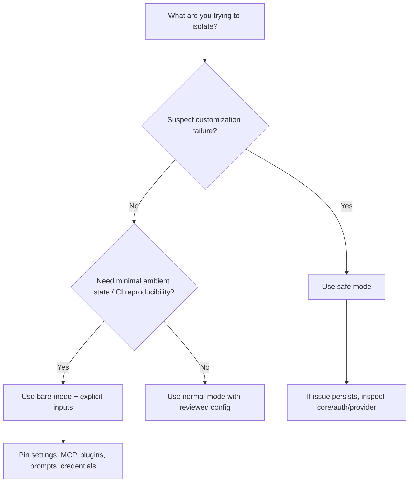

# Normal, Safe, and Bare Modes

Safe mode and bare mode are distinct isolation tools. Safe mode suppresses customizations broadly while retaining ordinary authentication and core behavior. Bare mode creates a minimal, explicit-input environment and narrows first-party credential discovery.

## Comparison

| Behavior | Normal | `--safe-mode` | `--bare` |
|---|---:|---:|---:|
| Managed policy | Yes | Yes | Yes when explicitly provided/available |
| Built-in tools and permissions | Yes | Yes | Yes |
| Ordinary auth and model selection | Yes | Yes | Restricted for first-party auth |
| Automatic `CLAUDE.md` discovery | Yes | Disabled | Disabled |
| Skills | Yes | Disabled | Named skills still resolve |
| Plugins | Yes | Disabled | Automatic sync skipped; explicit plugin input allowed |
| Hooks | Yes | Disabled | Skipped |
| MCP from ordinary configuration | Yes | Disabled | Only explicit configuration should be relied on |
| Custom commands and agents | Yes | Disabled | Explicit agents/settings can be supplied |
| LSP | Yes | Disabled as customization | Skipped |
| Automatic memory | Yes | Disabled | Skipped |
| Background prefetches | Yes | Not specifically promised off | Skipped |
| Keychain/OAuth read | Yes | Yes | Never for first-party auth |
| Themes, keybindings, output styles | Yes | Disabled | Minimal mode |

The table follows the version-matched root help. “Disabled” means the mode advertises suppression; it does not mean the corresponding code is absent from the executable.

## Safe mode

Safe mode sets `CLAUDE_CODE_SAFE_MODE=1` and disables customizations including instructions, skills, plugins, hooks, MCP servers, custom commands/agents, output styles, workflows, themes, and keybindings. Admin-managed policy still applies; auth, model selection, built-in tools, and permissions continue normally.

Use safe mode to answer: **is a user/project customization causing this failure or behavior?**

It is not an offline mode, credential-isolation mode, or sandbox by itself.

## Bare mode

Bare mode sets `CLAUDE_CODE_SIMPLE=1` and skips hooks, LSP, plugin synchronization, attribution, auto-memory, background prefetches, Keychain reads, and automatic `CLAUDE.md` discovery. First-party authentication must come from `ANTHROPIC_API_KEY` or an `apiKeyHelper` supplied through `--settings`; OAuth and Keychain are never read. Cloud providers retain their own credential mechanisms.

Explicit context and extensions remain possible through system-prompt flags, `--add-dir`, MCP config, settings, agents, and plugin inputs. Named skills still resolve.

Use bare mode to answer: **can this task run from a deliberately enumerated set of inputs without ambient Claude Code state?**

## Security selection guide

## What neither mode guarantees

Neither mode inherently:

- makes `--dangerously-skip-permissions` safe;
- blocks provider or explicit network traffic;
- erases existing persisted state;
- constrains built-in shell execution without sandbox policy;
- prevents explicitly supplied malicious configuration;
- changes third-party cloud credential chains;
- guarantees that debug output contains no sensitive data.

## Reproducible automation profile

A conservative headless profile combines bare mode with a trusted cwd, explicit prompt/settings files, explicit tool set, explicit permission mode, strict MCP configuration, pinned plugin directories if required, a dedicated API key, and disabled session persistence. The resulting command should be stored as code and tested against the artifact digest.

Derived This profile reduces ambient inputs; it does not claim hermetic execution. The shell, OS, DNS, proxy, cloud credential files, and explicitly loaded extensions may still introduce external state.
