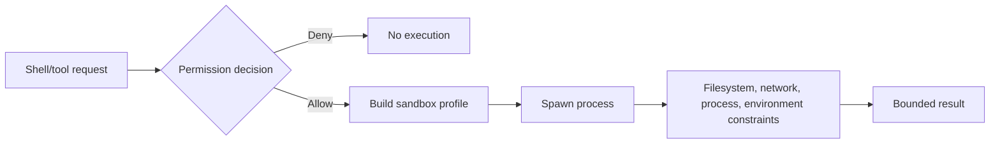

# Workspace and Sandbox

Workspace trust and sandboxing answer different questions. Trust decides whether repository-controlled configuration and instructions may participate. Sandboxing constrains the effects of an operation that has already reached execution.

## Workspace boundary

The initial working directory and `--add-dir` roots define the files a session may intentionally inspect. Project settings, local settings, instructions, hooks, skills, and `.mcp.json` can all make the directory an executable configuration source rather than passive data.

Derived [`workspace-trust.proxy-helper`](https://github.com/swyxio/claude-code-internals/blob/main/evidence/anchors.json) supports a concrete gate: a proxy authentication helper from project/local settings is skipped while trust has not been accepted.

Hypothesis This gate does not prove every executable project setting is covered by one universal function. Hooks, MCP stdio commands, workflows, plugin references, and LSP launchers should each be traced.

Two CLI modes bypass the ordinary trust dialog:

- `--print`, including when stdout is not a TTY;
- `doctor`, which may spawn stdio MCP servers from `.mcp.json` while checking health.

The correct response is not to assume automatic trust. Choose a trusted cwd or pass explicit, strict configuration.

## Sandbox controls

Three anchors expose separate policy dimensions:

| Anchor | Derived control interpretation |
|---|---|
| [`sandbox.fail-closed`](https://github.com/swyxio/claude-code-internals/blob/main/evidence/anchors.json) | A managed deployment can refuse startup if a required sandbox is unavailable. |
| [`sandbox.no-escape`](https://github.com/swyxio/claude-code-internals/blob/main/evidence/anchors.json) | Policy can make a per-command sandbox-disable parameter ineffective. |
| [`sandbox.auto-allow`](https://github.com/swyxio/claude-code-internals/blob/main/evidence/anchors.json) | An explicit setting can auto-allow shell commands when sandboxed. |

[`sandbox.weaker-network`](https://github.com/swyxio/claude-code-internals/blob/main/evidence/anchors.json) records a macOS compatibility setting named `enableWeakerNetworkIsolation`. The name itself is a warning: compatibility can trade away network containment.

[`sandbox.weaker-nested`](https://github.com/swyxio/claude-code-internals/blob/main/evidence/anchors.json) records a separate weaker-sandbox compatibility option for nested execution. Nested and network weakening are distinct decisions and should be surfaced independently in policy review.

## Command decision versus containment

`autoAllowBashIfSandboxed` affects the first decision because containment is expected in the second stage. It should be enabled only when the actual sandbox profile is understood and fail-closed behavior is acceptable.

## Environment scrubbing

Derived [`permissions.subprocess-scrub`](https://github.com/swyxio/claude-code-internals/blob/main/evidence/anchors.json) says a subprocess hardening mode forces default permissions unless tools are explicitly allowed.

Environment scrubbing also needs a secret policy. Child processes should not inherit model/provider tokens, proxy credentials, remote-control tokens, or unrelated cloud variables unless required. The anchor proves permission-state hardening, not a complete list of removed environment variables.

## Local IPC and deep links

[`socket.directory-mode`](https://github.com/swyxio/claude-code-internals/blob/main/evidence/anchors.json) requires local socket directories to be mode `0700`, reducing cross-user access. [`deeplink.argument-injection`](https://github.com/swyxio/claude-code-internals/blob/main/evidence/anchors.json) records rejection of trailing arguments after a deep-link URI.

Directory permissions do not replace message authentication, and argument validation does not establish URL-origin trust. Both are useful layers in a larger IPC/deep-link boundary.

## Testing questions

- Does a required sandbox fail before any hook or MCP child starts?
- Are symlinks and path traversal constrained to approved roots?
- Which network destinations remain reachable under weaker isolation?
- What happens when the sandbox implementation is missing or crashes mid-command?
- Are background agents and hook commands subject to the same profile?

The atlas does not claim answers that have not been safely exercised.
